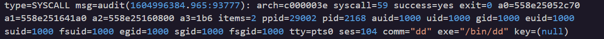
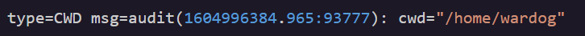
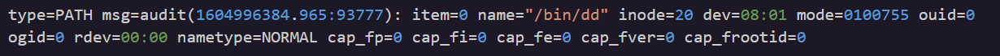
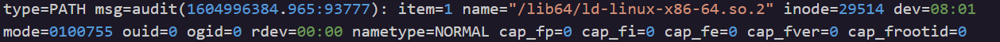
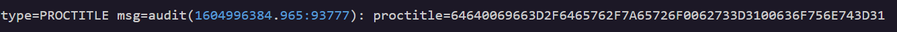
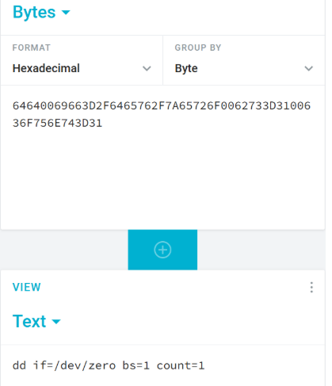

### **Day 1: Log Analysis 3**

**Challenge:** Analyze 3.log to determine what two letter command is being used in this attack.

This is an audit log file, so let's analyze its contents.

Open the 3.log file and look through the lines. You will notice commands that look like linux bash.

| type=SYSCALL msg=audit(1604996384.965:93777): arch=c000003e syscall=59 success=yes exit=0 a0=558e25052c70 a1=558e251641a0 a2=558e25160800 a3=1b6 items=2 ppid=29002 pid=2168 auid=1000 uid=1000 gid=1000 euid=1000 suid=1000 fsuid=1000 egid=1000 sgid=1000 fsgid=1000 tty=pts0 ses=104 comm="dd" exe="/bin/dd" key=(null) |  |
| :---- | :---- |
| type \= SYSCALL | Since this is an audit log file the type lets you know that this is a **system call** type of record. A **system call**  is a direct request made to the kernel to do something.  The best reddit explanation said ‘your Mom doesn’t trust you with scissors, so you have to ask her to do anything that involves scissors’ And so the kernel does not trust you to perform system calls. |
| msg=audit(1604996384.965:93777) | This log comes from the linux audit framework, **auditd** and each log record gets a single **audit ID** like the number in the parentheses. Each other type of record that we will see below shares the same **audit ID** since they come from the same event |
| syscall=59 | Every system call has a fixed number, on linux **syscall 59** is execve. The **Execution Vector** (execve) wipes all the memory of the current process but keeps the same **pid**. Everything gets overwritten with a new binary.  |
| items=2 | This tells you how many PATH records show up in the log for this specified event. (more below) |
| ppid=29002 | This is the **P**arent **P**rocess **ID** of the process that actually made this **system call** and the **ppid** tells you which **parent process** started it in the first place |
| pid=2168 | This is the **P**rocess **ID** that actually made this system call. So the **ppid** called this **pid** and then the **syscall** was made. |
| auid=1000 | This is the **audit user ID** or  **login uid**, so each time a user logs in this ID stays the same (regardless of sudo) and is used to trace the origin chain of an activity. |
| uid=1000 | This is the **user ID** the process was actually running as at the moment of this **syscall**. It can be different from **auid** if the user switched identities. |
| … |  |
| tty=pts0 | **Tty**  or  **teletypewriter** is the general term for any terminal device on Unix. In the past it was used to be hardware that sent typed text over a wire **pts0** or  **pseudo terminal slave** is the modern virtual version of the teletypewriter. It is automatically created by the kernel when you  log in remotely ie SSH or open a terminal emulator window. The number **0** tracks the order of creation in each session |
| comm=”dd” | The **command** name as how kernel saved it |
| exe=”/bin/dd” | This is the full path to the binary file that got **executed** |

| type=EXECVE msg=audit(1604996384.965:93777): argc=4 a0="dd" a1="if=/dev/zero" a2="bs=1" a3="count=1" |  |
| :---- | :---- |
| type=EXECVE | Now **execve** different record type than the **syscall 59** in the line above, they describe the same event but from different perspectives. This **execve** record type captures the full argument list of the command that got executed. |
| argc=4 | Tells you to expect 4 arguments |
| a0=”dd” | This is the first argument and the command name itself |
| a1=”if=/dev/zero” | **if** means input file (**of** means output file not shown here)  **dev/zero** is 1\. a character and 2\. a pseudo device   A **character device** transfers data one **character** at a time. A **Character special file** acts as the interface to character devices. So the driver communicates with a **character device** by sending **single characters** as data to the **character special file**. (VS. There are also block special files that act as the interface to block devices, the driver sends block of data)  It’s a pseudo device, meaning that there is not any real hardware. It behaves like a device the system can read/write. With **dev/zero** being 1 and 2, a device with no hardware that transfers a single character of data per access, this file returns an infinite stream of null characters. One at a time. The **dev** directory consists of device files, which are abstractions of standard devices that applications interact with via I/O system calls (sending blocks or characters of data…) |
| a2=”bs=1” | Sets the block size to 1 byte, so when it runs it can read/write one byte at a time |
| a3=”count=1” | Tells dd to perform exactly one block operation. So per execution bs\*count \=1 aka only 1 byte per execution |

| type=CWD msg=audit(1604996384.965:93777): cwd="/home/wardog" |  |
| :---- | :---- |
| type=CWD | **C**urrent **W**orking **D**irectory. When you ask code to read/write it automatically looks for the cwd  |
| cwd=”/home/wardog” | This is the user’s location in the system when they run the command, but the file was still executed in its own location /bin/add |

| type=PATH msg=audit(1604996384.965:93777): item=0 name="/bin/dd" inode=20 dev=08:01 mode=0100755 ouid=0 ogid=0 rdev=00:00 nametype=NORMAL cap\_fp=0 cap\_fi=0 cap\_fe=0 cap\_fver=0 cap\_frootid=0 |  |
| :---- | :---- |
| type=PATH | This record type shows the files that the kernel accessed write/read to execute and complete the syscall of this log. |
| item=0 | This is the first of the two PATH records. From the first line we know there are 2 to come so this is the first one **0**. |
| name=”/bin/dd” | This is the actual file path the kernel accessed and where dd binary is stored and executed. |
| inode=20 | Every file on linux has an **in**dex **node** a unique ID for file metadata. The metadata stored is file size, owner, permissions, timestamps, pointers to disk blocks but no file name. The filesystem ID combines with the inode and creates a unique identification label. |
| dev=08:01 | This shows the storage device location of the file, **major:minor** is the format. So this is the location virtually or physically in the disk of **inode 20** |
| mode=0100755 | This is the file **type** and **permission bits**. 0100-755. The first part 0100 means that it is a regular file (if it was 0400 it would be a directory, or 0200 a character device like /dev/zero) and 755 shows the permissions for the owner, the user group, and everyone else in this order. Each number is a sum of permissions so 4 means read, 2 means write, 1 means execute. The owner is 7 so read, write, execute. The group and everyone else are 5, so read and execute, but not write.  |

| type=PATH msg=audit(1604996384.965:93777): item=1 name="/lib64/ld-linux-x86-64.so.2" inode=29514 dev=08:01 mode=0100755 ouid=0 ogid=0 rdev=00:00 nametype=NORMAL cap\_fp=0 cap\_fi=0 cap\_fe=0 cap\_fver=0 cap\_frootid=0 |  |
| :---- | :---- |
| type=PATH | The other file accessed by the kernel to complete syscall |
| item=1 | The second PATH  |
| name="/lib64/ld-linux-x86-64.so.2" | This is the **dynamic linke**r that needs to be loaded before the program can be executed. The binary dd was written to call functions that live inside shared libraries. dd uses library functions instead of having that code built directly into it, and so it cannot run on its own, it needs those libraries linked in at the moment it executes. The loader will locate and load all the library programs, resolve the function addresses between them, and then the binary can execute using them.  Resolving function addresses happens because the shared library functions' location varies depending on what is loaded on memory at the current moment. So the loader literally has to go look for each function, load it, and write the current memory address. |

| type=PROCTITLE msg=audit(1604996384.965:93777): proctitle=64640069663D2F6465762F7A65726F0062733D3100636F756E743D31  |  |
| :---- | :---- |
| type=PROCTITLE | This means **Proc**ess **Title** and is the record type that gets the entire command line  that triggered this event into a string. This is used as a redundancy measure. |
| 64640069663D2F6465762F7A65726F0062733D3100636F756E743D31 | These hex pairs are the 4 arguments encoded into one hexadecimal sequence. This is how linux stores the argv (mentioned before) in memory |
|  | Using a hex decoder on the sequence it outputs the same result as the same arguments from the EXECVE record and it’s a way to confirm that our reconstruction is accurate. |

**Summary:**

In this challenge of [Certified Vibe Hacker Workshop](https://certifiedvibehacker.com/) by [Hacker SideKick](https://hackersidekick.com/) we had to work through a linux audit log and understand what this single event was doing. 

By looking though all of the different event record types we learnt more on how the linux OS operates, and saw a building block that can be used to scale an attack.

Commands built with **dev/zero** can be used to generate huge amounts of data and if there is an **of** file specified (there was not one here) the target file  can be overwritten or wiped  entirely.

Bibliography:  
[https://www.reddit.com/r/C\_Programming/comments/17rokbv/how\_would\_you\_explain\_to\_a\_5\_year\_old\_what\_a/](https://www.reddit.com/r/C_Programming/comments/17rokbv/how_would_you_explain_to_a_5_year_old_what_a/)  
[https://medium.com/@m1\_duronto/topic-deep-dive-into-system-call-59-mastering-execve-for-advanced-process-control-0b28a4d48630](https://medium.com/@m1_duronto/topic-deep-dive-into-system-call-59-mastering-execve-for-advanced-process-control-0b28a4d48630)  
[https://docs.redhat.com/en/documentation/red\_hat\_enterprise\_linux/7/html/security\_guide/sec-understanding\_audit\_log\_files](https://docs.redhat.com/en/documentation/red_hat_enterprise_linux/7/html/security_guide/sec-understanding_audit_log_files)  
[https://medium.com/@M4verick/how-i-went-from-confused-to-confident-understanding-ttys-ptys-ssh-and-tmux-d34252c0e452](https://medium.com/@M4verick/how-i-went-from-confused-to-confident-understanding-ttys-ptys-ssh-and-tmux-d34252c0e452)  
[https://unix.stackexchange.com/questions/21280/difference-between-pts-and-tty](https://unix.stackexchange.com/questions/21280/difference-between-pts-and-tty)  
[https://man7.org/linux/man-pages/man2/execve.2.html](https://man7.org/linux/man-pages/man2/execve.2.html)  
[https://linuxhandbook.com/dev-zero/](https://linuxhandbook.com/dev-zero/)  
[https://www.baeldung.com/linux/file-dev-zero-meaning](https://www.baeldung.com/linux/file-dev-zero-meaning)  
[https://en.wikipedia.org/wiki/Working\_directory](https://en.wikipedia.org/wiki/Working_directory)  
[https://www.redhat.com/en/blog/inodes-linux-filesystem](https://www.redhat.com/en/blog/inodes-linux-filesystem)  
[https://towardsdev.com/inode-in-linux-detailed-information-f829a078c3d7?gi=adf66f02b83c](https://towardsdev.com/inode-in-linux-detailed-information-f829a078c3d7?gi=adf66f02b83c)  
[https://en.wikipedia.org/wiki/Dynamic\_linker](https://en.wikipedia.org/wiki/Dynamic_linker)  
 [https://www.gabriel.urdhr.fr/2015/01/22/elf-linking/](https://www.gabriel.urdhr.fr/2015/01/22/elf-linking/)  
[Hex decoder: Online hexadecimal to text converter \- cryptii](https://cryptii.com/pipes/hex-decoder/) 

[image1]: <data:image/png;base64,iVBORw0KGgoAAAANSUhEUgAAAi0AAAJJCAYAAABmjAc+AAA+o0lEQVR4Xu3dX2gcV9rn8exd2Js3V0tuB5YVMYsgLA0ZmsWLRRYizBJNlgh8EW0IYwbSEIjANyIQlIGYlwTFTAaTGaEws4oHr0jeZGTHmU7iaSdvLHtWM3Jsy/bKsmOPHDt225bbjpOevHKerVNVp6vq1J/ullrdfeTvBx4SV1VXV1d1nfr1OdXqB25/+500WpU7dymKamE98P4xaoOVeYwpilp9mTnkAXOCWfqBt25/Kzdv3a7VjeUKRVFrrAfe+yu1wco8xhRFNV86ayxX7rj5QweY1NCiw4p6gFpB+cay/PjjjwIAALDeVOb47vuqmz9UFlGZJDO0qIWu37wlV8s3CCwAAKDtVP5QWURlktTQooeDrl2/KZe/uWquAwAAoC1UFlGZJDO0qGEh1cty6fI35uMBAADaQmURlUkILQAAoKsRWgAAgBUILQAAwAqEFgAAYAVCCwAAsAKhBQAAWIHQAgAArEBoAQAAViC0AAAAKxBaAABAS/zp4CF5460J97/roYOhZUU+/eK4PPDBl26l+dvRhGWunpdH1LTPLgfTlIWF2rJptW3BX/beJdmmphUvyPnISu7I+Cf+8h+dl1OJ807LO99FZgAAcF+7Wr7uBhZd6t+t1sHQ4jh/Vh70w8QVc57rmox8qAPHyWByK0JLLYAsyP7wOnSYceu0jN8Kz7wsz/lhJhp0AADABu5p8Rw+7PWk9M9XzVlyfvZkLWw8MrsczGggtESWT3P6TOy5w8+p6uGj1zKXBwAA7dHx0BL0pizI/nuhyTcvyE91ePj4QrQnplWhxXlud/lPLtbWr3tZth09Kw+7/3/an1OVdw568w7rhwMAgLbpgtDi+PqcGwYe/CKIJrX7SmJDNNJQaEmu0BCTT0//pf/U7r/d+1yCkOIqX5BH/fUAAIC4DT88pHnh4biMLIX/nTIU00BoeeToVbly606sTLpnxRsGuuxuw/Nf+TOXzrm9Le/eEzlVGzbSPS8AAEDb+Dfihrz2kd8bcuCcnLqnwoPz/6VL8r25oNJIaGloeCj87aQFeXNuPjJUpIeEHpm9KM9Pe+t98PDV0KMBAEDYeoQVrWtCS+QeFrfOpH+tuIWhJTzso6rWy6IteUNXXs3La2VjPgAAaIvuCS2OK8fmawFh28KKOTvQQGhJq+Arz9qKvHsomB//6nU1ePzBpeSeHwAA4Lo/eloAAIC17qt7WgAAgL0ILQAAwCrrEVY0QgsAALACoQUAAFiB0AIAAKxAaAEAAFYgtAAAACsQWgAAgBUILQAAwAqEFgAAYAVCCwAAsAKhBQAAWIHQAgAArEBoAQAAViC0AAAAKxBaAACAFQgtAADACoQWAABgBUILAACwAqEFAABYgdACAACsQGgBAABWILQAAAArEFoAAIAVCC0AAMAK3RFaFhbkgQ++zK79x2Xk2FU5VV0xHw0AAO4D9oSWUD0yc0WW75krAQAAG1kXhpaTsuXzBXkuUmfk0f3x8NJS4W346LycN+cDAICO6sLQsiD7zfm+K8fmI6HltbK5xBoQWgAA6GpWhRa5el4eCYWW57/SM27Lmx8H07NCRzj0PDB9NvrvlEpUvSH7Z8/Iox8ery338Een5bnZy/Xvu/lhWbZ8dFwe+mPwHI98siCvLdyQ7xn2AgAgkVWh5bViNExcCc/87lJk3k+P3Q7P9SydCy1zXEaWjBCTUlF3Y/OT6men4s9/3ugpSq95ee1KneADAMB9pgtDSwP1x3kZuXjXXIs8GFnutIzfCs9dltc+Cub/5C/XwzMbGx66eVG2hJ7joc8uRW8I/uG6/DIUrB78IohVV748HXkNfzN6VJad538osv3HowvU8fmNb+WfPjwZeY56pZYHAMAWdoaWD7xvEJn+djQYqnHr4FJtXiQ0fHwh2kuj1A0t0dDzyOyyuYDvmox8qJfzenMUM7SMX/u36MNapJHgopZRIQcAAJt0YWhJHx46NRsdXnn+K3MIJRosVLm+W5L+2jSzB8ZXL7QY99M0WuFwE+9NCeqhj8/IyMlrcuWH0HOuUlavC2EFAGArq0KLyHUZORBcgB88fNVcIPYNo++dad+fOhNMO7jkTotpQ2hRvr92SZ4zglW0jkv/sevJ29iEpODCcBAAwGaWhRaR87OhC3FSuJA7Mv5JcKHedvqSbAtduN/5zlzeVy+0lC/Io7X1nJSRC3fkyq36tVzvm0T3qrJ8+ao8HNpG/RytoIIKw0EAgI3ArtDybXiYx6nPL5tLeL67JD+LhQCvUtULLbIi+z8LrctZ5lTG15MP346GlSDwqDodmadF1p+1rQAA3Ie6MLQk/UXcBdn2SfweDfMbOBHnzxrfJop+mydm6Vy0t2P/vGzz/xpvYEUOHzZu9v3jSXnz9CV516k3/3JGttRuwlXzzsg7d7xHmjfiPvzxWXnzqxt+j8yybIsNGSUHGwAA7lddGFoaqI/Oyn6jJyNJ5NtEH56Tv5kLGNSNsrHn+iDe43F49nTCcE60Xrvgp5WIu/Uf64Sg504n3SkMAMD9rTtCy7qoyjslHQZOysjX5nwAAGCTjRla7t2S8YNBL0viX8cFAABW2VChJTbU4tSWLwksAABsBBsqtDw8HYSVhz8+I28m3lcCAABstKFCCwAA2LgILQAAwAqEFgAAYAVCCwAAsAKhBQAAWIHQAgAArEBoAQAAViC0AAAAKxBaAACAFQgtAADACoQWAABgBUILAACwAqEFAABYgdACAACsQGgBAABWaDq0LH1znaIoiqIoqu3VdGgBgNVSjQ4ArBahBUDbEFoArAWhBUDbEFoArAWhBUDbEFoArAWhBUDbEFoArAWhBUDbEFoArAWhBUDbEFoArAWhBUDbEFoArAWhBUDbEFoArEXHQ8ux6Ql54614TXx+1VxU/vrxe/KbCX+Z3/5Ojn79nbmIyPyB2LreGJ+Uiem/yNnb0UX1c+899o/oDN+Zj36Xui2ef8hf/8VZx/Qpc0bq68p6fcBGt36hZUWuHf80OMcm/iC///iEXPvBXO5q7Fz81eR7su/4dWcNCX647rY77rJOm/ObqU8T2x13/p4ZuRyZekredZ9jSv5cO92vyp/3xNuDNyampHIv/NhkSY81t//YB1679cbUX+VG5NHL8tleZ/k/nYtMBWzSNaFl9+8mI/XOUaNxu3sqOEnfnpRf/Vb9/++c5YyLvw4tTgPjrcs/gd2G4UBk0VqweO+YVCNzHPecBsd9joyA8f0J2auW+e0++ev30VlnPo6+Hvd5xjNeH3AfWJ/Q8p2c+dMf/HPcO7+89iF+ztdCi79c7dxMOs+dNuf9t802x2t3TO70JkNLrX1422+j1OPrBJdaaNHbP663ydn+L/wnuTojE+60P8iBv4cevFCUXznTDy+HpgGW6ZrQksk/CT8zTja3l0M1KOFPDjq0GA3I5c+n3OmV0DT13L/5315j9/sj4ZX/Q46+p9Y9Kb/fOxlvzFzepxbVMKiG4I29fzE+1UQlNorAfab1ocXv7VQh4OML0Vl/L8luZ/rJyEQvtLw7H56mw8XvZN9ZvZi+8L9ntDve85m9FUltTr3QYnLXkdBrG6YfG9n+rz51X+cbvy0Gr3X5r/J7N2T9wfv32U+9duq3H+glACtZEVouH/KCRUytYTkgx/S0WGhZkRtnSzLhf0oKU8/97vxtOTzlndwfL3nTbxzxuoNVkFHLJIWNv5e8bfpN6XLk/9MQWoD1CC1JwSBLPLQc/Re/p2PiU9GZRbc5iSHCaXcibY6sNbR4bZSaljZUrSUND6mw9ZsPT8gNs5fm7jF5x2n3/nzsX+U3arlxZ5uNHmHANl0TWszhobBVhRZ/eEh36e7+6FxszLoWSPRQ0HjRaVX9E/xfTrhDRsc+SAgbfjdr0LuiG6LfyfsL0UU1QgvQjtByW06WivL+h059MOWep9EwYwwPuUMzZm9Ke0JL0N79QX4/XYq1T0mSelpWdHuUMEwt3/vD6k7bdsYMNYCFuia0ZEoZHjo27X1Cyh4e0sM4E/Kbg35Xii/Si+J3n+5VY8S1E9xrYMyw4d7Hop43ErT8T2tJDYcQWgCl9aElGB76lRkw/HYjKbSEL/p62OTo3WBa1vCQancSh4fGP5Uz4YmhdRyujUsn9bQ0Lim0JA5vhbjbZu4bwFJ2hBblbuhG3NoNaBk34kY+9SQ3FObQj3ffSzBMlBxalt31/P6o8VUkCYaVVA+MidACrEdo8Vz+wrtnrXazu/6WoVPRYZN4aKk6bYYXXN6L3qR6N3QjbuSm1/iNuHf1OkLb4P7/b6fkz1fCSya3RY2K3Ygbep1p7Ys7n9CCDaLjoQXA/WO9QguA+wOhBUDbEFoArAWhBUDbEFoArAWhBUDbEFoArAWhBUDbEFoArAWhBUDbEFoArAWhBUDbEFoArAWhBUDbEFoArAWhBUDbEFoArAWhBUDbEFoArAWhBUDbEFoArAWhBUDbEFoArAWhBUDbEFoArAWhBUDbEFoArAWhBUDbEFoArEXnQ8vBYenp6ZGeHSVzTk1pR4+7zPBBc043WZKJJ73t7OkZNme2zNL4gP8cPeasttHPPzC+ZM4CMq1LaNFtSELlNvdL6WLVfAQASxFaWqY9oaUbEFqwWusdWooHikG9PyEjz+S9eZuGZOqK+cB6SjLsr5d3OtAd7A4t1SUpvjok/Y/1ep+qtg7JzgNLEv5cNaA/deVHZW7Fn7iyKLv9gDF6JPopbOTZfsn1+o/ZlJP808kBpPzFmBSeyHnP+/SoFC8uZoaW4afzktvkz8/lZe6muYRjpSLz7+6Uoa056XWW632sX4ZeLcpSeBNDDbQW9L4MyNyeYRnc7G1XT0+vs13eg6sXi7LTeW1qulpvYXxOKnp/hFRmJ+u+fv38hBa7nL/wd5n6435zcsw/fvjBXU4t32rrHVqSmO9X/e+eF4qRtiJoi35VCyvRGpCJi6Hlb87J5I5ByeeCc2VythJaANg4dPuh2od61DLr0X4o9oaWlTm/IcnL9l3TMrOwJMNPBA1M4YDfHN0tyUjen54bdv89rBoZ9e9Nhdrqqs525NS0J0Zk6sSSlMtlWTy0UwbcoDEok6FPaX21RqxX+l+elOIeJ2hsDp47HFrKe4e8ac56Jw/Ny9LCjEy+OuhNe3xM5v3l5l7xPxE61bt11F128iUvZLj1zJS3YEIDHR4yGnx10v+UOSbbw9uUH5Sde4oyvWu75GvbOVRbR+31O1Xv9et1ElrscfzUGXnjrQm3/s8H6Q2Pmq6XU6Ue10ptDS3Viiy+W/Df/8GHFt2eqAralDkZ9duF0kpVKs77v1yeloK/3Jz774pU/XUM6Q8gm/plZE9JZpw2YFC3Mz19MnZKrxfYGMLtgmpDkqj2Q81br/ZD6Z7Q0kCFQ0t5j3fhL+wLfbKpOI2Mbkyci3xZT97nN1yq8Xm9r/b/A28HF92Zf+6Xvi19MmE0NjoQFPYFn8lqj39rMViwUgzCkA4tKzO1hnDe6NXwlsvJ6Kz37yH9OlWQqS1bkeKLutdkwJuU0ECn3udyaqz22N3ngskzL+t1Bsvr19+3ZTBYUOq8fkKLVeoFl3Y0OOsdWpIq99ROKYV7No+M1gJ67pU5b9qJsdqHkUD68JC3biecnAhNDK2jtl5ggwi3H6o60X4o3RNatu2MjkeHauc2ryEIQkvQmKSX0ZV7cSIYKurJ18JCxEpFCk/3BcMjoQou0CVv2pMTRkMWv6clHCZSy+9h0v+ODYGZmgktKduaurw7PDVW5/UTWmxnfmKq/uMfkcbmy/nT5kNaZr1Di+ohDGrJeT+PevM2Oe1BKLjPvaKDe59Ezt3caLBQWmhx2hLz/IhXfFgV2AhU+2C2H6rC7cp6tiHdE1qaGh7yG5MtwfBKXbOjoWERo4fGMfeqNzwz8Lpxr4e/fWsNLfXo5ToVWvTrV5X9+gktG0G44WlXY6Osd2hJMuTPi54H8zK2xZs+p4dwVc/nkdAD64WWwnT0nhjgPmK2He1oPxRLQ4vT5OzyhnnyzuMi8aMyJxO7pqUcuvAuvhVcpMNDRflaF27QgBUjwzhVmftn73mSL9p1hofuFmvDVeFPeUp535hMHAu2fMhfZ3R4yNmy2nCW+kQoiQ10UgjxNBpagtcf/YRY7/UTWmynGpmxNjU2SidCi54XCxmnguEcVfEhnSC0hM50UedFcA5E58iVaRlTN7lHpwIbkv7wo9qQdrE2tCjbaze+GdU7KBMLXvM0XQim13pXQr0utcvuxUkZTBgW6c353xAKNWiLbw+63+6JLLspL/na9oQv/BWZeSV0Q22o8i8Vg16NlUWZ2OZ9CypWm0ekpFvBhAY6HkK0RkOLNPX69TxCC5q13qElrdweVPNxEnz4UcNCZmRRavPdCoacK0dGpV/fP2eWc74Wk74dCGDNOh9aANw31iW0rIUbeIwbagF0LUILgLbphtBSPTcjxQOTstP/w3P0GAL2ILQAaJtuCC1Le4a84d1NORnYMWnOBtDFCC0A2qYbQgsAexFaALQNoQXAWhBaALQNoQXAWhBaALQNoQXAWhBaALQNoQXAWhBaALQNoQXAWhBaALQNoQXAWhBaALQNoQXAWhBaALQNoQXAWhBaALQNoQXAWhBaALQNoQXAWjQdWlSjQ1EURVEU1e5qOrQAAAB0AqEFAABYgdACAACsQGgBAABWILQAAAArEFoAAIAVCC0AAMAKhBYAAGAFQgsAALACoQUAAFiB0AIAAKxAaAEAAFYgtAAAACsQWgAAgBUILQAAwAqEFgAAYAVCCwAAsAKhBQAAWKFrQkvl2JgM9vZIT0+08r+YkLmKuXTU4viAu+zERXNOoLxvWPKbzPX3SnnFXNJU8ZcdlpI5yxdfb0/6NldmZOfW3ujym/LmUoGVsky/mI+tv6e331zSXdZcrnfrTplJ2xbH2DZjW1Rt3i4TxxIe1MS2jD6Viy/n7O/BXXMSW/PBYXd+35Y+6dscPK5366gUr5gLi1QvFmXU3Ieqnhg1F3Ut+e+PtIq9bzJe52ixbCxsqJRkOO8suyPt3SKp64+t++KEDJjbEK7IczjPa86P1UDia40tl/Q6b87JxC/i29yT3y6TC9Xosop/TLNKq3d83ErZn8O1c68g03fNuSEp+zzpvZu5H5+ckKXakksy8WTCMkYNHwzW3ex711WZSz1PY+rs9/C2uJz2yFwmqz1a3Ls91t71bhtLbe/S2t3+l4vRBVcqMje+PbYt2/csSvTd1fw+lyvF5tojZ0pfwrWoZ/OwTMfaI/+825Rz2q+85EKvNXYOKc77sPjyQGQ5XWo/xqxUpbIwI9PjO6Xgv4bYOWxIur4M70vYFp86pua2pB1PJe2Y1r+WtkZ3hJa7JWfHOg3qOXOGI2tHnHMadbXznpqQyZdzyQdTNfxqmbwTOjIORJKK0wDknQOy+xl1UBJCy8qcjDoXqOnYer2gUzgQPd3Ke4fc6X2vz0emy7nd0vP4mBhTZeltrzHPOw127CnM/XJqTPqcZc23pg50fbvMtVel9FJeBsYXjekSX7dEtyUmYfm5pGN5ZFRy6g3uHK8Iv6E1lXb4F5lnpoLXpS4+L++U4s3wkkpFpgsJjbIEF8WB8eByk6XhfR5R8bfXaSD27k69yGbuR9OhkeT3SzN0iHL2+aKx/XpbGnmdc7tGZSIhnMy/3pd47GoXz0ZeZwrvvevsz4OxLfRVnXbDOS+rJS+8OO+TJE2dRw43KBamjYtlk1YW423OKt676hz13ruNnafufm9wn+v2KCapPfLbup5NBaO9q0jxRe9iaspsd41tVx9aRxNeo2rTokExg7PPJ57qiT+fE/qaao9EvSpTWSa3eRfokUPh6X5oeTK+DnXt6Nk0JFORoOOEs9n465SVGRnNOYHkkjkjzAtsidc5nzqmsfbCOZ7uezrjmEYlX7/Wci1tpS4ILWWZckLBZCzB1qN2bNCglXYkH0z1RujJjcpM0gmexn/z6yDlJft4aEltsB1jW9TjR4LH3J2Wgn+CJJ2AbsP0dnSOOqFyL89EpqXRF+YkxRfV9vfL7tCJm9pgJZn1Tu5GtyVNZV/Bu5C9YHzKSgktytwrXoPYSOCoOutPWq6p0KJe6ypepw7PbjBwTu7EC0ez+7Ho7ZdhY3c1w2189iW0MM1uS5oTXliOWWtoWZn3GtmM87Z6oOC8Nq9hVcc+7T3U7Ovsd5bvfyvhwtKotH2SIe29q17T4B7zo0iGRkNLqD1KYrZHuq2LXrC1ebe9iz7rXPPtbgK3HU1oe2P8fR67YGdIbY+SOO/HscfVtvTJ2KnwjPTQos+xhkJXxTkeThtSzOotrBda/GOa9Fz6/Gj0mMauX7LKa+k66HxoKU/JkLPjyqr7udAnveog+9X7eFJ3nNTeoOFTOS20uA3WK3Net6zRRZh7Jt4dp9/IeecxWnJo0d2Uw+6/1PO76920XabK+t+h7ni/EdeNoe72z7/qPY/7b6Ox6enJyehsVZYOjMqAesPobd+Uk6Fdwfa5rkzKYE/8U8bcrsHaPg0+yXlBsadnSObGC7GuULMr0QsOwbaEl03cFu3SpGxXQz5bnMf35mTw5aIsJX18zQgttYtfyqfoGv/TRNIJWxt+yOW9IahI7Ywsq15r1j6PX/69T8mjs6FJKaGl3n401x0ZNvG3Xf87q0teK+8ZjH9a8oW3JfI6nUp+nQkqRRlWj82PmHOC49arus3Nfb5dJrM+UfqfOjMvP3eLbiMfvFO997Q690xNnUfu8v58ve16yDJxeMDgf3qP92xmSH3vqqE79UldDZ0Y52lvX+w8dan93sg+D7dHoWHItPZIt3VF/4Ll7T+vrVNi7a+6YGe0u/Xeux7vg+nIoeT3cE2j+9xvj9z2MKs98s286u27vPOeyT1RkInZpI3OCC21IduhhPflkkz+vE9y7jHtldzTo1K8mLExrjqhJdyOho5p5N+1Yxpcv9QxrXv9kuavpeul86HF35nb98Y/2Sy+ZQxtGD0gYbGTxucdiH4ZPWK+4bxuzUijXikldn0lh5bgwu86Ny3DTw/K8B6vwY8ddP3J1g9DM7uGZPDZnbV7NsxGQnG3/YnR+D0p/sUinsqrMvRE6J6QxwalXFX7sd/9dxBagnFhc8hAMbsSa2/oprYlqnxiSkaeUOvplcG3jWOdFVr83gZz39So94Q73p8+jNBMT4v7WjNep+pK1a9VDx/GhnpSQku9/Rhedya9Lc77K1WdT/vhbTGZrzNJ5rCFsuqelqobAjNfm7NM8QW1TF6KB4pBvV2IDiX6svZ5I+9dl/M+2+2fM0nDOC7de9HIJ2ul7nt3yX2+/M+n4uepH3Ril+lGe1oi7VGlbnuk2zp98Q23dUqs/VXbkdHupp7vvsrBEfe+idjrTtDUPldWqtntUYLSru3ecM/mEeP6kBFaVop+aDGvHVHVK/My9ZLXRme/3jqhxT+mnuCYumKhJbh+uce03vVLmryWrqPOh5aMLi255O9ovyHSY9NJnyRUYs1t9v5/+55gbe6YaNpJfGikFiKU0ks9iZ/GvZumnDTs/7u2vHtg4zfyKW64Ct8cqN80LyZ3RarXZXZtZjWQalsjn+4zxIeHsi8M3rYHDZTuRlzztugx1J7B6PSM0KKfO627fvqFOhdPaS60qOfLep3ep3b3XzLi34ym33e1Up/Ma+/RnaIHJurtx2Dd9XnHNHmfKVnDhUrWtkRfZxJvzDvxHhFttaFlxb8/JRcPUzV+L4u7/ljFP9WmvU6l4feuBOE/9X3kv+Zwm5Kl/nu3KuaFI7Dknqfma204tDTZHum2LjzEHPC2JXIjtBOaU7fDv1crjbq/Rd870Yhm9nlEWnuUQg+pR4caM0KL/8GhZ+tuSTvCYXOv5OsMBdYJLf4xTZRwf1zWMY1dv6S5a+l66nxoEb9L/og5VYKDnnJihcWSvs9Lk4OJ98yocb60i2FYck+L1N4kSQ23+QZRvDdJn4ydiEwWNSZsvkGUIfXat03GPjnq0JH0ZjPpE013+9ZEUnmUHkfWXcF6CG+t26LoT/gRKaFF30Qcu4FMqXqfUgfeMr9dENdMaFGvNet1pp3kESk9LfX2Y0Prdunx9eTQqe4ncMefdS9gktC2mFJf54rzicrvYalkfiKUVYeW2oUhtQHUxyHpPPIbVqO3JWufN/7e1b07aQFIf3LNCnu+Jt676ffjePeR1M5RrdHQIkF7FJfQHumQU5iOtXfq3qL4+auGttLb3fjyHvdbKU5Yid+snEY9T519bu6jkMT2KG15vQ+2hNuj9NDiBi/zHpi0dSvq2GXeAF4ntIj3euLnhW4v0o+pKen61YpraSt0RWhR3HHGzUOyc09J5i8t1b4WmPlpLiQttKhPhboru3frsCyWF2Xm/THZvjnhzZoiNbQoakhpU16GXp2U0pEZKfnrTvv0VPt69vszMnOkKJMv97uv3RyScjnrHnG3s1f6d0xIWX31TXVTqpNhk3HBujIpQ850tR1ed/mkjBX63W0bSex6FvfbV7VtP7EkSydK7vYkDZGFt2X6yGLmtqhPSu6F56mCjO3xuu7Vtnj31iR0x/oXuJGXRtwqPO2P9SZ1RV6ZloL76Ug1HkPO8gUZNHrGdn4RfUhTocUR3ufqtYZfpzksmSgttCgZ+9Fct/ftg5wMFMZk0h8CKeivM+a3y1TatujGyPmEl8nfFv069bYkvc4x95OXU48OSME5RkNbo/s83LvpWmVo0ReRtJuP9QUvLdToG7cjn1ibOI8qR9S9Rr3S9+yIc476w07vT3ivJen9WKPvXwiFfdMq3rvqHHX/FIR/nupz1D2XknoimggtimqPVLvYaHvkfhPN2ZZwW+edW/H2LtzuuutPXb4ic6/752jBawOGn+2P9l7+fDK5N97Z75n73KH/lEbQHnltY2J7pL8a39snQy8554V/3g352506PJQb8NqvwqD0Peado/2vzESvXeGvrjvLF3Z5bfXkLueC72+jOTy0228TvSq492QNvBCeFj/HI/vcOab6vZJ1TBu7fq39WtoKXRNatOrNspTLZalmvAlXr+quu1yuZKTZ1alWvO12193AtlfcZZ2qNLgl1UpDywfbUZZKI2P1yl1/3Q0+Ri9bb1vU/m76dXaTBvf5ajW8H9XfatDHp86iq6JfZyPbYruGj2novVuO99F0hH+eNnKONiX0/qq/XzzefmmsrQv2Zevb3eY0+TpD7WJjr7M5kWuGOXOtQse0Ec1ev9bzWlpP14UWAACAJIQWAABgBUILAACwAqEFAABYgdACAACsQGgBAABWILQAAAArEFoAAIAVCC0AAMAKhBYAAGCF7ggtV4re7zFEqlcGdwU/fR6zon4oy3hMb7+MFs0/W6x/EySlIr/ToX7HImGZSEV/q0T/rk1SJf+wWvDbPOHK/2JC5owX6/3mUXqFtzxrO2qV+ZskFSnt8H5XIr5URebGC9Ln/z5GpDYPy3TsB7SWJPyr2O7vCKllN+Vl+3jSMfXW39i6PdWb6ncvJvxf4G78d4UAAPbqjtBSSfjxsyPerxD3PDUR+6Gspbe9C3Ts4pf4mwnBD5nFL8YN0j8U5myL+YNW6qft47+qmeJuSUbcHxwzfuxQSdh2HVrSwk8jvB9ozDvriO2tmsrBYffH+fI7pmT3M0mhxVnPbFLYKMvkNm8bo1RoSdjf5yb8Xz7Nm3Pc9Zv0ukcOmXMCzf4YIgDAXt0RWhJU/F9z7XmhGP1BplkvzCT/XHuStYcWtR2FffFLtlJ8MeHn4RPpn65P/mnvJGsOLSvz0vP4mMxnbN+E+vXeTfpXfb2fPm94P63onzw3f94+JbQo5SkZcl5TKWObNL3uyE+7GwgtAHD/6J7QcmlStrvDCTn3p7QHXy7KUsLPR3o/PZ+T0dmq+zPd4eGEocThJB1aguGKcNVT3jMohQMJG+LyLvLquXObo0MhsaEt/2Ld88yUlG/O+T+LHlTSMEjm8NCTE+biUSszMursn3lzeogKhvlXwj0c9UPLzKt9kvf3e+6JgkzMxvd4Zmjxn2N01pzurVvtQ73+5HVHEVoA4P7RfaFlswolPdL37E4pXoyHhdIOdUHrk4FteRkeL8mi//PbSyem/IvXovmIzHtasnk9CVm9ApXZCVmM/FR8VcpHvHtWIr0zFydkwA0bgzLoBJupE0v+T3svSmnXdunJOxf5lHta+p4dkZGXjPp1ciTQqge8nqpU/lBNdLirsdBSu0clNyDDe5xwFts/9UNL0pCPDi16/cnrjiK0AMD9o3tCi2llTkbV/R/GcMr8633eBS1hyETdX+L1wkSmrnp4SF8QVyP2nHenpeCGlvg9OoobaFQvTGjaqoeHVpzXrO4dyY2ac1zeflLz80bPU969sVX3SO38wnxkXHnvUMI+yggt/n5oZEhNrztrKJDQAgD3j+4ILSkXMK9XRfVYhHpc9DDLtslgmm+6oJbvl93u/RnaakPLnDu80tMzZM5oSF9CQKkNbR0JTfS5y79YjExbbWipXewjQz+NSOlpSTk+Lr8HKToMlRJa9A3NZshJW7/undoyljrMRWgBgPtHx0OL+vqvGi7JPVWQsT1FKR5QNenf89Erg2+bwz3qQSUZ2dwj/TsmZPrIopQXZmRaDbHUbigNW2Vo0RfMrbvNOZ6VRZn6ufcV4cKuSX+7izK5qyD9zuvJ/3wq9k0jZfHtQfe17dxTkvlLSzJ/aFJGt/ZKfkcpdj+ODi29j8XvxVE1ecl4gE+HveFoBmpAcmiZftF7nT29fTL00oT7OqfHR2Ros/c8PZtHjEeo0KKW9YeyXvRClKrYflkp19av1j3t70e1fr3u6LBZWUq/DobJCk95w4nq/aOn7T5kfu0dALARdDy0BKpS8e9PUdWQaqW2fLkSv/+lbe6GtqNciX7bKUX1Zmj5hHDTtWqvdR2229iPAACEdVFoAQAASEdoAQAAViC0AAAAKxBaAACAFQgtAADACoQWAABgBUILAACwAqEFAABYgdACAACsQGgBAABWILQAAAArEFoAAIAVCC0AAMAKhBYAAGAFQgsAALACoQUAAFiB0AIAAKxAaAEAAFYgtAAAACsQWgAAgBUILQAAwAqEFgAAYAVCCwAAsAKhBQAAWIHQAgAArEBoAQAAViC0AAAAKxBaAACAFQgtAADACoQWAABgBUILAACwAqEFAABYgdACAACsQGgBAABWILQAAAArEFoAAIAVCC0AAMAKhBYAAGAFQgsAALACoQUAAFiB0AIAAKxAaAEAAFYgtAAAACsQWgAAgBUILQAAwAqEFgAAYAVCCwAAsAKhBQAAWIHQAgAArEBoAQAAViC0AAAAKxBaAACAFQgtAADACoQWAABgBUILAACwAqEFAABYgdACAACsQGgBAABWILQAAAArEFoAAIAVCC0AAMAKhBYAAGAFQgsAALACoQUAAFiB0AIAAKxAaAEAAFYgtAAAACsQWgAAgBUILQAAwAqEFgAAYAVCCwAAsAKhBQAAWIHQAgAArEBoAQAAViC0AAAAKxBaAACAFQgtAADACoQWAABgBUILAACwAqEFAABYgdACAACsQGgBAABWILQAAAArEFoAAIAVCC0AAMAKhBYAAGAFQgsAALACoQUAAFiB0AIAAKxAaAEAAFYgtAAAACsQWgAAgBUILQAAwAqEFgAAYAVCCwAAsAKhBQAAWIHQAgAArEBoAQAAViC0AAAAKxBaAACAFQgtAADACoQWAABgBUILAACwAqEFAABYgdACAACsQGgBAABWILQAAAArEFoAAIAVCC0AAMAKhBYAAGAFQgsAALBCQ6Hl5q3bcu36Tbn8zVW59+OP5joAAADWlcofKouoTJIaWip37spy5Y5cv3nLTThfX/lG7t27Z64LAACg5VTmuHPnWzd/qCyiMklmaNHBRXXJlG8syzdXy26vi1qBKjVsRFHU6uuBD76kNliZx5iiqOZK5QuVNVTmUJ0mKn+oLKIySWpoMcOLHi7SpYIMRVFrK/OCR9lf5jGmKKr50llDhRWVP1QOUZmkbmgxgwtFUa0r84JH2V/mMaYoavWl84fOIw2FFoqi1qfMCx5lf5nHmKKo1hWhhaI6WOYFj7K/zGNMUVTritBCUR0s84JH2V/mMaYoqnVFaKGoDpZ5waPsL/MYUxTVuiK0UFQHy7zgUfaXeYwpimpdEVooqoNlXvAo+8s8xhRFta4ILRTVwTIveJT9ZR5jiqJaV4QWiupgmRc8yv4yjzFFUa0rQgtFdbDMCx5lf5nHmKKo1hWhhaI6WOYFj7K/zGNMUVTritBCUR0s84Jne/2Po1/J9mNLDZVa9j99eia2DtvLPMYURbWuCC0U1cEyL3g21n/918VYIPnvh8/LpoP/T/7DR/Py75xlVD04fdz9t5pnLq/WYa7X1jKPMUVRrStCC0V1sMwLnk317/ediASPzasIHirIhNfxP//vhdgytpV5jCmKal0RWiiqg2Ve8GypcO/Kf/zkdGx+s6XWsVF6XcxjTFFU64rQQlEdLPOCZ0Op3hAdMMx5SaWX/S+HFmLzzFK9Nbb3uJjHmKKo1hWhhaI6WOYFr9srfKPto6X6IURVM6ElvLx6LnOeDWUeY4qiWleEForqYJkXvG4vHShUqftRzPlJtdrQouqhD0/G5nd7mceYoqjWFaGFojpY5gWv20uHCfXNIHNeWjUbWtS69WP6vjgXm9/tZR5jiqJaV4QWiupgmRe8bq+sXhYVSpJKP2brka9i85KCTPgbRf/rb3+Pze/2Mo8xRVGtK0ILRXWwzAtet5cOE+rvrqTNa7bM9ah163k/T5jf7WUeY4qiWleEForqYJkXvG4vHSbUH4kz56WVfkxSr0pSqXXrx9j4LSLzGFMU1boitFBUB8u84HV76TCh/qqtOS+tmg0t4b+Y+5+buHemW8o8xhRFta4ILRTVwTIveN1efOW5fpnHmKKo1hWhhaI6WOYFz4bij8tll3mMKYpqXRFaKKqDZV7wbCn+jH96mceYoqjWFaGFojpY5gXPpgoPFTXzd1vMCv9dlkZ7b7q5zGNMUVTritBCUR0s84JnW4WDiyp1n0vS33AxSy2jllV/h0U/Vq1L/XK0uaxtZR5jiqJaV4QWiupgmRc8W+snH5+O3OvSTKnHmuuzucxjTFFU64rQQlEdLPOCtxFK/V6Q+qqy+hP8KsioPxCnSvWqqH+reTb+plCjZR5jiqJaV4QWiupgmRc8yv4yjzFFUa0rQgtFdbDMCx5lf5nHmKKo1hWhhaI6WOYFj7K/zGNMUVTritBCUR0s84JH2V/mMaYoqnVFaKGoDpZ5waPsL/MYUxTVuiK0UFQHy7zgUfaXeYwpimpdEVooqoNlXvAo+8s8xhRFta4ILRTVwTIveJT9ZR5jiqJaV4QWiupgmRc8yv4yjzFFUa0rQgtFdbDMCx5lf5nHmKKo1lVToaVy5y5FUS2sB94/Rm2wMo8xRVGrLzOH1A0t+oG3bn8rN2/drtWN5QpFUWusB977K7XByjzGFEU1XzprLFfuuPlDB5jU0KLDinqAWkH5xrL8+OOPAgAAsN5U5vju+6qbP1QWUZkkM7To3hX1gO+++95cHwAAwLpS+UNlEZVJUkOLmqmSjQos31wtm+sAAABoC93bkhlaVLK5dv2mfH3lG/PxAAAAbaGyiMokmaFF3ctytXxDLl0mtAAAgM5QWURlEkILAADoaoQWAABgBUILAACwAqEFAABYgdACAACsQGgBAABWILQAAAArEFoAAIAVCC0AAKBlrpavm5NahtACAADWTIWVN96aqNV6hJfOhpbzZ+XBD76UB5y6Ys5zXZORD735D3xwMph89bw8oqZ9djmYpiws+Mum17YFvfAdGf9ETVuQ/eF13Lsk22rLn5bxW+GZl+U5Nf2j83I+PBkAAMifDh5yA4v673robGhxHD583A0I/fNVc5acnz1ZCxuPzC4HMxoILZHl05w+E3vu8HOqevjotczlAQBAe3Q8tAS9KQuy/15o8s0L8lMdHj6+EO2JaVVocZ7bXf6Ti7X1616WbUfPysPu/5/251TlnYPevMP64QAAoG26ILSI/O2o19uybWGlNu3Kl6drAeSnx26HlpYWhpYVf/lgiEgHlXe+84eCnPJcleenvX9/rx8OAAAi1uNeFq0rQovIdS88TJ+t9WL0+4Eh3AtS00BoSa7QfTE+L6ToIZ+q+/96SOj83Lz7b/f5a+s+Hn44AACQ++FG3BA3hNQCgxcevB4Pc0lpKLQ01tMi/s24X3rhaOmc8Zxeb8vzXwVDQw8UL4QfDgAAfBv+RlwtuAH2pPxy1gsfPzuVcsNrC0OLvrlW9aA8/KF63I3IbHeY6sBJ+Ym/Xm7CBQCgM7omtIjcljc/9nszkgJJWCOh5ehVuXLrTqyWf4g+JPq16i/l3fDNwK6rwTaFhq8AAEB7dVFocdy6KFv8gPBpLDyENBBa0ir4Oy0Bfe+KqiR63qNzkT/aAgAAQu6b4SEAAGCv++pGXAAAYL/1CCsaoQUAAFiB0AIAAKxAaAEAAFYgtAAAACsQWgAAgBUILQAAwAqEFgAAYAVCCwAAsAKhBQAAWIHQAgAArEBoAQAAViC0AAAAKxBaAACAFQgtAADACoQWAABgBUILAACwAqEFAABYgdACAACsQGgBAABWILQAAAArEFoAAIAVCC0AAMAKhBYAAGAFQgsAALBCZ0PL1fPyyAdfygOrrpPy2lVzpQAAYCPqbGi5dVl++fmCPJdQ0XByXB4txZd57vPzsv+WudJ2W45s67YFcz4AAGiFzoaWDPb0qBBaAABoB0LLmhFaAABohw0VWg7PnpaHI48z67j5EHmtGF3mvLmA3I2uY/9ZZ9pl2RZbt1EfnU9YFwAAWK0NElpW5NTsvBEu5uW52SV58y9n5JE/htd1WsZvRh/7t6MnQ487K4fv+bPuXZORA6HHHlySZXfGv8nyrTtyxa2rkef92Ul/+u1q8BR1fH7jW/lvX5xbVanHAgBwP9gQoeXUX1JCR9jX5+QntfUtyH5jme8XFuTBcLD5ekn6Q9vw6JwXV+JaMzykwsc/fRh6HXVKLQsAwP3E/tDyXThcHJeRJXMBbUXePRSsc9vpFXMBkZsXY+FA1chSwrI1rQktWr3woubRuwIAuB/ZH1pW+bdeHplN7jnZEls2fh9MVGtDi6aCibnNhBUAwP3M/tBSviCPhpYbuaDvNcmu5WpC78lXZ2NBQVX//F1zyZD1CS2K7nWhdwUAgI0QWmRF9n8WWvaj83Iq6Z4W3+HbCWHFvZE3NCQzvSD7v1uW1z4K1vvQ55fle/NhrvULLQAAILABQotjKXyTrRMwPr0gp34wF1qR5bNn5YH9Z+SdG0ZwuRrurQn1rHx1Vh6qTT8uz3+VFHiioeXho9fMBQAAQAtsjNCi3LtlPCatjsuWL2/UHrY8fzoyPxZMjJtzH5kNHqvFn+NL/k4LAAAttnFCi1a9IftnF2TLR8flIf33WfYfl0c+WZDXFszAYfzhuA9OG/M9z++PBpIr5gL37sjhY2fk0dByj3x2Kb4cAABYta4NLQAAAGGEFgAAYAVCCwAAsAKhBQAAWIHQAgAArEBoAQAAViC0AAAAKxBaAACAFQgtAADACoQWAABgBUILAACwAqEFAABYgdACAACsQGgBAABWILQAAAArEFoAAIAVCC0AAMAKhBYAAGAFQgsAALACoQUAAFiB0AIAAKxAaAEAAFYgtAAAACsQWgAAgBUILQAAwAqEFgAAYAVCCwAAsAKhBQAAWIHQAgAArEBoAQAAViC0AAAAKxBaAACAFQgtAADACoQWAABgBUILAACwAqEFAABYgdCSZaUqlXLFnJpBLb8oMweKMn+pItUVcz4AAFitLg4tSzLxZI/09AzIxEVzXrKeHmf5HSVz8upcnJABtT6n6q7xbklG8t6y/S9NysxCWRaPTMvEjt1SamVwWSnJ8CbnebZNStmcl6Kl+2QNlsYHnG3JyegRc879YKmp93G7FQ/MN/x+2vDuLsr8FXNia1VOldx9DqB5hJYWKL3kBZbhg+ac1pp6xnmeTQUp3jXnpOvUPjHlnO3o23W/NtRdFloODnvvi1oN1w/m9wtn36zLeZywzwE0r2tCy9KBnTK0NSe96oTO5WX+ZkWmCxmh5eac5HNqfq/kthZk7NCS9K3pAl2W0q9HZOSleCWblyl//tDjXkPU92z4cbulFPr4ujthveEKL5umbk9Fs/vk5rz0P9brNaLOPu9/dqcUL1ajy1wpysiuUvon8ROTGfvIt1LK6B0K9mNi/TrpuauydGhChp/Oe691y6AM75mTSkKvVvnQ7sixKL46JP2bc7XXPPhKfN8UdxVkMLTM1KlmhgiTBKGlerEkEzsG3eOU2zokOw8sibHHa8YKg9Knj09vTvqeLkjZXLhcqvPeir4P40qtDy3VshSe7pNcr3de5Db3y9CrRXMpj/OenXxpyH0f9j7WJ4M7JqRkvgcd83u91xNzasp7nXvDgdg/l/33ztye4drx7H2sX8rG+yR83heeyhnnsVeRfejsc3N+4/u8JMOEFmDVuiO0rJS9htm9APVJn1M9vYMymNLTUjk2JgNqmMS5oKhl+/wGKfMCXZfu2YlXMt34pFV0u7f7ryutJi8Fyyabl57HxyStr6LZfVLeNyx5Z/ncE0My7DS0w8/2S049vidvLulM65OxU8ZkV1WKL6jH9JkzIqoHClI4EL8QebL3Y+8vpqOhpTInY9uCC/nIS07A0Bf2J0bDS7q8YSnvWKh95C7n7yN1Uc29Mhd9wLmJ2jKDBWfdW9R+7JXBXU4oii7ZBBVa+mX4le2SDz2/fo39r87FgktFfTLflJOBgn8hfNG7sPds6pOdR0JLX5qs897aXue91drQUl1wtkcNlTrbnnfCZCEUvCZORV9l5eCI+x50j7MTJmphclNehvdFr/qlHd5yMboHI/Ie1+fysBRvFv1tUfvC/1BUmI4cy7TzPlyRNsjZ5/H93Og+J7QAa9H50HK3KAWn4dp9zpyRPDw0v8tr7HMvxj+5xRuvtfEueAkNpUE3qOvSreybeTknkylj7c3tk3kZc3uGnCByIjRZOzIau5CPqt6bhGEp/bzpgcRxZVIGG9iHYeqCrS7uJSMlqPDjvh7jouMpy+S2HpkyPuHqY6gqX+e9oV9PzIkxL/zlRmUmoTenPhVanLBxzJweOnaRfe5d2Iqreq5mtSq06ADrBOXX06J1WNVddnBPvEuiss87zuE5qwstPTLwuhFKxTsnBt5eMie71PtlPc9jQguwNh0PLenBICm0BCd8UiMbb7zWJn3botY7tOiLdbIm94lu5NVwQ+wToqq89Dw5IZEm3Q8ekSEeFW566t2n4gekx8fMGcnOTXi9RZucYx4LscEn4txmc5v9cj7Rm8dAH8OB8eSLVCD7YqKP8dDe+EW2vox7WspTMpT0vJU57zipUj0FTxdk53g8lK5di0KLvnHdfO+kcZZPX9Y790dngymrCy3J+zzr/UBoAbqbpaFlKPaJWok3XmuTvm1RjYSW7C78jOEhPzDkXp4x5/ia3CezXthQvRUZ/SNxfkhxt0OHmBeKmetQvUM9PYOpPUQR7kU6L9v3LppzatwbkdN6iFI0E1pG3KGKIXOGq/hi/WOcLiO06F4c5wKeaaUq5RNT3vEMX+y7ZXjokh9acqMS79tI4Cyfvuyi7N4aHZJpa2iplw0ZHgI6puOhRVbmZDSvGpHoxWpxjz/+bzQ85b1DXiOVN076m6rxNRuvtWllaFmdoKciqz+j2X2y9LY/ZPLU7sh0LS2I6G77RrZJ9w5lDh25Ks7+UzfU9iQM+RhqXy3POxeWhKWr8QtR46FFagHCDFl6+/IvlVL3TTYVWnIy9PZi9PG6Z8m8uF6clOGXk6+caig1aahu9VoUWiR4f/Tkt5uznPO8IlPGfnWXfXxUZsKHcmVRJp7yzqcw/R43c7nXRpjv8dWHFhXq028abwVCC7AWnQ8tvgH3Wy9BqW+xhG+ijKguymQhuJFR3bi3fXzOaww2UGhpqqei6X3i7N8Do5F9rqr38aHMP4rn3oPRwEUzu3dIy74J16uE439zTiac1+reVKlL3bS6Y9JYsMnQ4hvaHN2GASdALK0urfic0LJ1tyya293bL6PF5Muj+paRd2N0tEYzvm3UKHOdZiW9W5pRLu6MrdN9X5kLOlMW3x2Wfv9bRm719klhPPmbYJUj0fX2blU3XvvvoVaFFsfOrf6N3aHavid9+bpiX3c2qzWhEbgfdE1oQZxq0Or3VHSj7G86AQCwGoSWbnVxUvoTvvnQ/apSeqU/NhQAAMBaEVoAAIAVCC0AAMAKhBYAAGAFQgsAALACoQUAAFiB0AIAAKxAaAEAAFYgtAAAACsQWgAAgBUILQAAwAqEFgAAYAVCCwAAsAKhBQAAWIHQAgAArEBoAQAAViC0AAAAKxBaAACAFQgtAADACoQWAABgBUILAACwAqEFAABYgdACAACsQGgBAABWILQAAAArEFoAAIAVCC0AAMAKhBYAAGAFQgsAALACoQUAAFiB0AIAAKxAaAEAAFYgtAAAACsQWgAAgBUILQAAwAqEFgAAYAVCCwAAsAKhBQAAWIHQAgAArEBoAQAAViC0AAAAKxBaAACAFQgtAADACoQWAABgBUILAACwAqEFAABYgdACAACsQGgBAABWILQAAAArEFoAAIAVCC0AAMAKhBYAAGAFQgsAALACoQUAAFiB0AIAAKxAaAEAAFYgtAAAACsQWgAAgBUILQAAwAqEFgAAYAVCCwAAsAKhBQAAWIHQAgAArEBoAQAAViC0AAAAKxBaAACAFQgtAADACoQWAABgBUILAACwAqEFAABYgdACAACsQGgBAABWILQAAAArEFoAAIAVCC0AAMAKhBYAAGAFQgsAALACoQUAAFiB0AIAAKxAaAEAAFYgtAAAACsQWgAAgBUILQAAwAqEFgAAYAVCCwAAsAKhBQAAWIHQAgAArEBoAQAAViC0AAAAKxBaAACAFQgtAADACoQWAABgBUILAACwAqEFAABYgdACAACsQGgBAABWILQAAAArEFoAAIAVCC0AAMAKhBYAAGAFQgsAALACoQUAAFiB0AIAAKxAaAEAAFYgtAAAACsQWgAAgBUILQAAwAqEFgAAYAVCCwAAsAKhBQAAWIHQAgAArEBoAQAAViC0AAAAKxBaAACAFQgtAADACoQWAABgBUILAACwAqEFAABYgdACAACsQGgBAABWILQAAAArEFoAAIAVCC0AAMAKhBYAAGAFQgsAALACoQUAAFiB0AIAAKxAaAEAAFYgtAAAACs0FFpu3rot167flK+vEFoAAEBnqCyiMklmaFmu3JHyjWX55mpZ7nx711wHAADAulL5Q2URlUn+P079OZVckaTfAAAAAElFTkSuQmCC>
