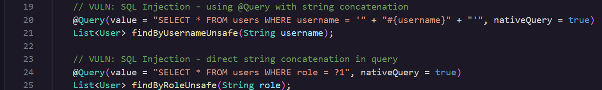

### **\# Day 10: SQL Injection**

**Challenge:** The application constructs SQL queries using string concatenation with user input, allowing SQL injection attacks. What is the exact method name in UserRepository.java that uses unsafe SQL query construction with string concatenation?

**\#\# Methodology:**  
The challenge guides us to **UserRepository.java** and inside there we can find a few query methods and the following 2 custom native @query methods.  

One of these 2 is the unsafe SQL construction so lets analyse them,  
Already just by looking we can tell that the 1st @query is unsafe since it builds the query using the **\+** java concatenation around the **\#{username}** username. This ends up gluing the whole string together at compile time, before the app even runs, so \#{username} never survives as a real placeholder. Because of that, when Spring later scans this method for a parameter to bind the username argument to, it finds nothing to bind.   
While the 2nd query is safer since it uses ?1 as a parameter and probably sends that to a prepared statement, therefore **role** is passed down as data versus SQL code or text. As we discussed on Day 9 prepared statements are a way of sending a SQL query to the database with the actual data values kept separate from the query structure itself. The database first receives the query with a placeholder **?1** and then compiles the query on its own without the user’s input. Then the actual placeholder is replaced with the user’s role and runs no risk of being interpreted as SQL syntax since the query structure is already there.

**\#\# The why:**  
So this is happening for a few reasons, the **\#{xyz}** encasing is the correct syntax used for **SpEL** (**Sp**ring **E**xpression **L**anguage) but when the query string is put together and parsed things go wrong so let’s break it down.

1. Compilation  
- The java compiler **javac** will evaluate the constant expression   
   **"SELECT \* FROM users WHERE username \= '" \+ "\#{username}" \+ "'"**   
- Since it sees the **\+** symbol it will follow the language specification and concatenate the parts together to look like this  
   **SELECT \* FROM users WHERE username \= '\#{username}'**
  - This new string will be written into the .class file and even though it looks like it would work since it does not separate the 3 pieces that were combined this is interpreted as a big string. Thus there is no username reference for the variable.  
2. Spring Boot  
- The Spring Data JPA (explanation below) will scan the classpath for interfaces related to JpaRepository.  
- Once it finds the UserRepository it will search and read the @query via reflection and will see the concatenated string.  
- The query parser will look for parameters within the concatenated string to bind against method arguments. It recognizes two forms: positional parameters (?1, ?2, etc.) and named parameters (:paramName, matched to a method argument via @Param("paramName")).  
- The parser will use regex or tokeniser to find matches on the concatenated string. The \#{xyz} is valid to use but when it comes to this step it cannot be used a s a stand in for a method parameter  
3. As a result this method would be recognised as a native query without any bind parameters even though the username argument was there.  
4. During runtime, even if there was an argument passed down ie “bob” the query execution logic would only find parameters that were found during the spring Boot and since no username parameter was found there would be no place for the string bob to go to.  
5. When this query would run in SQL the code would read the string as a string literal and try to find usernames like \#{username} in the database and return 0 rows.

So this is not really a SQLi attack since whatever the user input ends up being never reaches the Database.

Some questions I encountered when solving this challenge were,

\#\#\# Q1: **What is Spring Boot?**

- Spring boot is a java framework that simplifies stand alone ready for production applications that one can just run. It achieves that by needing minimal spring configuration, requiring 0 code generation and 0 requirements for XML configuration, it has production ready health metrics, automatically configures Spring and 3rd party libraries and overall simplifies build configuration

\#\#\# Q2: **What is Spring Data JPA?**

- It is a Spring Data submodule that lets you create custom native queries and simplifies that by handling the parametrization, pagination, and sorting mechanics of JPA-based (**J**ava **P**ersistence **A**PI) repositories. It improves the implementation of the data access layer by minimizing the amount of interaction needed between the two. It will automatically wire up interfaces and write queries. It will generate all the repository interfaces at runtime.

**\#\# Prevention:**  
Today I actually asked Hacker Sidekick to suggest measures to harden and fix this request to prevent SQLi attacks and here are its proposals.

1. **Prefer derived queries over native queries**. If the JPA entity maps cleanly to the table, a derived query is safer and more portable than nativeQuery \= true.  
2. Enforce an @Param contract in code review. **Never allow string concatenation**, String.format, or \+ inside a @Query string.  
3. If you must use native SQL (e.g., complex reporting)Always bind parameters. This is insecure, never do it:  
 
   This is the only safe pattern for native queries:  
  

**\#\# Summary:**  
In this challenge of [Certified Vibe Hacker Workshop](https://certifiedvibehacker.com/) by [Hacker Sidekick](https://hackersidekick.com/) we saw an example of an insecure native query method that used improper SQL construction. Since the placeholder \#{username} never binded to the user’s input by the time the code reaches the database no username would be found to look for.

**\#\# Bibliography:**
[**Spring Boot**](https://spring.io/projects/spring-boot)   
[**Spring Data JPA**](https://spring.io/projects/spring-data-jpa)   
[**Spring Data JPA Custom Queries using @Query Annotation**](https://attacomsian.com/blog/spring-data-jpa-query-annotation)   
[**Spring Data JPA \- Guide to the @Query Annotation**](https://stackabuse.com/spring-data-jpa-guide-to-the-query-annotation/)   
[**Chapter 15\. Expressions**](https://docs.oracle.com/javase/specs/jls/se7/html/jls-15.html)   
[**What Are Compile-Time Constants in Java? | Baeldung**](https://www.baeldung.com/java-compile-time-constants)   
[**JPA Query Methods :: Spring Data JPA**](https://docs.spring.io/spring-data/jpa/reference/jpa/query-methods.html)   
[**Ultimate Guide: Custom Queries with Spring Data JPA’s @Query Annotation**](https://thorben-janssen.com/spring-data-jpa-query-annotation/) 

