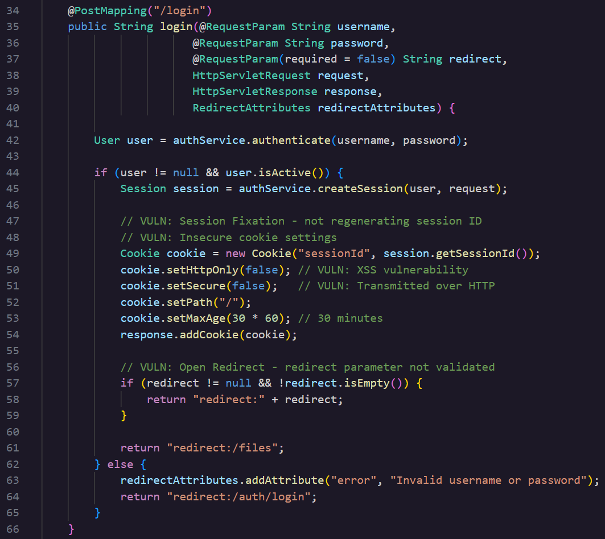
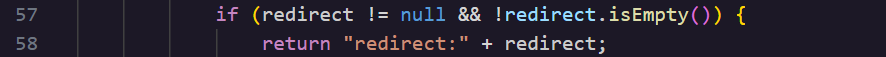
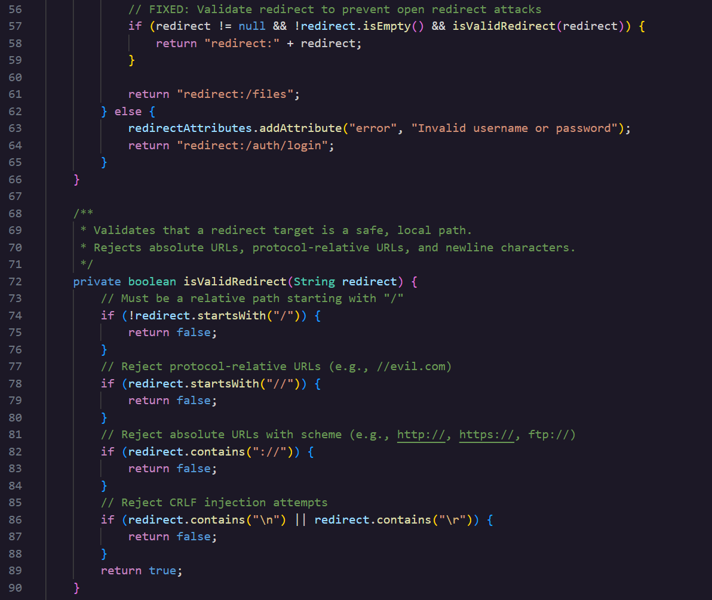

### **Day 11: Open Redirect - Hacker Sidekick Certified Vibe Hacker CTF Walkthrough 
**

**Challenge:** The application redirects users to URLs provided in request parameters without validation, enabling phishing attacks. What is the exact parameter name in the AuthController login method that accepts a redirect URL without validation? Examine AuthController.java and locate the login POST method. 

**\#\# Methodology:**  
So we have to find the parameter in the login method that lets a user redirect to an external site. So open AuthController.java and look for the POST method, here is a snippet  

There are several vulnerabilities but for today’s flag and challenge we care about the controller that accepts a parameter called redirect like an optional request parameter at line 57\.  
  
So this if statement checks to see if the redirect is null and empty and if it is not it returns the user to the redirected link. So it does not check the contents of the redirect string, it does not check if this path is allowed, the host or the URL scheme. Thus the user could POST the redirect parameter which will get concatenated to the rest of the path and be sent back to the user.  
This is what that could look like:

1. An attacker creates the link, [https://website.com/auth/login?username=user&**redirect=https://maliciouswebsite.com/login**](https://website.com/auth/login?username=user&redirect=https://malidiouswebsite.com/login)  
2. The attacker shares the link with the victim, could be in the form of a phishing, smishing…  
3. The victim opens the link and the redirect is sitting at the browser bar waiting. This link can be obfuscated so that the malicious part does not look as suspicious  
4. The victim is directed to the real login page and uses their credentials to login in.  
5. If the login is successful, the user is active and not null (if there is any object reference tied to it),  the user is authenticated, and since the backend authentication check passes, it creates a session and a session cookie for the real website. Lines 49-54.  
6. The code checks to see the redirect link is neither null nor empty, if yes it points the victim to that page other wise to the internal location of /files  
7. The victim is redirected to the malicious website, which could be the next page that the victim would typically see at that website, a main page, a 2FA page. Overall a page where the attacker can extract more information.  
     
   

**\#\# The why:**  
This weakness is known as CWE 601 URL Redirection to Untrusted Site. This vulnerability is sneaky as the link starts out looking like a legitimate website.  If you get a phishing email for example claiming that you need to log in to verify your identity ie “Unusual sign in activity detected, confirm your identity now” chances are that you would probably click on the link out of panic and since you are first taken to the ‘real thing’ wouldn't raise that much suspicion from the get go.  
At the beginning I assumed this attack was the same as a reflected XSS, but turns out there is no script injection for open redirect. So in XSS the attackers code would get executed inside the victims browser, while here the attackers redirect does not execute or do anything it is used as the next destination 

**\#\# Prevention:**  
OWASP makes the following suggestions to control and prevent this type of vulnerability,

- Don’t use redirect and forwards in your code  
- If you do use either one, do not accept user input as the destination  
- If you have to accept a path from the user make sure there aren’t any schemes like https or other protocols   
- Sanitise the input by creating a list of trusted URLs, like an allow list  
- Instead of accepting a full URL, the user send a short code or ID, which the server maps internally to a real, pre-approved destination   
- Add a notifying page before being redirected that communicates that to the user and asks them to click to confirm this change.

I also asked Hacker Sidekick to harden the redirect and it did so by creating a function **isValidRedirect(String) (lines 71–91)** that enforces:

- Relative path only, must start with /  
- No protocol-relative URLs, rejects //evil.com  
- No absolute URLs, rejects anything containing ://  
- No CRLF injection, rejects \\n or \\r  
- The login() method now gates the redirect

And here is the implementation of those changes,  

**\#\# Summary:**  
In this challenge of [Certified Vibe Hacker Workshop](https://certifiedvibehacker.com/) by [Hacker Sidekick](https://hackersidekick.com/) we saw an open redirect vulnerability in a Spring based file server login flow where the user is able to login and be redirected to an entirely different website.

**\#\#**  **Bibliography:**  
[**CWE \- CWE-601: URL Redirection to Untrusted Site ('Open Redirect') (4.20)**](https://cwe.mitre.org/data/definitions/601.html)   
[**Unvalidated Redirects and Forwards \- OWASP Cheat Sheet Series**](https://cheatsheetseries.owasp.org/cheatsheets/Unvalidated_Redirects_and_Forwards_Cheat_Sheet.html)   
[**Open redirect vulnerability | Tutorials & examples | Snyk Learn**](https://learn.snyk.io/lesson/open-redirect/?ecosystem=java) 

