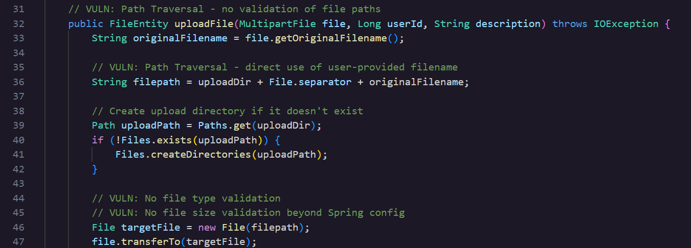
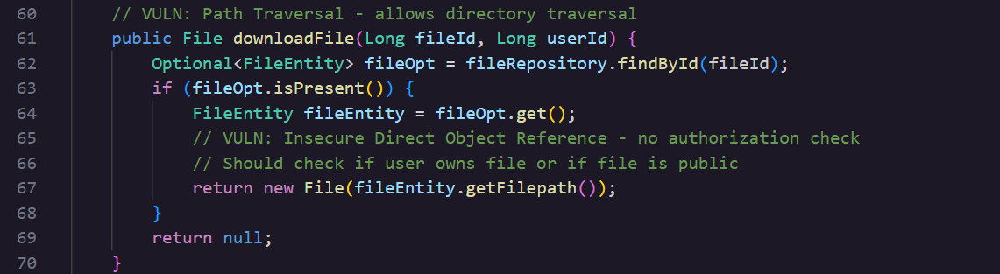
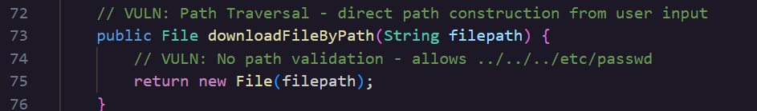
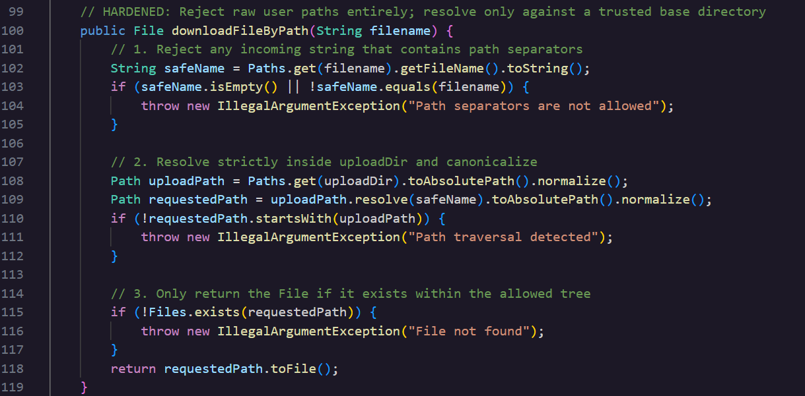

### **Day 12: Path Traversal**

**\#\# Challenge:** The application uses user-provided file paths without validation, allowing directory traversal attacks to access files outside the intended directory. What is the exact method name in FileService.java that accepts a filepath parameter and returns a File object without path validation?

Today’s challenge belongs to the Static Code Analysis category and we have already solved challenges with the same title but those belonged to the Web Application Pentest category. And so for this solution we get to see behind the scenes how the vulnerability looks like in the codebase.

**\#\# Methodology:**  
I started solving today’s challenge by reading through FileService.java and soon enough saw the 3 methods where user input interacts with the filesystem **uploadFile**, **downloadFile**, and **downloadFileByPath**.  
Here is **uploadFile**  
 
Here is **downloadFile**  
   
None of the methods are particularly safe as they all fall under the Path Traversal category but some do have more structure around the user input or different ways to traverse. 

**uploadFile** takes **originalFilename** which is user input from **file.getOriginalFilename()** and concatenates that to **uploadDir \+ File.separator** which then gets uploaded to the path.   
An attacker could add payload in the **filename** field like **../../webapps/ROOT/shell.jsp**, the payload would be treated as a string added directly to the path and the uploaded file would be written straight to the web root.

**downloadFile** looks up by filed the record in the database and creates **File(fileEntity.getFilepath())**  using the stored path string.  
An attacker could call **uploadFile** first with a malicious filename, poison the database record with a traversal path and then call **downloadFile** with the returned **fieldId** (from uploadFile.) The function would trust the stored filepath and return an object that points to any file on the server’s filesystem that the attacker chooses.

 
As you can see this function is really small, there is no check against an allowed directory or comparison to confirm this path lives inside the desired folder.   
**downloadFileByPath** takes the raw **filepath** from the request and returns the **new File(filepath)**.   
An attacker could add a payload that traverses through the directories like **../../../etc/shadow** and since the method creates a **File**  object without any string validation the contents of shadow would get streamed back to the attacker. Java would resolve the **../../** against the filesystem and handle it like any other relative path. Whatever string gets inputted as the filepath is handed straight to the file constructor and returned.

**\#\# The why:**  
Path traversal is also known by CWE 22 Improper Limitation of a Pathname to a Restricted Directory. The problem among all those functions was that the user’s input was able to get into the filesystem without being checked, normalised or filtered against what or where it is supposed to go. So the code trusts the user’s input string and uses that to construct a reference to any location the OS can get to, including locations far away from the directory the user is supposed to be and have access to.  
Although each of the methods above had a different entry point for the attacker, the root cause was the same. 

**\#\# Prevention:**  
PortSwigger and OWASP make the following suggestions to help with this type of vulnerability,

- Avoid using user input when it comes to file system calls  
- Use indexes rather than the actual portions of file names  
- Ensure the user cannot input all the parts of the path, so have boundaries surrounding the path code  
- Use tools or code access policies to control where files can be saved or retrieved from  
- Normalise the user’s input   
- Validate the user input before processing it. Compare it to a whitelist of permitted values and verify that it only contains permitted regex patterns  
- Canonicalise the path the user’s input  
- Verify that the path starts with the expected base directory

I also asked Hacker Sidekick to harden each one of these 3 methods and here are its suggestions. 

**uploadFile**

1. Extract only the filename portion from the user input using Paths.get(...).getFileName() to strip any directory traversal sequences.  
2. Reject filenames that are empty or start with a dot (hidden files).  
3. Generate a unique internal stored name with UUID.randomUUID() so the file is never written to a user-controlled path.  
4. Resolve and normalize the final path inside uploadDir, then enforce that the resulting path still starts with the upload directory path.  
5. Persist the validated path instead of the raw concatenated string.

**downloadFile**

1. Add an authorization check: the requester must be the owner or the file must be public.  
2. Normalize and validate the stored filepath from the database against the uploadDir base path before creating a File object.  
3. Return null if the file does not exist on disk.

**downloadFileByPath**

1. Reject any input that contains path separators by comparing the raw input against its extracted filename component.  
2. Resolve the requested filename strictly inside uploadDir, normalize it, and verify it does not escape the base directory.  
3. Only return the File object if it physically exists within the allowed tree.

 

**\#\# Summary:**  
In this challenge of [Certified Vibe Hacker Workshop](https://certifiedvibehacker.com/) by [Hacker Sidekick](https://hackersidekick.com/) we saw how 3 methods had the same underlying vulnerability in different ways. The flag is the method which accepts a filepath parameter and returns a File object, regardless all 3 functions were interesting to analyse and explore path traversal from 3 different points of view.

**\#\# Bibliography:**  
[CWE \- CWE-22: Improper Limitation of a Pathname to a Restricted Directory ('Path Traversal') (4.20)](https://cwe.mitre.org/data/definitions/22.html)   
[Path Traversal | OWASP Foundation](https://owasp.org/www-community/attacks/Path_Traversal)   
[What is path traversal, and how to prevent it? | Web Security Academy](https://portswigger.net/web-security/file-path-traversal) 

