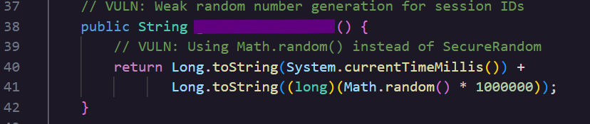
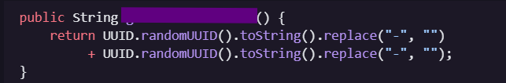

### **Day 13:** Weak Random Number Generation

**\#\# Challenge:** The application uses Math.random() for generating session IDs, which is predictable and not cryptographically secure. What is the exact method name in AuthService.java that uses Math.random() for generating session identifiers?

**\#\# Methodology:**  
Today’s challenge is part of the Static Code Analysis so after downloading the code files, and opening AuthService.java I started looking for the function that best matches the challenge’s description.  
Only one function uses Math.random and so here is that function and the flag for today’s challenge.

Looking at this function we can see that the **session ID** is built by taking the **System.currentTimeMillis()** and adding a **Math.random()** value to it.

A real world example of what weak randomness can lead to was an exploit discovered in Firefox for Android known as CVE 2014 1516\. Researchers discovered that the app stored the user’s profile in a directory that was supposed to have an unpredictable name. Because the algorithm was not random enough the researchers were able to brute force the directory name and gain access to sensitive user information

**\#\# The why:**  
Turns out Math.random() in Java is backed by a single shared instance of **java.util.Random**. This is a **L**inear **C**ongruential **G**enerator (**LCG**) class with a 48 bit internal seed. A LCG is an algorithm that creates the next random value based on the previous internal state using a fixed formula. And so it is not that random. This is a non cryptographically secure algorithm and Oracle’s documentation does not recommend such usage.  
 **LCG**’s are part of **P**seudo-**R**andom **N**umber **G**enerators (**PRNG**). PRNGs try to approximate randomness and in trying to do so create a pattern. And so the random number will be repeated and can even be predicted by an adversary.

Not all **PRNG**s are bad, but that depends on the number of factors, one of them being the period. The period is the number of iterations such an algorithm goes through before it starts looping. Thus a PRNG with a long period will appear random to our human eye, however a computer can crack or predict the algorithm's sequence.

This is also known by CWE 338 Cryptographically Weak **P**seudo-**R**andom **N**umber **G**enerator 

**\#\# Prevention:**  
The prevention is simple enough, don’t use Math.Random. Anywhere that being predictable can cost your security. So tokens, password reset tokens, apikeys 2FA codes, anywhere a value holds power over a user's identity, authentication, or authorization.   
The better alternative PRNG is **CSPRNG**, **a cryptographically** secure algorithm. It built so that even if its output was exposed an attacker could not easily predict the next value or generate a past one. In Java this algorithm maps to **java.security.SecureRandom()** if you are working with JavaScript the equivalent is **crypto.getRandomValues()**.

I also asked Hacker Sidekick how it would secure the function better and it suggested to use a high entropy ID such as **UUID.randomUUID()**

**\#\# Summary:**  
In this challenge of [Certified Vibe Hacker Workshop](https://certifiedvibehacker.com/) by [Hacker Sidekick](https://hackersidekick.com/) we saw how a session ID generator that works and seems harmless can be a bad choice.

**\#\# Bibliography:**  
[Math.random() Exploit: PRNG Means Pseudosecurity | Black Duck Blog](https://www.blackduck.com/blog/pseudorandom-number-generation.html)   
[Don't use Math.random() • DeepSource](https://deepsource.com/blog/dont-use-math-random)   
[Random (Java Platform SE 8 )](https://docs.oracle.com/javase/8/docs/api/java/util/Random.html)   
[Why do not use Math.random(). The JavaScript Math.random() function… | by Kemil Beltre | Medium](https://kemilbeltre.medium.com/why-do-not-use-math-random-a6f8b0ad38dd)   
[How does JavaScript’s Math.random() generate random numbers? | HackerNoon](https://hackernoon.com/how-does-javascripts-math-random-generate-random-numbers-ef0de6a20131)   
[Math.random() \- JavaScript | MDN](https://developer.mozilla.org/en-US/docs/Web/JavaScript/Reference/Global_Objects/Math/random)   
[CWE \- CWE-338: Use of Cryptographically Weak Pseudo-Random Number Generator (PRNG) (4.20)](https://cwe.mitre.org/data/definitions/338.html)   
[NVD \- CVE-2014-1516](https://nvd.nist.gov/vuln/detail/CVE-2014-1516) 
