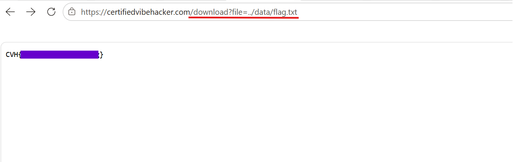
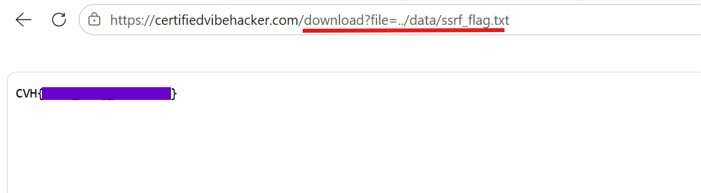
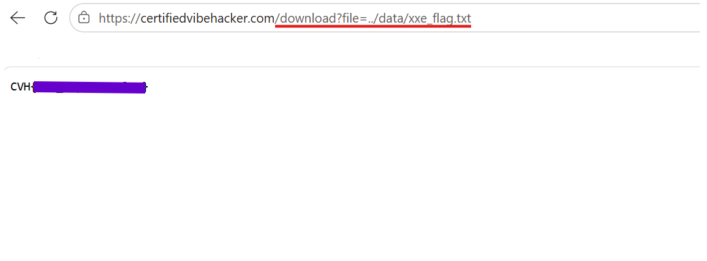

### **Day 16: Path Traversal**

**\#\# Challenge:** Path traversal vulnerability allows access to arbitrary files outside the intended directory through improper path validation, the location is  the /download endpoint.

Today’s challenge belongs to the Web Application Pen Testing category, and we get to exploit the [Certified Vibe Hacker](https://certifiedvibehacker.com/) page. There is another challenge about path traversal that explores the back end side of this attack check that out [Day 12](https://bscsaki.medium.com/day-11-path-traversal-76052418230c?postPublishedType=repub).

**\#\# Methodology:**

1. I started exploring this challenge by navigating to the **/download** endpoint, which always sent me to **/upload**.  
2.  On the upload page there is an upload file location and a button saying “Download test file” with a link that points to [**https://certifiedvibehacker.com/download?file=test.txt**](https://certifiedvibehacker.com/download?file=test.txt).  
3. Then I tried the **test.txt** path, which also took me to **/upload** and from these two attempts I can assume that the **/download** path is active and I just need to find the right traversal to get there.

This button link is also helpful since it shows the right request pattern for the file parameter

4. Then I decided to find what kind of file structure I can expect; I checked out other challenges and XML External Entity (XXE) Injection (Have not solved yet) had a hint showing the location of that flag **/app/data/xxe\_flag.txt**.   
5. This hint prompted me to try out the new path ending in **xxe\_flag.txt** which again sent me to **/upload**   
6. Then I started trying out this same path and replaced **app** and **data** with **../** interchangeably and finally **../data/flag.txt** worked\! I was actually able to get the flag for both challenges (today’s and xxe) and the **Server-Side Request Forgery (SSRF)** which was solved on Day 

Here are the pictures,

**\#\# The why:**

Path traversal is classified as CWE 22 Improper Limitation of a Pathname to a Restricted Directory. We explored the backend side of this attack on [Day 12](https://bscsaki.medium.com/day-11-path-traversal-76052418230c?postPublishedType=repub) where we got to see how the code improperly handles the input. The problem is that my input today **/download?file=../data/flag.txt** was not checked or filtered against what or where the user input is supposed to go. So the code trusts the user’s input string and uses that to construct a reference to any location the OS can get to, including different locations than the current directory  or other directories where the user is supposed to be and have access to.

**\#\# Prevention:**  
PortSwigger and OWASP make the following suggestions to help with this type of vulnerability,

- Avoid using user input when it comes to file system calls  
- Use indexes rather than the actual portions of file names  
- Ensure the user cannot input all the parts of the path, so have boundaries surrounding the path code  
- Use tools or code access policies to control where files can be saved or retrieved from  
- Normalise/canonicalise the user’s input   
- Validate the user input before processing it. Compare it to a whitelist of permitted values and verify that it only contains permitted regex patterns  
- Verify that the path starts with the expected base directory

Over all the process is this: avoid user input if possible. If not, validate the user’s input against an allow list, resolve the full path, and make sure the path starts with the expected base directory at least.

**\#\# Summary:**

In this challenge of [Certified Vibe Hacker Workshop](https://certifiedvibehacker.com/) by [Hacker Sidekick](https://hackersidekick.com/) we performed a path traversal and read the contents of the file flag.txt which contained the solution for today.

**\#\# Bibliography:**  
[Path Traversal | OWASP Foundation](https://owasp.org/www-community/attacks/Path_Traversal)   
[CWE \- CWE-22: Improper Limitation of a Pathname to a Restricted Directory ('Path Traversal') (4.20)](https://cwe.mitre.org/data/definitions/22.html)   
[What is path traversal, and how to prevent it? | Web Security Academy](https://portswigger.net/web-security/file-path-traversal) 
