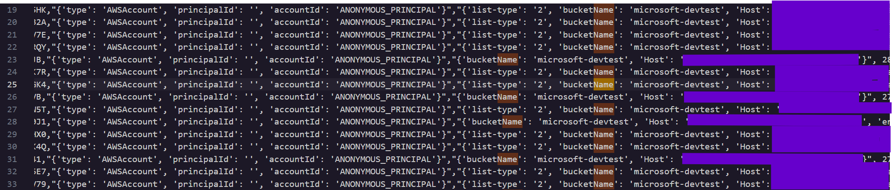

### **\# Day 19: Log Analysis 4 \- Hacker Sidekick Certified Vibe Hacker CTF Walkthrough**

**\#\# Challenge:** Analyze 4.csv to identify the domain name of the honeybucket that is being accessed.    
Today’s challenge belongs to the Log Analysis category and we are tasked with locating the name of a honeybucket being accessed inside an AWS  API call record. You can download the file via the [Certified Vibe Hacker](https://certifiedvibehacker.com/) Workshop. 

**\#\# Methodology:**

1. Open the log, take a look of the file, it contains the following fields Event Type,Event Name,Request ID,User ID,Request Parameters,Alert,Event ID,Event DateTime,Alarm DateTime,Source IP,Request User Agent and Repeated Attempts. All self explanatory names and fields so my mind went to checking out the word name.  
2. Did a ‘name’ search and saw the parameter **bucketName** inside the **Request Parameters**. I don’t need the bucket name, I am looking for the domain name, which should look like a website…  
3. By looking further down the same row the domain name can be found under the **Host** parameter.

4. All the records matched this bucket name **microsoft-devtest**. For the **Host** field there were only 3 domains: one plain global endpoint, a regional endpoint and a single regional endpoint containing a dash symbol. All three pointing to the same bucket and the plain global endpoint appeared more often and turned out to be the flag to today’s challenge.

**\#\# The why:**  
**\#\#\# What is a honeybucket?**  
A honeybucket is a honeypot. A honeypot according to NIST’s glossary is a system or system resource designed to be attractive to potential attackers and intruders. Just like how bears love honey the men love the buckets of information

A honeybucket is one specific target out of the honeypot family. So a honeypot could be a fake server, a fake login page, a fake network a honeybucket is a cloud storage bucket that holds real data for one of those decoy services, on the fake login page for example.

**\#\#\# What are the real world use cases?**  
Honeypots and buckets can be used by a variety of people for a variety of goals. According to Fortinet, here are the two main ways. Security teams can place decoy pots next to real systems and so any interaction would be flagged immediately as suspicious. Threat intelligence researchers use honey pots to lure malicious actors and to study how scanners, bots and attackers work in the wild.   
Lastly, anyone can create a honeypot.

**\#\# Suggestions:**  
Since we aren’t directly dealing with a vulnerability today, let's talk about honeybot suggestions and not prevention. A research team came up with the following advice,

1. **Pick names that mimic real companies**. Buckets that were named after companies with vulnerability disclosure programs received more unsolicited traffic versus buckets not following a real company’s naming convention. That is how scanners flag them in the first place.  
2. **Use realistic fake data instead of empty buckets**. Do not leave buckets empty, and don't fill them with random strings either. If the bucket is supposed to contain PII, populate it with realistic fake copies instead. An empty bucket gets skipped. A bucket that looks like it holds something worth stealing gets interacted with.   
3. R**otate the credentials inside the decoy file**. The researchers updated the SSH password in their document every hour, with the fake password built from a base password plus a hash of the current timestamp. That let them track and measure exactly how far attackers went with the credentials they found.   
4. You can **self host** or use a **managed service**. Self hosting requires a service wide globally unique name between 3 to 64 characters, to configure the bucket, add the content, and make the bucket publicly readable. A managed service, like Breach Insider's Honey Buckets tool, lets you register a honeybucket with a tempting name and handles the alerting for you.    
5. **Make sure to turn on logging on before the bucket goes live.**

You can create your own bucket and host at a managed service like [Breach Insider’s Honey Buckets tool](https://dashboard.breachinsider.com/honey-buckets/).

**\#\# Summary:**  
In this challenge of [Certified Vibe Hacker Workshop](https://certifiedvibehacker.com/) by [Hacker Sidekick](https://hackersidekick.com/) we saw a honeybucket log file, and investigated its contents to locate the Host parameter and find the flag for today's solution.

**\#\#** **Bibliography:**  
[What Is a Honeypot? Meaning, Types, Benefits, and More | Fortinet](https://www.fortinet.com/resources/cyberglossary/what-is-honeypot)   
[honeypot \- Glossary | CSRC](https://csrc.nist.gov/glossary/term/honeypot)   
[Creating a Honeypot. First, I think it’s important to… | by Justin H. Hooper | Medium](https://medium.com/@ecojumper30/creating-a-honeypot-f2b4cc33385a)   
[Using Honeybuckets to Characterize Cloud Storage Scanning in the Wild](https://arxiv.org/html/2312.00580)   
[Honey Buckets – Deceptive Amazon S3 buckets.](https://dashboard.breachinsider.com/honey-buckets/)   
[Cloud-first Honeypot-Honeytoken. What to consider before deployment… | by Cube1214 | Medium](https://medium.com/@cube1214/cloud-first-honeypot-honeytoken-3740fe508034)   
[Logging requests with server access logging \- Amazon Simple Storage Service](https://docs.aws.amazon.com/AmazonS3/latest/userguide/ServerLogs.html) 
