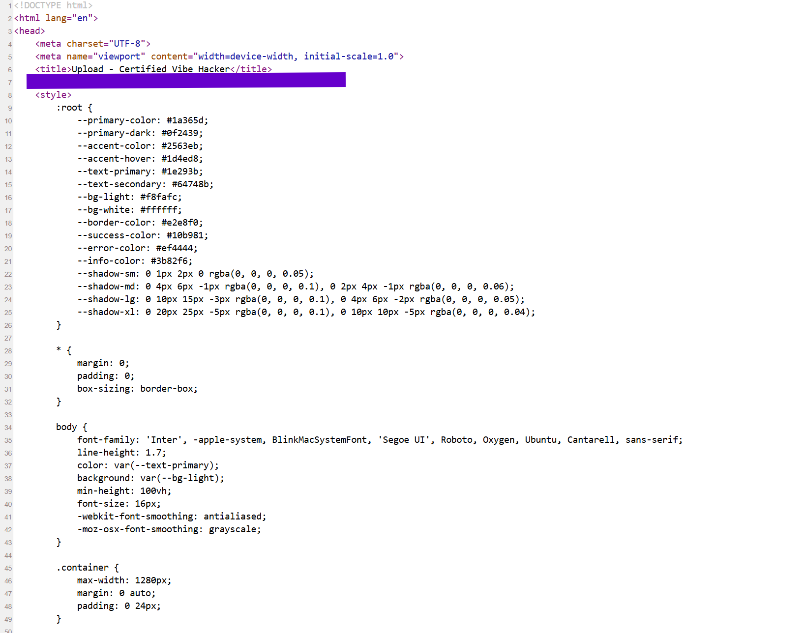

### **Day 2: Hardcoded Secret**

**Challenge:** Hardcoded secrets and flags exposed in HTML source code comments

Today’s challenge belongs to the web application testing category. Compared to Day 1 where we had to go through a Linux audit log file, today the objective is to find a flag exposed in the HTML source code of the Certified Vibe Hacker Website.

The hint given by the CTF is to look for HTML comments inside the base.html template of Certified Vibe Hacker.

**Methodology:**

1. Open the Certified Vibe Hacker on your browser   
2. Right click and choose view page source or click F12 and look through the \</\>Elements   
3. Scan the raw HTML by filtering for the comment syntax “\<\!-- “  
4. You will find the flag inside the comment structure  

So this flag is visible and accessible by everyone who follows the same steps. In addition, because this is the base template, meaning that all other pages are built on its structure, the same flag will exist for multiple other pages and directories.

In real life this is an important and easy mistake, developers leave secrets in the codebases and then end up exposing them online. Hardcoded credentials and secrets correlate to CWE 798 ‘Use of Hard Coded Credentials.’ This is a weakness category tracked by MITRE and this is applicable for any product with a codebase not just websites. Mobile applications are a common example, where developers have shipped app packages with API keys inside and anyone can extract them by decompiling the APK (**A**ndroid **P**ackage **K**it). You can find more information [here](https://cwe.mitre.org/data/definitions/798.html).

There can be different types of secrets exposed like,

- Login credentials  
- API keys  
- Encryption keys  
- Access tokens  
- Connection strings…

One of the reasons why this happens is insufficient code review. Organizations and owners of code use various tools to scan codebases before going public, or manually audit the environment. Sometimes it is not sufficient or not executed altogether. A 2024 GitGuardian State of Secrets Sprawl report found that over 12.8 million secrets had been committed to public GitHub repositories in a year.

The solution to this problem is to treat secrets like something that should never belong in a codebase. When the program needs those secrets, they should be pulled from a secure source versus being always available by being hardcoded. 

The OWASP Secrets Management Cheat Sheet sets the following guidelines:

- Secrets should live in a dedicated vault or secrets manager.  
- Secrets should be generated with randomness.  
- Secrets should be given the minimum access needed for their purpose similar to the least privilege principle.  
- Secrets should be rotated in case they are actually exposed or leaked.

**Summary:**

In this challenge of Certified Vibe Hacker by Hacker Sidekick the flag is hidden in plain sight. The exposed secret can be found inside the base.html template, a common problem with real world consequences.

[Managing the Risks of Hard-Coded Secrets](https://blog.codacy.com/hard-coded-secrets) 

[Hardcoded Secrets in Code Guide | SecPortal](https://secportal.io/vulnerabilities/hardcoded-secrets) 

[State of Secrets Sprawl Report 2024](https://www.gitguardian.com/state-of-secrets-sprawl-report-2024) 

[Keys on Doormats: Exposed API Credentials on the Web](https://arxiv.org/html/2603.12498v2) 

[OWASP Secrets Management Cheat Sheet: What You Need to Know](https://infisical.com/blog/owasp-secrets-management-cheat-sheet) 

[Secrets Management \- OWASP Cheat Sheet Series](https://cheatsheetseries.owasp.org/cheatsheets/Secrets_Management_Cheat_Sheet.html) 

[MASWE-0005: API Keys Hardcoded in the App Package \- OWASP Mobile Application Security](https://mas.owasp.org/MASWE/MASVS-AUTH/MASWE-0005/) 

[What is APK and How to Install APK Files on Your Android](https://www.kaspersky.com/resource-center/definitions/what-is-apk) 

 

