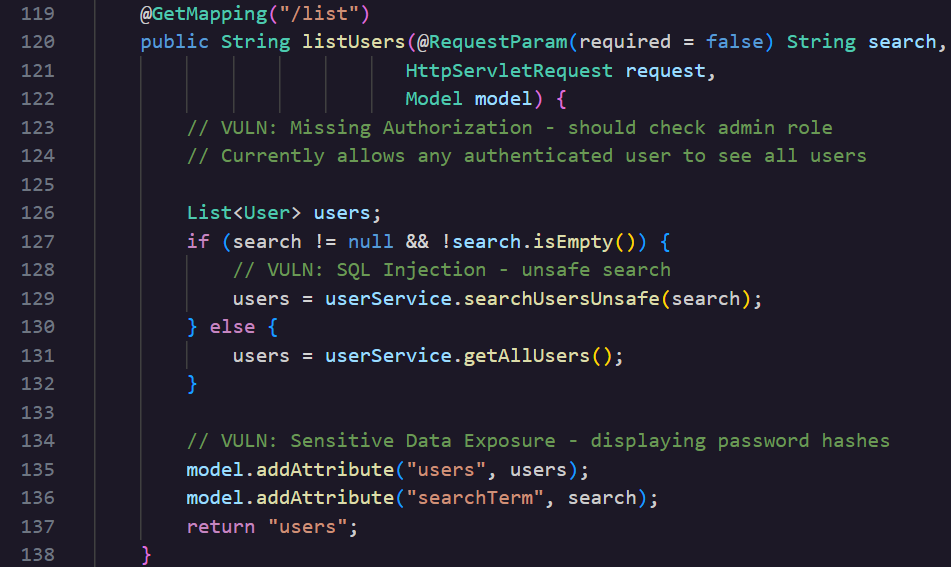
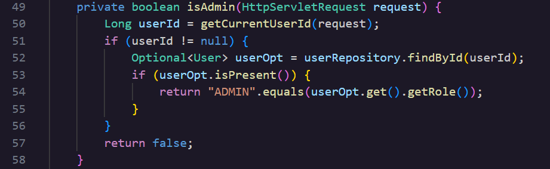

### **\#Day 21: Missing Authorization \- Hacker Sidekick Certified Vibe Hacker CTF Walkthrough**

**\#\# Challenge:** The application lacks proper authorization checks, allowing regular users to access resources and perform actions they shouldn't have permission for.  
What is the exact endpoint path in UserController.java that allows listing all users without checking if the requester has admin privileges?

**\#\# Methodology:**

1. Open UserController.java and look through the file. The controller is annotated with **@RequestMapping(“/users”)** so make sure to consider this when looking for the flag. List users is a method inside the class and is mapped with **@GetMapping(“/list”)**. 

Within this file this is the only method that explicitly misses authorization and gives access to resources, here is an image.  

As you can see there is no point in this method where it checks if the user is authorised and should be granted access to the resource behind /list.

A malicious actor could send a request to /users/list and get back the full table of users from the database. To make it even worse since this method also exposes sensitive data, the response would also render the password hashes for every user returned 

The fix is actually located in this same file. There is another method named isAdmin which would fix ⅓ of the vulnerabilities located inside listUsers. The SQLi and rendering password hashes would still be unpached, however **isAdmin** resolves the missing authorization by checking if the user is the Admin, take a look.  

**isAdmin** first confirms the session belongs to a real user and then checks the user’s role against ADMIN before denying or letting the request through.

With **isAdmin** called first thing in the method the hardened version looks something like this,

@GetMapping("/list")  
public String listUsers(@RequestParam(required \= false) String search,  
                       HttpServletRequest request,  
                       Model model) {  
    if (\!isAdmin(request)) {  
        return "redirect:/auth/login";  
    }

    List\<User\> users;  
    if (search \!= null && \!search.isEmpty()) {  
        users \= userService.searchUsersUnsafe(search);  
    } else {  
        users \= userService.getAllUsers();  
    }

    model.addAttribute("users", users);  
    model.addAttribute("searchTerm", search);  
    return "users";  
}

**\#\# The why:**  
Authentication is the process of proving that you are who you say you are. You can verify the identity of a person or a device. Authorization is the act of granting an authenticated entity permission to do something.  
This vulnerability is classified by CWE 862: Missing Authorization and MITRE defines this weakness as the lack of performing authorization checks when an actor attempts to access a resource or perform an action. It’s a child weakness of CWE 284: Improper Access Control and belongs to OWASP top 10\.

Yesterday’s challenge [Day 21 IDOR](https://medium.com/@bscsaki/day-20-insecure-direct-object-reference-idor-hacker-sidekick-certified-vibe-hacker-ctf-4c06cda1922b) was also an example of a controller java method that did not authorize the user.

**\#\# Prevention:**  
According to OWASP’s Authorization Cheat Sheet here is how to properly enforce authorization in an application:

- **Enforce Least Privilege**. A fundamental security concept of only allowing users and services access to a minimum set of resources they need to complete their goal in the system.  
- **Deny by Default**. The default decision should always be to deny access. Even when no explicit rule covers a given resource or user, the safe default is to block the request rather than let it through.  
- **Validate the Permission on Each Request**. Regardless of how the request was initiated or the source the permissions need to be validated every time. For Java OWASP points to Java and Jakarta EE Filters, including the implementations available in Spring Security, as one way to enforce this consistently rather than checking manually inside each controller method.  
- **Sound Logic**. Make sure the authorization logic of tools, technologies being used aligns with your control access rules and implement a custom logic layer on top of the existing product.  
- **ReBAC, ABAC \>\> RBAC**. Prefer **A**ttribute and **Re**lationship **B**ased **A**ccess **C**ontrol over **R**ole **B**ased **A**ccess **C**ontrol.  
  **ReBAC**: access is granted based on the relationship between resources.  
  **ABAC**: access is granted based on the assigned attributes of the subject, assigned attributes of the object, the environment conditions and a set of policies.  
  **RBAC**: access is granted based upon the roles assigned to a user.

**\#\# Summary:**  
In this challenge of [Certified Vibe Hacker Workshop](https://certifiedvibehacker.com/) by [Hacker Sidekick](https://hackersidekick.com/) we saw a missing authorization vulnerability in java where the endpoint aka flag for today’s challenge authenticates but never authorises the user.

**\#\# Bibliography:**  
[Authentication vs. authorization \- Microsoft identity platform | Microsoft Learn](https://learn.microsoft.com/en-us/entra/identity-platform/authentication-vs-authorization)   
[Authorization \- OWASP Cheat Sheet Series](https://cheatsheetseries.owasp.org/cheatsheets/Authorization_Cheat_Sheet.html)   
[CWE \- CWE-862: Missing Authorization (4.20)](https://cwe.mitre.org/data/definitions/862.html)   
[CWE \- CWE-284: Improper Access Control (4.20)](https://cwe.mitre.org/data/definitions/284.html)   

