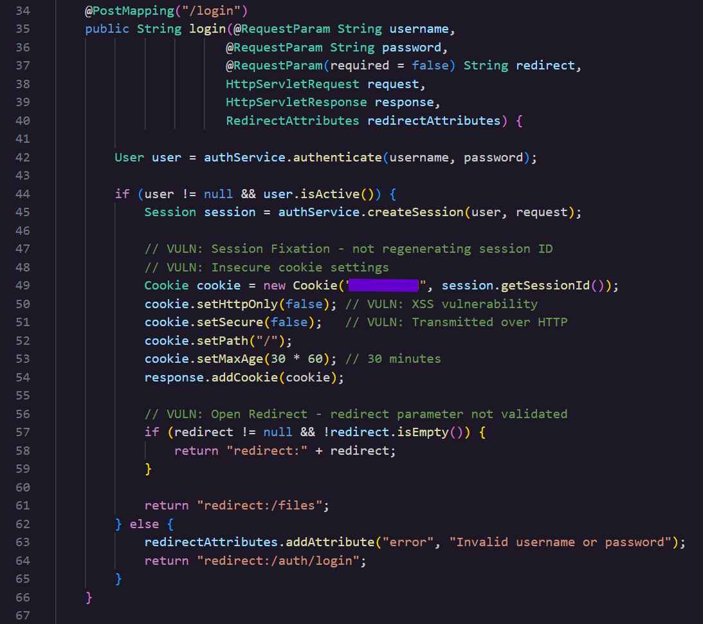

### **\#Day 22: Insecure Cookie Configuration \- Hacker Sidekick Certified Vibe Hacker CTF Walkthrough**

**\#\# Challenge:** Cookies are configured without HttpOnly and Secure flags, making them accessible to JavaScript and transmitted over unencrypted connections.  
What is the exact cookie name set in AuthController.java that has HttpOnly set to false?

Today’s challenge belongs to the Static Code Analysis category and we will better understand cookie creation and how to harden a cookie in a Java Spring application while looking for the flag.

**\#\# Methodology:**  
Follow the prompt’s instructions and navigate to **AuthController.java**. I started by looking at the Login method. After a user is authenticated this controller builds a new cookie object and adds setters to it before adding it to the response. Take a look at the code snippet here.

Take a look at line 49 that is where the cookie construction begins and you can see each line until 54 where the setters are set to be appended to the cookie response. setHttpOnly is false along with other secure flags and so this is the flag for today’s challenge. The name of this cookie sits inside the parentheses of the Cookie constructor, as the first argument passed in right before the session ID. I'm leaving the actual value out of this writeup since that's the flag itself, but if you pull up your own copy of AuthController.java you'll find it in plain text on line 49\.  
Let’s see what each setter does, lines 50-53.

| **setHttpOnly** | Controls whether client side JavaScript is allowed to read the cookie's value through document.cookie. Here it's set to False.  |
| :---- | :---- |
| **setSecure** | Controls whether the cookie can be sent over a plain HTTP connection or only over HTTPS. Here it's also set to False. |
| **setPath** | Scopes which URL paths on the domain the cookie gets attached to. Here it's set to the root path, so it gets sent on every request to the app. |
| **setMaxAge**  | Sets how long the cookie lives before the browser deletes it, in seconds. Here it's set to 30 times 60, which is 30 minutes. |

**\#\# The why:**  
This weakness maps to two separate CWE entries since two different flags are missing on the same cookie. CWE 1004 covers a sensitive cookie without the HttpOnly flag, and CWE 614 covers a sensitive cookie in an HTTPS session without the Secure attribute. Both belong to the broader category of broken session management.

**\#\#\# How do cookies actually work?**  
A cookie is a small piece of information that a server sends to a browser using the Set Cookie response header. Web browsers store cookies for a set amount of time, or for the duration of the user's session, ie what **setMaxAge** controls. Cookies enable websites to personalize the user's experience by remembering placeholders, preferences, or light and dark mode. The browser stores the cookie and automatically attaches it back to the server on every request within that cookie's scope.

Cookies are used in session management as HTTP has no memory and thus the server has no way of knowing who the request came from. So the cookies hold that information and bridge that gap between the web server and the web browser’s communication.

With **HttpOnly** set to false, any script that executes on the page can read the cookie's value directly through document.cookie, and an attacker who gets a script running on that page, for example through an XSS flaw, can forward it wherever they want. With it set to true, the cookie still gets sent to the server automatically, but scripts running on the page can no longer read its contents.   
With **setSecure set** to false, the cookie is allowed to travel over any protocol the browser happens to use for a given request, HTTP included, even if the app is normally served over HTTPS. That matters because if a request to the app ever goes out over plain HTTP, whether from a link, a mixed content request, or a network downgrade, the cookie comes along in that request as plaintext. For example, someone else on the same public WiFi network can read it. With Secure set to true, the browser refuses to attach the cookie to any request that isn't HTTPS, so that plaintext exposure can't happen.

Neither of these attributes are set to True by default inside the java http cookie class and so a developer has to explicitly set all these attributes to true.

**\#\# Prevention:**  
The solution is to set both flags, **setHttpOnly** and  **setSecure** to True. In the Spring application this can also be enforced globally through the servlet container’s session cookie configuration **javax.servlet.http.Cookie** instead of relying on every controller to be set manually… which leaves a gap for error.

I also asked Hacker Sidekick to harden the cookie creation within the login method and here is the secure version, 

**Cookie cookie \= new Cookie("cookieName", session.getSessionId());**  
**cookie.setHttpOnly(true);**  
**cookie.setSecure(true);**  
**cookie.setPath("/");**  
**cookie.setMaxAge(30 \* 60);**  
**response.addCookie(cookie);**

Compared to the original code snippet, Hacker Sidekick set the **setHttpOnly** and **setSecure** flags to True.

**\#\# Summary:**  
In this challenge of [Certified Vibe Hacker Workshop](https://certifiedvibehacker.com/) by [Hacker Sidekick](https://hackersidekick.com/) we saw how a Spring application's login controller builds the session cookie insecurely, explored how HttpOnly and Secure actually protect that cookie, walked through how to harden it, and located the flag for today's challenge.

**\#\# Bibliography:**  
[What are cookies? | Learning Center](https://www.cloudflare.com/learning/privacy/what-are-cookies/)   
[Session management \- Security | MDN](https://developer.mozilla.org/en-US/docs/Web/Security/Authentication/Session_management)   
[TLS cookie without secure flag set \- PortSwigger](https://portswigger.net/kb/issues/00500200_tls-cookie-without-secure-flag-set)   
[Cookie without HttpOnly flag set \- PortSwigger](https://portswigger.net/kb/issues/00500600_cookie-without-httponly-flag-set)   
[Session Management \- OWASP Cheat Sheet Series](https://cheatsheetseries.owasp.org/cheatsheets/Session_Management_Cheat_Sheet.html)   
 [CWE \- CWE-1004: Sensitive Cookie Without 'HttpOnly' Flag (4.20)](https://cwe.mitre.org/data/definitions/1004.html)   
[CWE \- CWE-614: Sensitive Cookie in HTTPS Session Without 'Secure' Attribute (4.20)](https://cwe.mitre.org/data/definitions/614.html)   
[Cookie (Java(TM) EE 7 Specification APIs)](https://docs.oracle.com/javaee/7/api/javax/servlet/http/Cookie.html)   
