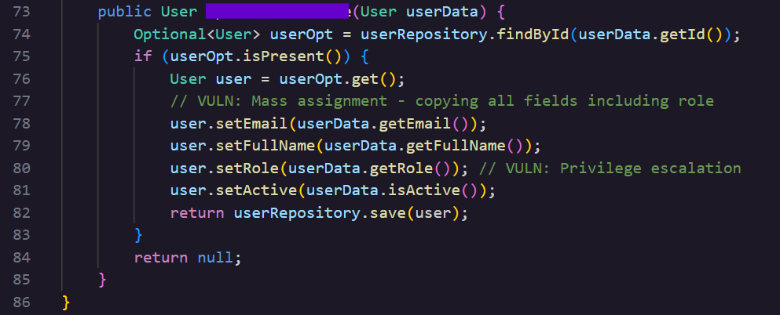

### **\# Day 24: Mass Assignment \- Hacker Sidekick Certified Vibe Hacker CTF Walkthrough**

**\#\# Challenge:** The application accepts and processes all fields from user input without filtering, allowing attackers to modify sensitive fields like roles. What is the exact method name in UserService.java that accepts a User object and copies all fields including roles without validation?

In yesterday’s solution [Day 23: Sensitive Data Exposure](https://bscsaki.medium.com/day-23-sensitive-data-exposure-hacker-sidekick-certified-vibe-hacker-ctf-walkthrough-92ebcc61306b) we discussed how API3:2019 (Excessive Data Exposure) transformed into API3:2023 (**Broken Object Property Level Authorization** (**BOPLA**)) by merging with API6:2019 (Mass Assignment). So today let’s explore the other side of this classification merge. This challenge also belongs to the Static Code Analysis Category and our target is a Spring Boot service that manages user accounts.

**\#\# Methodology:**  
Navigate to **UserService.java** and look for the method that accepts user input and copies/overwrites it into the stored user’s information.

This method looks up the existing users by their id and then overwrites all of the user’s stored data with the incoming new **userData**, its parameter. From lines 76-81 you can see all the data that is being compiled from the four fields onto the existing record of the user; email, fullname, role, and the active bool flag.  
This is what mass assignment is: mass assigning new values with no check and validation on that data. All incoming objects get written into the database.  
The biggest issue, and the one an attacker would actually exploit, is that **setRole** lets any caller change the role field with no authorization check behind it. An attacker could add a role field to a request they are already allowed to send and escalate their own privileges. Since **setActive** is writable the same way, the same request payload could also be used to disable another user's account.

**\#\# The why:**  
This weakness is classified by **CWE 915: Improperly Controlled Modification of Dynamically Determined Object Attributes**. The core issue is that the application receives input from another part of the system, in today’s example that’s the incoming request body, which contains many attributes that are meant to be updated on an object with no restrictions.   
At the API level, this same vulnerability class is tracked by OWASP as **API6:2019**, Mass Assignment, which describes exactly this case. A client adding an unexpected field, like role, to a request the server already accepts, and the server executes it because nothing filters which properties are allowed through.

As we mentioned at the beginning in the 2023 edition of the OWASP API Security Top 10, API6:2019 no longer exists and has been merged with API3:2019 into API3:2023 Broken Object Property Level Authorization (BOPLA.) Even though the two categories differ slightly they share they both lack authorization checks at the individual object properties rather than the object as a whole.   
,   
**\#\# Prevention:**  
The OWASP Cheat Sheet Series makes the following suggestions to prevent this class of bug.

- Use a **request DTO** instead of the entity itself. A DTO for this endpoint would only declare email and fullName, with no role or active field present at all \- Just like yesterday the DTO acts as a filter between what the client sends and what the entity actually accepts. It only declares the fields allowed to change, so role and active never even exist as options on the incoming object, there is no field for an attacker to add to the payload. The method then reads only from the DTO and maps the fields to the stored user.  
- In Spring specifically, an **allow-list** restricts which fields can be edited: 

 ` binder.setAllowedFields("email", "fullName");`

- Spring also supports the reverse, a **block-list**, which names specific fields that must never be written from user input:

   `binder.setDisallowedFields("role", "active");`

I also asked Hacker Sidekick how it would harden the method whose name is the flag for today and here are the changes it made**.**

- **Authentication check:** rejects unauthenticated calls (currentUserId \== null).  
- **Authorization check:** a user may update only themself; ADMIN may update anyone.  
- **Field whitelist:** only copies email and fullName (trimmed) from the request body. role and active are never written from user input.

**public User updatedMethodNameFlag(User userData, Long currentUserId) {**  
    **if (currentUserId \== null) throw new SecurityException("Authentication required");**  
    **// ... load target user ...**  
    **if (\!currentUserId.equals(user.getId())) {**  
        **if (\!"ADMIN".equals(callerOpt.get().getRole())) throw new SecurityException("Access denied");**  
    **}**  
    **if (userData.getEmail() \!= null) user.setEmail(userData.getEmail().trim());**  
    **if (userData.getFullName() \!= null) user.setFullName(userData.getFullName().trim());**  
    **return userRepository.save(user);**  
**}**

**\#\# Summary:**  
In this challenge of [Certified Vibe Hacker Workshop](https://certifiedvibehacker.com/) by [Hacker Sidekick](https://hackersidekick.com/) we saw a mass assignment vulnerable method let a profile update also change the role straight to the database. Its name is today’s flag

**\#\# Bibliography:**  
[CWE \- CWE-915: Improperly Controlled Modification of Dynamically-Determined Object Attributes (4.20)](https://cwe.mitre.org/data/definitions/915.html)   
[Mass Assignment \- OWASP Cheat Sheet Series](https://cheatsheetseries.owasp.org/cheatsheets/Mass_Assignment_Cheat_Sheet.html)   
[Understanding DTOs in Spring Boot: A Comprehensive Guide | by Roshan Farakate | Medium](https://medium.com/@roshanfarakate/understanding-dtos-in-spring-boot-a-comprehensive-guide-20e2b8101ee6)   
[What is mass assignment? | Tutorial & examples | Snyk Learn](https://learn.snyk.io/lesson/mass-assignment/?ecosystem=javascript)   
[DataBinder (Spring Framework 7.0.8 API)](https://docs.spring.io/spring-framework/docs/current/javadoc-api/org/springframework/validation/DataBinder.html)   
[API3:2023 Broken Object Property Level Authorization \- OWASP API Security Top 10](https://owasp.org/API-Security/editions/2023/en/0xa3-broken-object-property-level-authorization/)   
[API6:2019 \- Mass Assignment \- OWASP API Security Top 10](https://owasp.org/API-Security/editions/2019/en/0xa6-mass-assignment/) 
