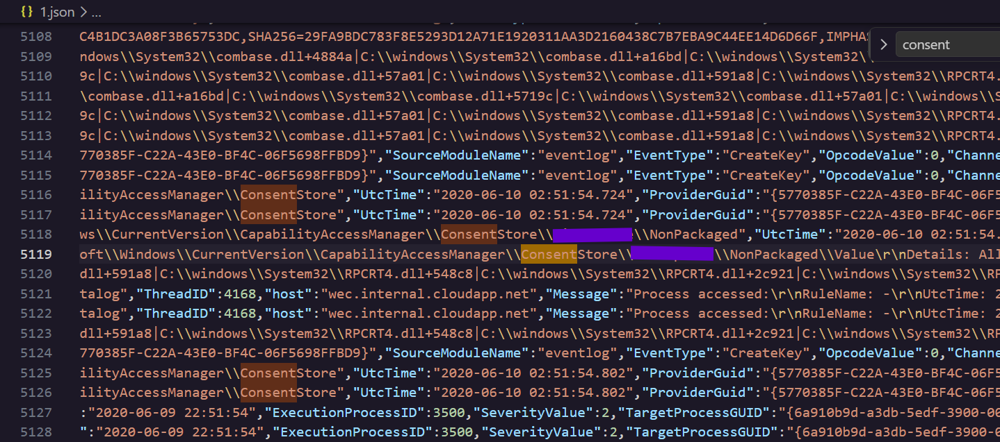

### **\#Day 25: Log Analysis 1 \- Hacker Sidekick Certified Vibe Hacker CTF Walkthrough**

**\#\# Challenge:**  Analyze the file 1.json to determine what type of device is being accessed.

There are a few challenges that I haven’t been able to solve for the past 25 days and this is one of them. Until I read the description again and it finally clicked. So make sure you actually understand what is being asked of you when solving a challenge.

**\#\# Methodology:** 
This is a .json file that contains Sysmon, Windows Security and x,w event logs and have to dig through to find what type of device is being accessed. If you open the file you'll see there's a bunch of individual entries. Something I like to do is run a small powershell script and see what type of events there are and how many times they appear but this did not help today.

Windows keeps a record of when an application accessed something, whether that's hardware or a protected resource. So instead of looking for the device itself, I decided to search for the request made to access it. Every request like that has to go through a manager component responsible for tracking app permissions, which Windows calls the **CapabilityAccessManager**. This manager checks the request by comparing it to a stored record of the permissions that the user set; This is kept under a ConsentStore. And so I decided to filter by consent and soon enough it came up\!

The rest is coming soon…  
