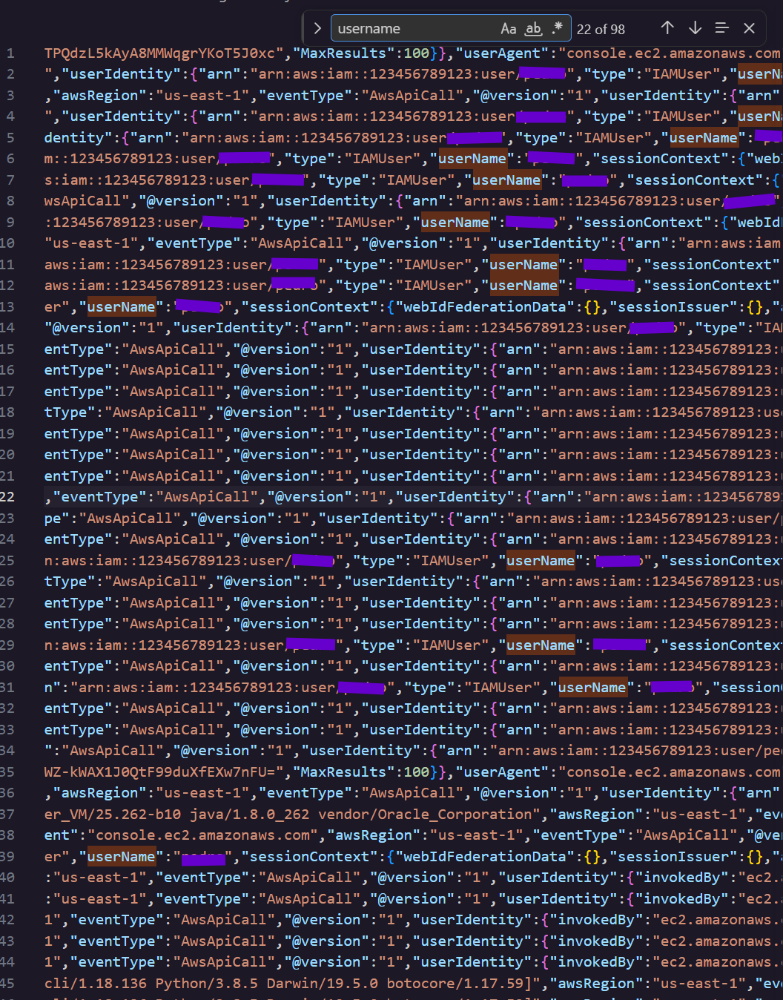
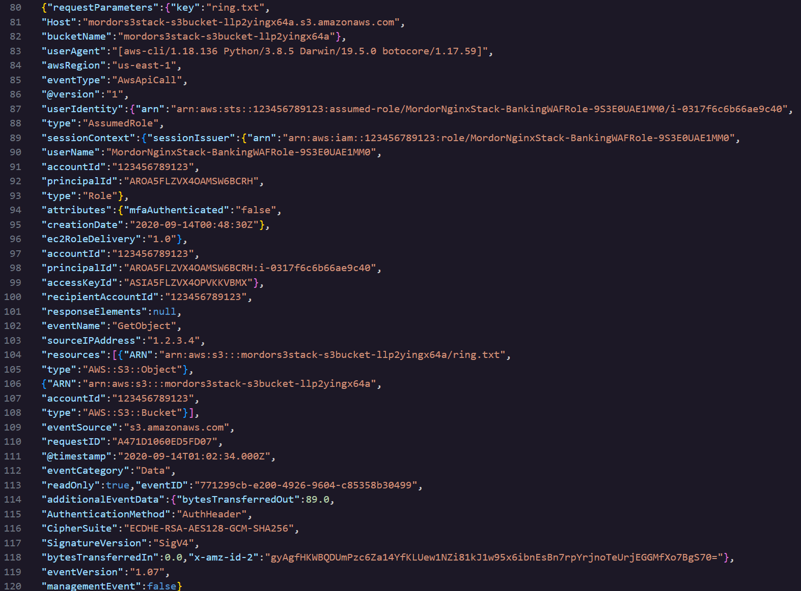

### **Day 3: Log Analysis 5**

**Challenge:** Analyze 5.json and identify the name of the user (first name or username only) who is performing the suspicious activity. 

Today’s challenge belongs to the log analysis category, and the objective is to look through a raw AWS CloudTrail log file and identify the user behind the suspicious activity.

**Methodology:**

1. Open the 5.json log file given by Certified VibeHacker  
2. Filter or look for the field “user”, or “username”  
3. Look through the logs and find the name of the user

The flag will be the only IAM identity that appears in this log, and all other identities belong to machines. For this challenge it was simple to find the name because there is only 1 user, but in a realistic scenario there would be multiple machine and human identities so lets dive deeper.

This is an AWS CloudTrail file, CloudTrail is a service that helps you enable operations and risk auditing, governance and compliance of your AWS account. You can see the actions taken by a user, role or an AWS service. The events in the log file can have taken place in the AWS Management Console, AWS Command Line Interface and AWS SDKs (**S**oftware **D**evelopment **K**its) and APIs. For example every time any identity human or machine calls an AWS API, CloudTrail records who did it, from where, when and what they asked for. This is usually the first place security analysts could check.

Here is a concrete example from the json log file:

**Who:** The userIdentity in line 88 says Assumed Role with an ARN (**Amazon** **R**esource **N**ame) shown in line 87 ending in “c40”

**Where:** The sourceIPAddress in line 103 tells us where the request physically came from, and eventSource in line 109 shows us which AWS service “s3.amazonaws.com “ processed the request. Another clue is the userAgent field in line 83 which tells us that this request came from someone’s command line tool on Mac. More specifically “Darwin/19.5.0” is the underlying OS kernel that macOS is built on, Python is the interpreter, and botocore is the python library that the AWS CLI is built on and handles the signing and sending requests to AWS

**When:** The @timestamp field in line 111 shows us that this event took place on the day of  2020-09-14 and the exact time. 

**What:** The eventName is in line 102 says GetObject and the requestParameters (which is the whole block of this log) in line 104 resources shows the file “ring.txt” and its path.

**Summary:**

 In this challenge of Certified Vibe Hacker by Hacker Sidekick we had to analyze a json file from a CloudTrail log and find the user behind the activity. We also 

**Bibliography:**

[CloudTrail log file examples \- AWS CloudTrail](https://docs.aws.amazon.com/awscloudtrail/latest/userguide/cloudtrail-log-file-examples.html)   
[What Is AWS CloudTrail? \- AWS CloudTrail](https://docs.aws.amazon.com/awscloudtrail/latest/userguide/cloudtrail-user-guide.html)   
[Identify AWS resources with Amazon Resource Names (ARNs) \- AWS Identity and Access Management](https://docs.aws.amazon.com/IAM/latest/UserGuide/reference-arns.html)   
[Darwin (operating system) \- Wikipedia](https://en.wikipedia.org/wiki/Darwin_\(operating_system\))   
[botocore · PyPI](https://pypi.org/project/botocore/)   

