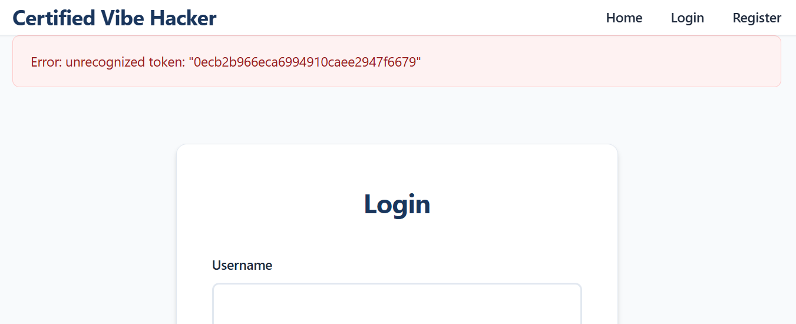
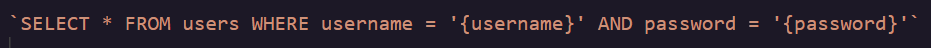

### **Day 4: Broken Access Control \- Admin Panel**

**Challenge:**  Weak admin decorator only checks if 'admin' is in the role string, allowing unauthorized access to admin functionality. Access the admin panel at /admin (requires admin role) The flag is displayed in the admin panel page

Today’s challenge belongs to the Web Application Pentest category, and even though it is labeled Broken Access Control I ended up using an SQL injection to login into the Certified Vibe Hacker website instead. So I will probably try the Broken Access approach in one of the following days…

**Methodology:**

1. The first thing I tried was to plug a single quote **‘** into the username field and I got this error you can see in the following image. Inserting a lone quote character is an old trick to test if user input is handled properly. As you can see I got an error message which tells me that I can try to further exploit this input field.

2. In the backend the query probably looks something like this
   
   Based of off this typical SQL login code block, I can start trying to build a payload that will grant me access as       the admin. Here are a few of the payloads I tried:  
1. **'Admin OR '1'='1' –** This command did not work   
2. **Admin' OR '1'='1' –** This command worked  
3. **Admin' AND '1'='1' –** This command worked  
4. **Admin' AND/OR 1=1 –** This command worked

So lets break those down,

1. This payload did not work because the single quote **'** ends up 
2. Comming soon...
