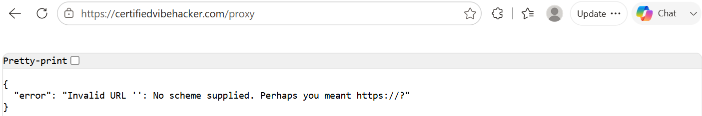
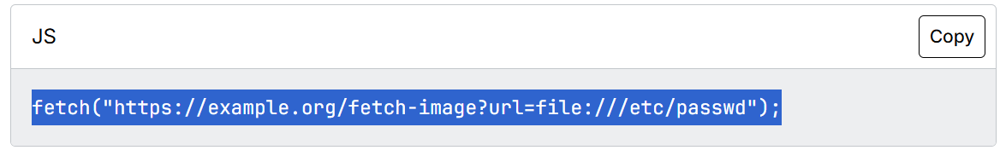

### **Day 5: Server-Side Request Forgery (SSRF)**

**Challenge:** SSRF vulnerability allows making requests to internal services and reading local files through unvalidated URL parameters. The location is /proxy endpoint and the flag is stored in /app/data/ssrf\_flag.txt Use SSRF to read the file via file:// protocol

Today’s challenge was really fun and easy… because we are sort of given the answer by its description, so with a little bit of [research](https://developer.mozilla.org/en-US/docs/Web/Security/Attacks/SSRF) I was surprised to find the flag right away.

**Methodology:**

1. I started by navigating to the **/proxy** path in order to see what I would get, and you can see that in the image below. This error output let us know that this route exists, we got back a Json error versus a 404 not found result. More specifically the invalid URL is a specific error message coming from a URL parsing library. From that we can infer that in the backend the code takes the user’s input and tries to parse it as a URL. And so when there was nothing following /proxy it threw an error. Another interesting detail, when I looked up this error all the results turned out to be related to python. Turns out it's an exact match for the MissingSchema exception thrown by Python's requests library. That us that the backend is almost certainly using Python, probably with Flask or FastAPI handling the route itself, while the requests library is doing the actual work of fetching whatever URL gets passed in.   
   

- What is a **proxy**? A program/computer used to navigate through different networks of the internet. It acts as the gateway between the users and the internet, intercepts requests and gives back responses. It can also forward requests or modify them. The main two types of proxy servers are: **forward proxy** and a **reverse proxy**. The former takes requests from anywhere the latter handles the requests coming from the internet and forwards them to the servers of an internal network. In this specific challenge the proxy takes the URL path we type and and tries to fetch back the request made.

- What is **URL Parsing**? The process of breaking down a URL string into its individual pieces (ie path, query) so that the application can read and validate each part separately. Parsers are used to validate the user’s URL to prevent open redirects or **server side request forgery SSRF** like today’s task.  
2. So a **SSRF** attack takes the URL from the user and fetches it to the server and since there is improper URL parsing one is able to get to where the URL points to. So I then took the rest of the clues from the challenge description **/app/data/ssrf\_flag.txt  and** read the file via **file://** protocol and put it all together. Online I found a guide showing this example:
    
3. So **https://certifiedvibehacker.com** \+ **/proxy?** \+ **url=file://** \+ **/app/data/ssrf\_flag.txt** and in the following image you can see I got the contents of the ssrf\_flag.txt file  
 

Let’s break down the URL, 

| https://certifiedvibehacker.com  | This line tells the browser which server and which protocol/scheme to use to communicate, in this case reach certifiedvibehacker.com using the https protocol. |
| :---- | :---- |
| **proxy** | This is the route path, so proxy is the route we are pointing the server to. It is not a subdirectory because it is a specific path the application's code is written to handle. |
| **?**  | The question mark marks the boundary between the path and the query string that follows. |
| **url=** | This is the parameter name the server reads to know what to fetch, and everything after the equals sign is the value assigned to it. |
| **file://** | Here is where the attack ‘starts’ so instead of typing ‘https://’ **file**  is a different scheme that tells the server to read locally. And as mentioned it is possible because this endpoint doesn’t undergo validation.  |
| **/app/data/ssrf\_flag.txt**  | This is the path itself, and so combined with the **file://** they make up the **URI (U**niform **R**esource **I**dentifier) that points to the exact location of the flag.  |

**The why:**  
Kind of already explained the reason but here is a consolidated explanation, this vulnerability exists because the /proxy endpoint trusts the URL parameters without properly checking the request. The OWASP’s definition states that this pattern happens when the attacker modifies or supplies a URL, then the server reads and submits it, thus granting access to internal resources where they can read the server configuration, connect to internal services or perform requests they are not supposed to. This vulnerability is identified as **CWE-918**.

**Prevention:**  
The OWASP suggests the following implementation for developers to prevent such an attack using the OSI Layers.  
L3/4 → Network layer: 

- Network and resource segmentation, so that a user would not be able to connect or access the internal resources  
- Enforce “deny by default” firewall to block all not essential traffic

L7→ Application layer:

- Sanitise and validate all client input   
- Enforce the URL schema, port and destination  
- Do not send raw responses to clients  
- Disable HTTP redirections  
- Pay attention to URL consistency

**Summary:**

In this challenge of [Certified Vibe Hacker Workshop](https://certifiedvibehacker.com/) by [Hacker Sidekick](https://hackersidekick.com/) we performed a SSRF attack by following the guidance of the challenge’s description. This was a great challenge to see the execution of such an attack and how important it is to sanitise user input and keep a clean backend.

**Bibliography:**  
[**Server Side Request Forgery (SSRF) \- Security | MDN**](https://developer.mozilla.org/en-US/docs/Web/Security/Attacks/SSRF)   
[**Server Side Request Forgery | OWASP Foundation**](https://owasp.org/www-community/attacks/Server_Side_Request_Forgery)   
[**CWE 918 Server-Side Request Forgery (SSRF)**](https://www.cvedetails.com/cwe-details/918/Server-Side-Request-Forgery-SSRF-.html)   
[**URL Parser: The Ultimate Guide to Understanding and Managing Web Addresses | by Koaungyairpaing | Medium**](https://medium.com/@koaungyairpaing/url-parser-the-ultimate-guide-to-understanding-and-managing-web-addresses-df629ada020e)   
[**How to fix Python requests MissingSchema error?**](https://scrapfly.io/blog/answers/python-requests-exception-missingschema)   
[**urllib.parse — Parse URLs into components — Python 3.14.6 documentation**](https://docs.python.org/3/library/urllib.parse.html)   
[**Proxy server \- Glossary | MDN**](https://developer.mozilla.org/en-US/docs/Glossary/Proxy_server)   
[**What is a Proxy Server? Definition, Uses & More | Fortinet**](https://www.fortinet.com/resources/cyberglossary/proxy-server)  
[**A10 Server Side Request Forgery (SSRF) \- OWASP Top 10:2021**](https://owasp.org/Top10/2021/A10_2021-Server-Side_Request_Forgery_\(SSRF\)/)    
[**Server Side Request Forgery Prevention \- OWASP Cheat Sheet Series**](https://cheatsheetseries.owasp.org/cheatsheets/Server_Side_Request_Forgery_Prevention_Cheat_Sheet.html)   
[**Parts of a URL: A Short Guide**](https://blog.hubspot.com/marketing/parts-url)   
[**Uniform Resource Identifier \- Wikipedia**](https://en.wikipedia.org/wiki/Uniform_Resource_Identifier) 

[image1]: <data:image/png;base64,iVBORw0KGgoAAAANSUhEUgAAAloAAABkCAYAAABetJ4eAAAbH0lEQVR4Xu2dfXTWVJ7Hn3N2/+g/u9PZOXuWM+usMHLo6o7M6S44MIwzI+rMjq4uRQEt+ILVGdnKgFRFxDJaUXmpoAiCFViVUnkRGCkttAhCQRTQ8mqhtpaXQgvFpYW2FNrqb/NLcpObm+R56/NAW76fc740ufcmublJbr753TwhQAAAAAAAIC4E1ITuRmtrK33zzTd04MAB2rdvHwRBEBQHcR978uRJvc8F8ee7776jhoYGOnPmDJ09e1afvtzi7fL2eZrrEyu+//57fX1dQeHQbY0WX/B88dfV1alZAAAA4gT3udz3wnDFDzY3TU1NavIVhevD9YqW9vZ2am5u7rJqaWlRd8mi2xktdthlZWVqMgAAgMsM98XcJ4PYUF9fTxcuXFCTOxVcP65nuFy8eNFlWrq6OCIn062MFj9JHT9+XE0GAABwhbja++Tz5xrodM1Jqq2pptO1J/T5aGDD2lWihFzPcAx2W1uby6T4qanJndaZJdOtjFZVVZWaBAAA4ArDQ4lXExzRuHTpElVVHKayg/vowL5SOrh/j/6X548dqdTMyCVX5CMYHPnpSoSqr9dQ4UuH22jQtu/ol1va6BebW+mmjy9RP02Jv/6UtpeecZXvzOLjL+g2RivUhcwO+/jRI2oyAACAGPDFrs/VJAeh+uhgDBv63zR86BA1OSh5eXlqUkiK1heqSVFR+fUh2r/3S8tY7di+lVYuz6PPtpfo88J0VZaH95pLR959upL41Vs1WRytmlTSQP8w/wz98K0zlDjvlKEFdZRw0za65q4v6KcjD1P16fMuQ9OZJYjYaN1953+qSR2GX6L75S/6UdJ1PXUN7P/v1NjYSDf0uU4t6gmHH0+cOKEmW6xZuZwW58ynnZ99Sh+tWqlmAwAA6ADjxjxK0176i5rsgPto7qsj5ZGHHtCXkyME4RCp0eKXmUfeNyzoS82h4AgVP9SLCBabrdnZM2jGqy9T9vRX9b9vzMp2mK1jR4OPxHBkKNJ97yxwvb0iW6ohYf3dggb6+zeOaTpCiXOO0A/nVFLi64fpR4M/p2sf2E8/SS+n2UVdK6ol9j0io3Xj9X3UpJhw5+9vV5Po9lt+o5uucKioqFCTHKSNGuE5HYxwy3UWckck0RbTQBdPGaq1XRJd3DLFWciHDN92Pk5Jg4x1JF13p5LnTbjHTCUpY7OaBADoArAJynr+WX36u/Z2JddJqL5ahvuSN9+YrUsg5sPpZyI1Wr8aeJPjb7RUlJfpJurggb10uOyAbrBmTnvF8XflB3n0lZbP5dh0BcMvKtRV8Kq/bEaaNBVV1tG1b++knu/soF7vlNBP39lMvRdupB+P30z/MvQw/fP405QwuZr+Znq9y8yE0upVH+qfeFLTL5eYsIxW1gtTdMUDrwumYF2+fjEVFqxTszw5ePCgmqTzycfF9PS4dD2KJSv33UUhjZRX/upnR5AIjsvT0fD4qEfsmQMLKOeAPRsu1Tl3UsYmNZUoJSeyl0/9jZbN1WC00l7IV5MAAD40NNTTlk0bXQ+yK/KW0OFDX0klbfz6ai+C9SXB8gThGq1leUspdcS9tMEcNuT7z8SnMyxTF+59iKmvP6sbKI5UcTSrIP+vnkbrlZdepH17vrAiX+fPn1NXZXHunHfeO28vcMz//rZbHPNe+LWbX3os8Kq/akYGfvA23bxiAf1mxZv025Wv060rX6M/FL+u550/30TbHv6U1o/YS6uHf015w2poyfBTtGxUjWs9rN/d+lvHfDhGS10mluIHkZBGi8Ooy5d9oCbHhLKyryI6if3w+1XLmEceVJMslvzvQjXJAXcYzeX5lPbQKDpkRoo4Tde8na7p1lPbNfM0gtaV2982Gfuolj/6Eark6Ye09YmM/8unF9fbP399Ueqoiqem6id9sfn5r+rCl/XoVPFRIwTJeef25OjGRwy1Jl03jhb/V0/aQoZpEmm0aZy13otH1+vpWYWirS7SiEF9KalPX8to3SpdbGzi9IgWr4cMo3VuN29Xq1utVYwe+l1fj/q9p693j3l9ndv9HvXvo9Up+TZ7wfZzetn+g4Yay5lG69yebPrMXG5P7jhjPeaPV7gOZ4qmaGkTjQQTfT+0dc03X3fIzeCIXk9aWS4u8ONUfbFCr8OtY94z1sttUeT8xtp+82E8bdQEmpkxSj/2JebDmHE+rKbVp4z5kvcztbRRlLv3tJUvSBu/xDF/Zn1mVEYagM7KU38eQ8XrC6jutHH+y/Dw2cH9e+mpsWPULN++WqXvDUn6Naqya+fnZv/mzlMJZbT+4+c/o8zJk7Q6HVOzouZ07UnLPLGRKvlkk26uVE1/daqer0e+NPFyXvC7TH5DmV3FaHH9eT8E/JFP2Yg0NjXS0I1TaMjap+nedU/SiPw/08iCdBr38TNWma/vK6ZPh26ij1N20dohX9Hquw/RlmF1LlPDemvum455YbR4H0Va5nOTrHmRJ+eHq0Xv5LjSZmXPcMzz8GlIo8UbH3X/iJCKBq5ksJ+r8gXLZUJx6pR591PwikoJQr2rxcuuruapJm36T3qaX0SLy+YeNfZjpmao2Fg1b51m5pJtsExy/ijVq/0gPb7IeMqbPbgnLeaFBbunUEahYRYyknsS3/P5eKTM/FRPkyNawmgxVkRLGK32L6n/+PX6ZPH4vrRS8xeD2BCZ5cVFdibXMD2MYbpko6UZLNPwcJ5uq3bbUU6unyhn7AMbqZv1tNkrzfpo+7pHn+C8/kaaiW60zm2mpAGj9fkzy1Jpfrlh3lLM+iVddxs9sdI59JA/xtlBZA3Q2sHcsSytPYv1xj9OKfON5bh8vpkvG0s2QwL5vJlgTnPa8x8Yx6koS5wbROuy+NhrE1VLaMIHR7SDbRjG/YseodVm3zkxyHkIQFck+9WXaM+Xu9VkB1xGxa+vVqms9B5ijMQQhDJabADCfQ84XGpOHLfMExsueehQiOc3FOZbhoxVc9LbgPL90e8e6WW0OBonDJdoq5qaGv1v6ZdfuNpP5Il0Xp7L+Zk2Lvd1ebk1/cT/PG5Nq+sWqPugvgi/98QueroolSYV309/2TiMXto4lF7ZOIQ2lS2ipuZGvUzl8Fzaf+8a2jl0A21N2UafpOygkqG7XCaHTdOOT7c70thosXhaNVNiPtqIVv7ajxzz/5bU21WG39MKabTYjcUrolVdfZxWLF+mJlsszX2fTlSbd7Qg+D0lyTfMau2pRX7CCsdoqdPBjJbF7jn0utn/cIRr7AuL7DyTmdvtk07cyBlhagQcaSouXG+pstnZ0YRrtLZk9KRp0no+q7zoGKqThw6zPtP+2Z9NTxSyyXFGtAS83cVH3fUzytnrEtN39OlJ/f+QSrNz1+vLieVlkrQyfZ8w1sGwuZLXbZhM9/ClmuZsw83mfh4n6yySonzcZgatlDbePg85oiWoWWNMO88HO5/oBKU9u1qfavg4k9Iy7eHHtFFjdQMmH28Augv8IOz1MLvrsx20aME8NVnHr69W4RuW142b70XBbuoyoYyWIJx1hcspM6Il3r/i4cOvDu6lhW/Pp+mvTKVFOQv0PPGLRFEuVhEtNkrCPIl8tU/mfJGmlhFty1LXHy2hIlr7vn6L8rcOoPxPkmnDlp/Tx1tvpC0lNxr5TU3UfOQENYx8nWpHzKejwxdT+bAP6NDwlfRN5iaXqWGppkkeOhTGiiNa8ry6TCQq2bqFijasp+Qbb3DlscKKaDEzNBee+ZzxsmOsCXaSB8uT8Rv39+oEBFEZrcmS0ZKm5bIlr42gzdJ10bzzNXp+nRReb9luT2tMWH7Emlb3d+XInpSvhMPkMtWLwzNaHB16Yq3zlx9JyXY0qr98IWrpWWZ0So1oCTjyxm9gcP1U1Iuasd8ZqzMM1u4pdOts5zFjQ7Qlo79W1niS5Tqob3mopoqR687I279Y+LhlGIMZrcrlY6lEOmby8cwdb0zLaWygLY4us45h2kOZugEX8LngiF4C0M3w6mOLCtdRU2Ojmqzj11d7ofaHMsHyBB0xWuL9rEjf0eL31uSIlngPa91Ha2h5Xq7+V/6mlih7rsH/I6Ze7zgxbJhkM8QmS4gR+yVHpzjtxSl29N7LaMUar/rLRuTst19S+efX0KHt11DF9h5Ute0fqW73j6hZO4fYaDUteI+aHp1K50dNo4b7Z1HdfW9RjWa6zh887jI1LBG9YrGh8jJa/JcjX/K8up5I9Ln2cKGmCYX1jpZgjVZZ/pltrNm/b5/ngeCx/4qKr9VkT/y+z5I5MUNNspiQbgwH+uFltHh4aewry2jeh6WOac4fO3oClezYTGlj5uhlORJSsmM7PT9GM2TN9jta4sZtcMQxrHhu00RKuuFmyi9cbwxHtVfoJ0Dxmhzq63Uh1L6nD7XlPvdmUKPF8PLFhX+lW28wll88pCcNGjmR8nMmOiNamsFJGvGeOScbrduo76BUbR3aNoeYw7la/fr+4XHf+tkXb5K2T3+lQTekWpGsEVo9crX9nDbGME8iwjZ7iLk8DyNynXOzSRgs2Wgl9TGHHitzKGVMtl6HrC12G3IULKmPKB/caOmRJwmOWM1bs5nezRpLaZONaJXjhlJtvLu3ec0CLd34UUOOdpwr9Ye2JlouNtZ+EC/Yg26NfF2cqTMeKBvq6+mTTcVWuoxfX+1FsJt+sDxBNEYrnBGUUBw9UmEZqY1FhfTq1Cx9uPC1GdP0vzw/Z/Zrer4wW8Hw+tWegE2VbJ5EREttH1HG7pOdUSv+K5sudfmO4FV/1Yw0nd5ALWX3EG39CVHxj6l1+4t0cUcxndDarDXzKWoeP5ma01+gpseyqPnhV+m7R2a71tFZxQSU/Q9JPL6jxUZrQL9k6wD/+pcDfMOlXoT6jla88Xqq8yTIS/DgysDvUomX4AXOocEOoEQvAehu5Lw1hx4fPYoaG8/r8396eCR9uGwpPZn+R6Vk9N/RenT0Q/rQU6TLhmu0Joz/s/7y/ZzXZ6lZESO+o8XvZr2c9YLDYIn3s3iepzmfyx0/WhX0C/GRfEdLHjrsDETyHS1dTY1Ebwwhev53dPH+X1HFHYOpdfaf6NLLY+nSixnUMvlpuvDsc3RhbaER8VKX72SK6jtanZlInpRiTdhGC3QJYmG03l2+mcbivADdnPXr1qpJdOZMHZ33GKXoSB99z5C7aPg9KWpyUMI1Wgtz3laTOszS99+lWTOn68bKT5yft0SMHgTHKyrUFfCrt/pCvKXz56k1fwHRuNvp9N03U2P2vdS+6EFqm/tHaps9hi5NTyeakeFerpNK0G2MFuP36wwAAABXjrKy8P6rme5E3pL3rWiWKk7Py31fXcSXcCNanY1g9eZRK9WY6OLo6IO/pX39BhEV3UO0ahh9//5I+n7xw9S+YDRdOHXMvUwnlaBbGa26urqwf9UCAAAg/lytfbIYDuTPIWwoXEcfLl+m/S2gCvPzCMGGC704e/ZslwkmcD25vqHg4WDVnHQXyXQro8Xwwb0an54AAKCzwX1xODdcEB719fV04cIFNblTwfXjeoYLv8ekmpSuLtVEdzujJeD3ATr7CQkAAN0R7ns78k4W8Ifblm/mnRGuVzT3Xd93trqY/CKO3dZoCXjH+RsaBw4c0C98CIIgKPbiPvbkyZO+NxsQW/jDnw0NDfoL5xw15OnLLd4ub5+nuT6xgiNCvL6uoHDo9kYLAAAAAOBKAaMFAAAAABAnYLQAAAAAAOIEjBYAAAAAQJyA0QIAAAAAiBMwWgAAAAAAcQJGCwAAAAAgTsBoAQAAAADECRgtAAAAAIA4AaMFAAAAABAnYLQAAAAAAOIEjBYAAAAAQJyA0QIAAAAAiBMwWgAAAAAAcQJGCwAAAAAgTsBoAQAAAADECRgtAAAAAIA4AaMFAAAAABAnYLQAAAAAAOIEjBYAAAAAQJyA0QIAAAAAiBMwWgAAAAAAcQJGCwAAAAAgTvgarfb2drpw4QI1NTVBEARBEARBIdTc3Eytra0OP+UyWm1tbXTq1Cmqra2lb7/9lurr6yEIgiAIgqAwxP6JJXAYLTZYbK4aGhogCIIgCIKgKHXixAk9uuUwWmfPnnUV7I6aN28ePfPMMw5NnDiRSktLXWUhCIIgCIKiUU1NjW20upTJWjaMAoGAOz0Mscni98+8mDVrlqs8BEEQBEFQNOKRQstoHT161DIvp8pKKNB/pmuBYBq2zDm/4r4ArfAod7nkt32OXvlRXFzsKg9BEARBEBSNOIhlGa2qqipHlCiQ8Jj+N0lL43TWTdPLqWHXVGt+2LJjWpkV1ryu6+18IV5PgrzuwLWuyrD2ZSVJy/W1tt9X3r6+PM8nWctxmR+YZe5aeMqKeMnbF4LRgiAIgiDocslltIRWHDMKsIkxCu/TTZQ9z4bHMEOsUBGt8uk3GdOfPGWYIXPdwpzxPBsta33mdrjMzm/t7dvbdhoto74rrDLq9oVgtCAIgiAIulxyGS21gGysWP/kUYb16zeMaJMQG503y51l2GAlBEzD5SHZaN0kGS21HEs1Wsa002ip22fBaEEQBEEQdLkUsdE6Jg/LOSJMStqGx1xDdzytRr5kyUOHP7hvhef29ciW2JaZ52W0vLbP4l8X+lFUVOSqEwRBEARBULRyGC01M9a61mWanJIjWvESf8KBf13I0StZbLI42qWWhyAIgiAIilaXyWgZUSh3ulOXw2hBEARBEARdLl0mowVBEARBEHT1CUYLgiAIgiAoTnIYLQAAAAAAEDtgtAAAAAAA4gSMFgAAAABAnIDRAgAAAACIEzBaAAAAAABxAkYLAAAAACBOwGgBAAAAAMQJGC0AAAAAgDgBowUAAAAAECdgtAAAAAAA4oSn0UrukUCwXQAAAAAAHcNltApGB+iOnDKrAAAAAAAAiA6X0Vp1fwDRLAAAAACAGOAwWoFAgALXDJXzAQAAAABAlCgRrRZK1sxWi1QAAAAAAABEh2vosOABDB0CAAAAAMQCT6O1w8oGAAAAAADR4jJazODe+LwDAAAAAEBH8TRaAAAAAACg48BoAQAAAADEiciNVtsqCgSSiWoX0qo2NTP28He9kmcZn56IBFFe/K2acb3x+Qpd18tFI8ZzHRVzKdA7w5nGrE2l1LVqooG8T8Z0gVXHVdV2uQJ70p+KbG25VEcS73OkBAL25z2yK6SMGOBqs04Iv6PI7a+2OaeF92vcqoiG3cXxHvzkQjXLF65jrI9NZ2fwvyaqSQ5SAx4/4tkzl9KUa690zmBnQgeZOyBAtUpawphN1rR+fBPtbYpr/vpX8FFoAK4WIjdauhngG3qB62YUD/hL9WxUOmq0BLG6QYVtGiI1Wg8YrSrnhdXORzSj9bNsR1LVrGTHfDjccVcPEreAWLWVIOw26wSE1eaeRGq0uE1aaPLtiY4bdDCuRqOlXscqnkbL49rjtoslgYR0JaXWZbxKJ/WioXmGTbeM1gxXbQEA3ZQojJabeq1DE0/m2Yc4pYB6PDbZSmOcEaWBepo9L6pRQKmJapobsa5okG9QgZ69HNvip9OFZi85NGA8qXIHLsrIHahsGkQURI4oLU1JtJZTO3uBvA/GtG20ekh50d/0FfSoV/B2y66opcCAuea09k9bmbUfeiTTh0SrjNkGh4xtsUSbc5uJNN3MSWVS19YTm5TAgMH6fC8zXTu77O33cxpJGf7+m1HOPC4Vdlk+hoy8/YJGTimQlnO2i9zmrnypTRLN4yXqy4rkSrLqWz2XArcs9LiWnOcgmzE+3wYOMNN6TjYKScsNzqnV979Hv2Sl7i3WvDjPXGyzjUNZZi/9b3Y/e/uiTuKY+kdNq2iwuQy3jWEs3MfSfX0VuK5LaxmW8jAh4PUM/Ftze5l8dtnRYRZv3bEea93qOeFxLvHa9Gvc6LcEtXMG0lwp8sxsGpPgTNCY2s88JgCAqxLr7tERo+XswDhMbhsGgdohc8dlldA6d6Mj9un8Y4jDaFmddpW1Zb3+jUut6EL9trmUYO6bY1mP6IxttErtdXs8VQtEZ29P2zcHeZgq/q1iw/vIN9iljca0MCnMjrEJvpGU9N4BSr5rslVved8Eos34XBBRSlt8g6rS201EJ/hv9s+cN0e/29XC2w1jWy+Gs32MloE4PwtsU7TWOeyqtrncDrI5EPtpH+NII1rGOjIWlzrmDRlDTvK2GTmiZbVzm2Ri+NxjU21eg9zecvk7Mg0j7YcVVdWjNc5rWbRhOEZLHEPd5Gjr8DqW7uurwLp2uLx9XbrPJxk7osWvGZjH0uPaUyNa8nUs9pPPpR63pNnnkg+WybXQDHjKUkeKOpwPALj6iJHR6qGkhDZafNNO32xMc2g9fRtPqbe32BPKaHHnvjTFvqEHAonUYna44RutKmtIoeCBRFdnL5BvHsa0NHQodeLxbxUb64asbZ+n0xMCtMnc/8k9Q3xjra1Fv2kyXjdG1WjJUTsDt9FaeleADAsSHhw90c2eZLQ4jbGO2eZ06jGJ12obLTUSoba5bHYm93C/r2VFLA5lR2i0nOeR+1oKz2hx9MjAaEPZaHGklo2zRWOp53YE+jHU2siI1uywh8faSq1psf25t7gjOAZuo+V1LN3XV2yNlhpJCma0jHNC0GKfSz442pTnU8xILQAASMTEaJXNsIcoRKQglNFyDCNYnb56e/MmmqFDr5fhvYwWR7PkF8LtZcTNzfw/IU3xco4Ih7lOMfww+En3U7WATZhYbuAcI6In2u0OLW2HeQOSt9chwho6NP7yzVmfrpeGYHqkOcrayG1ivLTsGAKzTIHTaMlljHZzGy3n0KV/3d1l7GGyXgnCaKll5OElY1jU61i6lpPbRJxLYr53hmS0Qv+IQzVa7mspPKOVIQ25W0ZLzCeaxsORpr5bZKNeX/JwfgGP8JK9v716G8OLbtxGy+tYyvPBjFa6qIN1zTrxNFptO6x1W8dkW7rv9gVeaerQYUue3UcI5H7DTgt+/AEA3R+rF+iI0QKgK6CaGjmi1e2QIlqRwu86rTINVXfHfU6Eh/oSvNevDwEAgIHRAlcN7psqjJYKR5Gyt10lLou8zgkAAIgtMFoAAAAAAHECRgsAAAAAIE44jJb4+XVaYbDf2gAAAAAAgHDwiGiVRvVuBwAAAAAAcOJhtGop2BfAAQAAAABAeHgYLaLUa8R/mQEAAAAAAKLFw2hVUeD+VSIZAAAAAABEibfRwjtaAAAAAAAdxmW0Nk1KpoSxQf9HOwAAAAAAEAauzzsk9B4s5wMAAAAAgChxRbQAAAAAAEBsgNECAAAAAIgTMFoAAAAAAHHi/wHoItqApL6vFgAAAABJRU5ErkJggg==>

[image2]: <data:image/png;base64,iVBORw0KGgoAAAANSUhEUgAAAloAAABfCAYAAAAwCWlwAAASFklEQVR4Xu2dP2wc153HWQSCS5csUlyAFBFwgGDoCruMgTQE0qgRIOAqS0VAXHGXRqERwAWhgqBdHFUcLOsMHWyBiSAiSGDBCKQEshwmhALFiixtQWmJSBsTthRSoqRwTYt4N795M/P+zy5Jjbj0fj7AB+a+2ZmdffPmve+8mZVHFAAAAAA0wohfAAAAAADPB4IWAAAAQEPUBq2//PWmevhozS8GAAAAAA/JTJKdbJJB697fl/0iAAAAAOiBnaGSQesPf/qzXwQAAAAAPbAzVDJoXfnjVb8IAAAAAHpgZyiCFgAAAMBzhKAFAAAA0BAELQAAANgzHDx4UI2MjAyE+/btU1NTU/4uOhC0AAAAYE8wPT3tFw0EEv5SELQAAABg4KkLM7vN5cuX/aIKghYAAAAMPHKrbi9C0AIAAICBh6AFAAAA0BAELQAAAICGIGgBAAAANARBqw/O//K883q9dUm9cWws86dqed1ZBAAAAFBB0OoDu5Km/21EjXxnVH10ta0++r/pfNmRX69a7wYAAADQ9Axa623nHxM9NDXvv2NX2LWgFVTY4w+zsv1qsuUWAwAAAAS5wWE1X/7hPVPyioSts7t/u2xXg9ZHTGABAABAH9QFrfn/eEm99JNLbuHjefXGsZP679VL6qc/MLNd+//TvFdeT79qls3n2WTZ+7xldfLV7QW3XQta6t756ku9fmxabX3XAQAAYFioC1pvSFha9EsNed7418nq9f7s9XvLZtl75UzYqtxdeyn/81BWfrIov/Xz79V+fh27F7Qq1tXJn4/ly16ZuuUvBAAAAEhkCM2boyM1jx7NK3k0yQ5it07sV6M/u5b/7W+3ev278Syc6f+34qgEtX9503pX/zQYtPRDaTb+axd9f/WVd9r+AgAAABhy6jJEe2q/Gvnxh27h4kk1+t03sj+uZeuOqjetKHPtZ6Nq/5TOG/527df6bwlqr1WzW1ulwaDl7fw3sqPF628+Cr6Y+uZSXnbk124xAAAAQJAbPGT5of8t7owVv0CcLma5XpYZqZFXnPfOf2P+PvJL/dD46tyR7PXr1fve+2G27N9Hd5RNGg1a7/3o5fwLjH53NP/va/9tZqvKB89Gf/C6Gh19yakQAAAAAJteQUs49H2dJ8Tzi/bT36tqfupQtezkDbNMXi+fLZZ9Z9R9Zjw2MbRFGg1amnW1vFw8cRZBli0v8/NDAAAASLPTwJOidrvynNarxS8Xt8kLCFoAAAAAO6M2EO2A1Hbnz36oXntZHmna2b+LQNACAACAgScViHZK6q7brd+dV7dWdxayBIIWAAAADDxNBa2mIWgBAADAwEPQAgAAAGgIghYAAABAQ+zbt88vGhi63a5fVEHQAgAAgIFnamrKLxoYjhw54hdVELQAAABgT3Dw4EF1+fJlv3jXkJksCVm3b9/2F1UQtAAAAAAagqAFAAAA0BAELQAAAICGIGgBAAAANARBCwAAAKAhCFoAAAAADUHQAgAAAGiIvoPWP1YeIiIiIuIWJGghIiIiNiRBCxEREbEhCVqIiIiIDUnQQkRERGxIghYiIiJiQxK0EBERERuSoIWIiIjYkAQtRERExIYkaCEiIiI2JEELERERsSEJWoiIiIgNSdBCREREbMjGgtaBo9cQERGHXn98xOGSoIWIiNig/viIwyVBCxERsUH98RGHS4IWIiJig/rjIw6XBC1ERMS+/DxS1lt/fMThciiDVmdDfy+//Nvk9a5Srd+G5bm/eaLU5j/Dcty2tfW9B+w8fqbGI+WY9mLWkVw8t72BdyfWtbVjV79W6uGjoFy8+ECp+58tBeXNufwt7Gcf5N9pbemryLK0/viIw+ULCVo2c5FGGFca9HqkPG27j+1LJ9VdfhCUC/LfhadKdebtzrPXfnSy5c8i5dp+9un5+3n1fWLKPl3/VVi+20rdl6y1OsHywTVe3/c3zfdpf+qvkza2rXrr22Bv/5Z/5sXTfvkL9hdrpsI2d/J9Cj9dN9urPYfT1h3DrCtR3TtfWmVyHAz+tp6P8bZWKjV44Z2wXBSORcpT7rTvmstyVnfxi6B8EHXqNGuHUo/5d5c29HQteL8sv//Z34LylP74iMNl80HrrDTJ7XRyvQJOaO+OQXeEYbkbtNwOtdd+1A9yvffp+Xv8s43kVe2Bo0vJOhgU324921NBK17f97Zdz1tfr74N7kUvfJl9pbt2iNmJvc7hlC/yGPZnvK2VSqUlPve3/9zyLPZO+y7heKR8EHXqrY+gdeDoF+m6juiPjzhcNh+08qvUSCc34V79LVhT8DEWflGue9spX7trpnClY1i4+cxZ7nzmubXESWNONJlejwWt2DZjlOvGKQdDf5ub1uctWuUau27EuaLqUp1g3klMhOWihBjlzeiNO1f+ytxCKo6RCT369VhivbmZYr2sfO3hhupuZle0d5+odnGrtjyGEmav3zTrri25A2pd0JJZhJJuJ5yZjOq1NbW5YZbl7fNrZ3F0vQ29v7H9itd3OtTPdaxpEuvYW/M5ButY3S/qseRK1S500LLrpt+ZC/sznfbkHcNu/tkmzJXHtKT96e1qmd0u1lru+e+3meQxlONinauCWS7njxUs645h9f6wDzp+einwmHMc48dQZmpKYu1BjK0n9mq/0oel1hXjbU38PN+v1P7kfWPVh2oXHlo7Y50T9vczmPqevev2sdFbzpF+X1h4bNa7aO2Psy8Z92+a73FMQmJi2Zkld19MXykhWX++HMXyLkX1PWb0LcCcx/ossPe9ClrymEXNmBGcZxPFdr9ccZb54yMOlw0GLW9wKyg7cznxzRS3DhduQ453jnKidq6aTl0or5pkm61LJpQEtwGTVye605X/Hp5ZUuOT/n6YfQu22WM2IX5V6G7z4op8p0X9WvbRDkITy6rdWXXXn7yXlT0JPksrV7V2cHMVTkXKqte/yjqWrtl2Hswy3jqqOyw79LU761XoOvD+I1UdL+s7SFl1ZViUSR3ev1FOu4e3QlJBS8rtWxEyaPnfJaYcgyvvm9dXsk69s1DUdz4gmPrKZzQ/MX+b9qRvr4X7FdZ3DBPepRbN+2cWN1X3znKwvvsZmZ+sO8dF2oV5nxsI6gbclNXAUuodQ/3f8jO+yI79I3WqGvB13ZTrCtJe5O+xSzJImvPYfp+YOoYSKqtjFKwXC1rxY2jeH/Yl0n5954rbpzH8W4d19Sz4Zf2038NnV1R7cSVYVxu2tdJ8pktFBv7cpXB/8kDwdfVaZhCrPqgw3ne5s3zjiWfCWllAv/4bt0yYLdvMzKr1+Utef+b2Ce5+fJ4fJ3ub1XpeX1kuyy9qH0h5p9pXOWMulheGE1+52znaUuPZeJD3bROL6vj/uPVib//tSHkr278z5bYL/fERh8sGg1bRyCJXNqKUXplfURcKBfc9ic5RxU7++LKgI6wJWmnd/Qi2ue2gZbbpBIt3dF1IZ3L9xkryJE8pHaYJMZ75tq3ZnEKhPA4X5iUwed9HjqFMwjz2666lriyWg5R09P0HLfvqWrC3mwpaUvf375g20+6GV+kxpa3ZHaIzq+e1z9mlTdX6vf7bP3aCv1/p+o7Phuhjv2Hq+0bYJmPrperEfJY5Zv6sZTlLUhKuv9WglQWC95fV3I0nVUCxl7mf4bZ1wbS18BiWwb41f8/aRmybftCKH8PYPvRv6hhqw77AGFtvu+23NN3WipmyxK1BCfPKmvnPlTrrrptjcWcjmOn227+2n7qMXTj7deK22bHpTh5QYu0pv428+SwLoI/UzOm2s838CD3diPaV0irykNnR55w8xlL+GMDvE9x9608hFrRi+uMjDpe7GrTOeNP27nviJ3T85I8vCzpCmRUY9KCV21KnPpFB+Ilak4CzhX0W4le1xUyOd9VaruPeQnE7M331qYqrQne92fdbxWvrOzUYtDpX6271xPU71bqgZesfO8HfLyFe36lBWs8kOPXtDRCx9VJ1Yj4rHbT6cUtBS2Y9s8+7fskM+vY+u/sfBi23rbnHMLXv4TbTQSs03pd0u5uBV87a70kdQ23YFxhj6223/drbjLa1fEZmM5hBstfzZ870rdkn7rGYKc9lrd/+tfG6tH3rxkbQV4hunVhtNr8A3HTqwn2vvtMgF4Gd/Naj29+On74X7Svl7sfbpx/ls5vyXWTW70oxY+n3Cf7n9aNA0MJ+3LWgdV+5J7+c6O574ie0/GrQ7lDkSq5s7H7HEHaEXgfdl00FLTOzdOZuts2b+gr+2Lmv1Ow5e+CNb9/vFHNlAExc1YpCdavPKzevW9mxMLdm3ypuSbw9oTsnE5C8unxHwlj/Qcv+ebr7+elQIfVkB0WZ3j/svWc2uzr3y6StnfG2U9Z3qn2KciVd/kJ1TJ7vU96xr63v1CAtl+fmls2BydvBsYytl/9s3xm87FmDFxu0wnPAncGQc7K8xTy3LKOfG7Tsz40dw5hCFTLytmbVYc0x1Opw65f7gS8MPqljqA3rwRhbr5/2m5dPhmV1ba1upis1i30gCyD2reix6bb6r2n3WdB435V9afv2ZeQZJjn+1S1CS8E8HC/ngW6zsfZq15+c03bAtJfJbJxZzz0PTtx8ptqdZ/l3kGN1/YH5/PxCv1pvydlmf4aPPJSeyfbplPWoguiPjzhc7lrQktmVqpOajP2CI/4Lmtmss6oGnIkl5z1+xxB2hHpAiIWNtL2Clt6H1DblWYX27/1QJNs0D5HKs9FleMyftbAH1Hw2ye0oyweKy+dgSk/didwiqJQOMqxPUSgfZD8+/7XTcep4YXWI1e1D/axG+b1n71oDah9Bq9pO8cC5vT9j8t6n4TNo+fM+G+Wx0B2de0Wpt7VmPSwr6rb2RTWoOYEx0T7zzyvClb6VoR9gt499fX2H30ur97s89jJI+oO1cMIfqPJn4MwgcjifVSrbxYsNWjKASRuR8C2vx/PnsMx31eGqqLeH1i3lYhvVjyYix/DE/BPVuhH+2lDCcutjfR7NLGafv2KdIzXHUKuPReocTZs6htqwLzAKM5NuWe/2W9Zd+BxWXVuTvbSfQbRN/7ta+rm6sk6u57+2doNWvO/S+122z9ivQ+3t+uXljybGpZ8pg57cadg0QXjsA2nrpt7l2F98t9y3284y4bjz3JfVV2bbvf9wMw9X+cXbU7OeXLB35pfyvw9/7Lbfvixm4YLyo+WFhlvmj484XO5a0BI71k9wgoEl80zL/JLIHgQWHuiOXJitTsB+gtY1/YuvjfDqNm2voCWDgw4+QvjMxW09pZ1Tbkdvs1X8u1HdB+4VYdv6ZY7g1001y+R8TtG5e2WlElCT/6bNhA5NOV1TN/mAnXWG5qHnIqQUsxX2957Nf8XTf9BaOKcHMeHCB24Hn7/nwbNquX1ML3RM+cLHZuZNqzth+xdwpXadtu2BvKZ9lpa39gT72Aup+q4bpMc+kE5a4x97f7n9eXZ9yzMrZjZk+0ErRt6Ga4KW2C7artC65A5+2lYxM+PNTNttTYXHsCVNuwoj7vbkF5A5VhvN7eMY2nXnn79p48fQf+atxH7P2Lv6QlFj9q2+/eqLAsEvF+Jtzf0hgq+ElNS/qzX+sb6QENY6K8HyeN/lfrfuQ/eCKA+T9o82LIUylEtIsX+tWPXpm5uq85lX716bsfsL+1wR3L5SX9Dmf+dtxA5GreoXoPH2W6d+f9jXawX/Fq8/PuJw2XzQGkDLAOeXvzjjt0V3ZH47JXKLoFAYlH/Txn9Gay849q7u0Kur/h71jdoZCX1beMYQI9a0NT3TFc4AatOz2I2Y7Wc+u5b4h29f6L40pg5vsYtDbfxOjD8+4nA5lEFr920gaO0h91LQsjkxGS7HmGa2UmafYreRcPgU/LJvnXOrqn0nnE32x0ccLglaiIiIDeqPjzhcErQQEREb1B8fcbgkaCEiIjaoPz7icEnQQkREbFB/fMThsrGghYiIiDjsErQQERERG5KghYiIiNiQBC1ERETEhiRoISIiIjYkQQsRERGxIQlaiIiIiA1J0EJERERsSIIWIiIiYkMStBAREREbsq+g9Yc//TlYERERERHrlQxVkgxa9/6+HKyIiIiIiPVKhipJBi3hL3+9qf6x+ijYACIiIiJ6ZplJspNNbdACAAAAgO1D0AIAAABoCIIWAAAAQEMQtAAAAAAagqAFAAAA0BAELQAAAICG+H/ab15AaVnofgAAAABJRU5ErkJggg==>

[image3]: <data:image/png;base64,iVBORw0KGgoAAAANSUhEUgAAAl8AAACQCAYAAAA2ng5VAAAHZklEQVR4Xu3dW4xUdx3AcV7UJxOffOmLSU0aY2I0MbU1fdA0xpimjRpNGw0PFgW1urSYgoViNTRgS2mhVdsoCHIRpFziA4rCQmmKLXIvLOUmbZbltsBS2IVlZ3f258wZdrpMW8K2zU9WPp/kzznnd85cGEj4ZiCcEXENKpfL0dvba1mWZVmWNexWqVRaP+JKGsPnf6G1tbVxBAAwXA09vs50dMTYn9zXOL4qe1paYn3z2vrx4kUL46YbPzHoisu1VK4frKurMxYvmBf//PuqYi1fuviy8wPOv/TkoKP+2LHrjWKv5eCxQfMrKce+C7W956dPuvzUO+hr3xPl/ohX5k4rjn915+dj58HT0by/s+HKATsbBzHtmdWxfcYdjeO6aWNubxy9zfEDCxtHH5ilMx5uHA3Jv1bOjgk/a4ruUrnxVM25tsZJTelY7Ny1KXY0r4zq57b/XHfjFXXP/fXVYntkc/XampkrNtf3r8a+9fOjs79+FK+1nR18OtoPvsvzlbtiwdq9jdPLnNz4WGzb/p+3BuXz8cgzS2L9nIlvza6g9dWXG0exdceuxhEA17ahxdfJ9vaYPOmhxvFV+9bX72ocxfx5c6Ovr69xXGj81mvK5Npr9/RcrH5tV+y/1rJ78CWFgfh6Y9XUyo/d8ejTfyuOn16ysdhOnvOPYjt9wqjKH+5nY96M8bH11MViVi51x7oTtUB4eMofi+3IcbVtxMGY/ucN0dZ6OE53XYy7v/K5Ynpk/neit/KQZ7/2yeL4Gzd/KaLjQExd3R6/vuezxfXV9dU7x196nlp8/fT2W6Jt6Q+K/U9/atxl8bWm/WR8f+qK4nHtHZ31+PrRN2+pvMm2WLZqTax48OboGdQy1fj6xfe+HNWfyYY5TfXX7a0cj/3d6vp1d3zxtvr+TTfeW2zbW2ZH+97V0V49OLG9mO18flpU02PKY/OL40cfGFd7UEX1dZ/6d61SVrxem80c90Cx/f3E2nOWTm6LLYcvxNELteuOnq292aZRtecZfe9D0XfhTLE/EF/7N66IuX94tlit1RfvqMXOX355fwzE1+iRP49jx4/Hsfbi3Vb0xZTnar/Gy2dNro3O7IrtbbWCXr5qbbx+5IWo/i578uWeYjZmzA/j3ImtcbI46oxZS7ZUPoM1xdGGRY8X24H4euQ3i2L3vkMxataLsWzCPcWZKZWQ3LZrb9x/3/g4feClaL3UhOtW/imeWvJCXDxzOJ6Y2BSnOnti4e7TxblXfnv3pee9pPtELNh06lJ8lWLazNnRsmZO7Ktcvv947b0/PnZU/fIZI79bbM8d2xKba288fjzpifp5AIaFocVXtv7+/jh//nzj+H0biC+uztEbbrCu4QXAsHJtx9dg1W/H9uzZU//GCwBgGBo+8QUA8H9AfAEAJBJfAACJxBcAwLWgv0J8AQAkEl8AAB+sK/+147v956cAALwnV46vQ4cONT7gfTtzpCfePNoTZ4+X4lx7KTpP9UbX6d4439EbF97si+5zfXGxqxw9F8pR6i5Hb085+kr9Ue7rj/76bV8AAIalocXXF97x3+D3xYc+dmuxN3/zwP35VkdTU1OxRnzk4/Url035doweseW6W329/XHrXWPrnwMAcN0aWnxVlbpOx7rm5jjacfltf/YfuXSPvormyvnmdeui3NtT7G/cVLv/4oO3ffRtYXI9rKrPfLh2H0gA4Lo29PgCAOA9E18AAInEFwBAIvEFAJBIfAEAJBJfAACJxBcAQCLxBQCQSHwBACQSXwAAicQXAEAi8QUAkEh8AQAkEl8AAInEFwBAIvEFAJBIfAEAJBJfAACJxBcAQCLxBQCQSHwBACQSXwAAicQXAEAi8QUAkEh8AQAkEl8AAInEFwBAIvEFAJBIfAEAJBJfAACJxBcAQCLxBQCQSHwBACQSXwAAicQXAEAi8QUAkEh8AQAkEl8AAInEFwBAIvEFAJBIfAEAJBJfAACJxBcAQCLxBQCQSHwBACQSXwAAicQXAEAi8QUAkEh8AQAkEl8AAInEFwBAIvEFAJBIfAEAJBJfAACJxBcAQCLxBQCQSHwBACQSXwAAicQXAEAi8QUAkEh8AQAkEl8AAInEFwBAIvEFAJBIfAEAJBJfAACJxBcAQCLxBQCQSHwBACQSXwAAicQXAEAi8QUAkEh8AQAkEl8AAInEFwBAIvEFAJBIfAEAJBJfAACJxBcAQCLxBQCQSHwBACQSXwAAicQXAEAi8QUAkEh8AQAkEl8AAInEFwBAIvEFAJBIfAEAJBJfAACJxBcAQCLxBQCQSHwBACQSXwAAicQXAEAi8QUAkEh8AQAkEl8AAInEFwBAIvEFAJBIfAEAJBJfAACJxBcAQCLxBQCQSHwBACQSXwAAicQXAEAi8QUAkEh8AQAkEl8AAInEFwBAIvEFAJBIfAEAJBJfAACJxBcAQCLxBQCQSHwBACQSXwAAicQXAEAi8QUAkEh8AQAkEl8AAInEFwBAIvEFAJBIfAEAJBJfAACJxBcAQCLxBQCQ6Irx9V+7UHjy3Q2DhQAAAABJRU5ErkJggg==>
