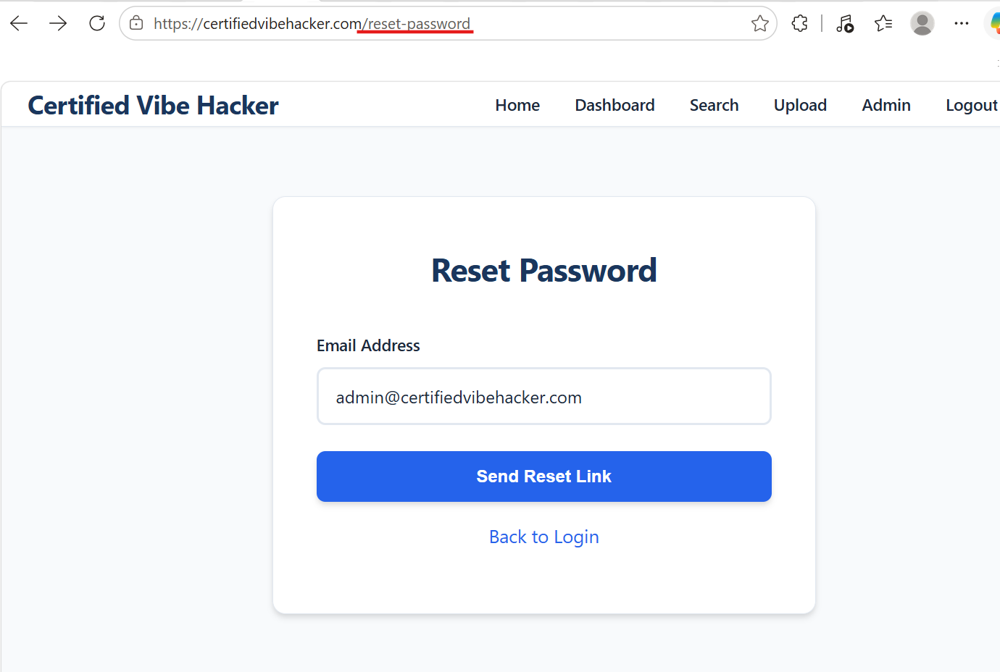
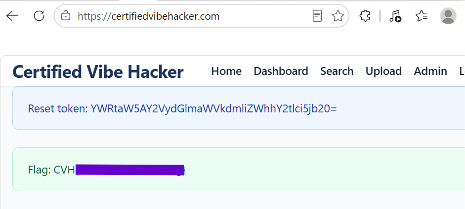
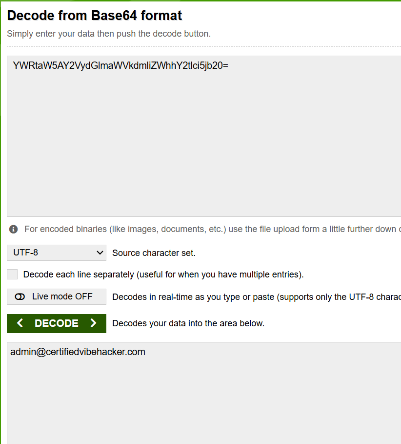

### **Day 7: Weak Password Reset**

### **Challenge:** Password reset tokens are base64-encoded email addresses, making them predictable and exploitable, location is reset-password endpoint

### **Methodology:**

1. Go to /reset-password and plug in any of the email addresses retrieved so far, I used the admin’s as you can see in the image below.

2. Click “send reset link” and you will be taken to the dashboard still logged into your account or to the main page if logged out, and you will be able to see the base64-encoded email address token, image below.

3. And if you decode it you can see it really is the user’s email address base64-encoded

### **The why:**

This vulnerability belongs to the CWE-640 Weak Password Recovery Mechanism for Forgotten Password. While the website does have a mechanism for password recovery it is weak and an actionable way to gain unauthorised access to a user’s account.   
Base 64 is only encoding and not encryption or hashing and therefore fully reversible. In a real world scenario an attacker could take over an account whose email address they know or enumerate other accounts.

### **Prevention:**

The reset token has to be created with a cryptographically secure random number generator, so that it is long, complex and uses a cryptographically safe algorithm that can withstand a brute force attack. The token should also not be using any token that is related to the user’s account, be stored securely, and have a single use and expire. In general OWASP suggests using the following guideline,

- Return the same message for existing and non existing accounts since an attacker could use that to enumerate valid users.  
- Send the reset token through a side channel, meaning a separate channel from where the reset request was made. An example of that is a confirmation email, so the attacker would now need access to the victim's inbox to actually complete the reset.  
- Make sure all the server responses take the same time, regardless of the account status 

### **Summary:**

In this challenge of [Certified Vibe Hacker Workshop](https://certifiedvibehacker.com/) by [Hacker Sidekick](https://hackersidekick.com/) we saw an example of ‘Weak Password Reset Mechanism’ where the password reset token is the user’s email address base64-encoded. 

### **Bibliography:**

### [CWE \- CWE-640: Weak Password Recovery Mechanism for Forgotten Password (4.20)](https://cwe.mitre.org/data/definitions/640.html) 

[CWE-640: Weak Password Recovery Mechanism for Forgotten Password — Plexicus](https://www.plexicus.ai/cwe/cwe-640-weak-password-recovery-mechanism-for-forgotten-password/)   
[base64decode.org](https://www.base64decode.org/)   
[Forgot Password \- OWASP Cheat Sheet Series](https://cheatsheetseries.owasp.org/cheatsheets/Forgot_Password_Cheat_Sheet.html)   
[What is a Cryptographic Token? \- GeeksforGeeks](https://www.geeksforgeeks.org/ethical-hacking/what-is-a-cryptographic-token/) 

### 

