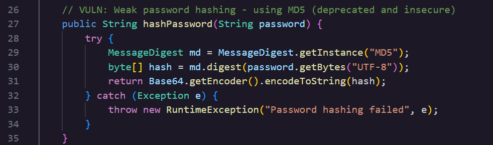

### **Day 8: Weak Password Storage**

**Challenge:** The application uses a cryptographically broken hashing algorithm for password storage, making passwords vulnerable to rainbow table attacks.What hashing algorithm is specified in the MessageDigest.getInstance() call within the hashPassword method in AuthService.java? 

Today we are completing the first challenge of the Static Code Analysis Category. This flag lives inside AuthService.java, a service layer class containing a low security framework from the code to the user (doesn't sound right make suggestions claude) in two ways,

- Authentication→ Who is this user?  
- Authorization → Does the user have access to this resource?

**Methodology:**  
Before finding the hash algorithm lets see what the class (which class) does.  
The HashPassword method takes the plaintext password and thenMessageDigest.getInstance(“Hash algorithm”) turns it into bytes and encodes it to the Base64 string. This string is none the hashed version of the password that is used to authenticate against. So when a user tries to login their password is hashed and compared against that encoded copy.  
Take a look at the code snippet bellow 

 
**The why:**  
**MD5** (**M**essage **D**igest **A**lgorithm **5**) is a cryptographic hash function that produces a 128 bit hash value. You can hash strings, files, directories..

- Hashes are irreversible so once applied you cannot convert a string to its original form.  
- Each hash is (supposed to be) unique, like a digital fingerprint  
- Each time you plug in the before value the hash output should be the same (since this is a mathematical algorithm), but even if one character changes the new hash should change completely

Now MD5 hashes are outdated since the 2000s. The main problem with this algorithm is that collisions are easy to generate with today’s computing. Collision attacks try to find two inputs producing the same hash value. More specifically in 2005 Vlastimil Klima conducted an experiment by running a collision generating brute force algorithm for 8 hours on a PC notebook that resulted in an MD5 collision. He later improved his technique  by using tunneling, this time went down to 1 minute. Brute force is the guessing process of automated scripts or bots that test thousands of password combinations per minute.   
Today’s challenge has a few known weaknesses worth organising, **CWE-916**: Use of Password Hash With Insufficient Computational Effort, **CWE-328**: Use of Weak Hash, **CWE-759**: Use of a One-Way Hash without a Salt, **CWE-261**: Weak Encoding for Password.  
   
**Prevention:**  
A simple solution is to not use MD5, implement salting, peppering, use Scrypt, or Argon2id.

| Salting | A unique random generated value that gets appended to the password before hashing. |
| :---- | :---- |
| Peppering | A secret value is added to the password before hashing, similar to salting but the pepper appended is unique to a group of a database and it exists in a separate secure location.  |
| Scrypt | A password based **k**ey **d**erivation **f**unction (**KDF**) that requires high computational power and memory storage. It works by storing pseudorandom data in a large block of RAM and accessing it in a non sequential order while hashing. This makes it hard for attackers to brute force as it needs a lot of memory and time. |
| Argon2id | Another password based **KDF** that won the Password Hashing Competition in 2015 and is currently the algorithm OWASP recommends first for password storage.  This algorithm salts every password hash automatically and just like Scrypt it requires large amounts of memory, not just computation time, which makes it resistant to cracking attempts that rely on GPUs or specialized hardware.  |

**Summary:**   
In this challenge of [Certified Vibe Hacker Workshop](https://certifiedvibehacker.com/) by [Hacker Sidekick](https://hackersidekick.com/) we saw an example of a vulnerability living inside the code. AuthService.java uses MD5 an outdated cryptography algorithm that leads to collisions.  
**Bibliography:**

[Guide to the Java Authentication And Authorization Service (JAAS) | Baeldung](https://www.baeldung.com/java-authentication-authorization-service)   
[Stop using MD5 and SHA-1: secure hashing guide](https://www.aikido.dev/code-quality/rules/stop-using-md5-and-sha-1-modern-hashing-for-security)   
[Hashing in Cryptography Explained: How It Works, Algorithms, and Real-World Uses | Splunk](https://www.splunk.com/en_us/blog/learn/hashing-cryptography.html)   
[Rise & Fall of MD5 – atsec](https://www.atsec.com/rise-fall-of-md5/)   
[What are Password Salting and Password Peppering? \- NetSec.News](https://www.netsec.news/what-are-password-salting-and-password-peppering/)   
[Tarsnap \- The scrypt key derivation function and encryption utility](https://www.tarsnap.com/scrypt.html)   
[What Is a Brute Force Attack? | IBM](https://www.ibm.com/think/topics/brute-force-attack)   
[Password Storage \- OWASP Cheat Sheet Series](https://cheatsheetseries.owasp.org/cheatsheets/Password_Storage_Cheat_Sheet.html)   
[4ARMED \- How to Crack MD5 Hashes Using hashcat](https://www.4armed.com/blog/hashcat-crack-md5-hashes/)   
[Stop using MD5 and SHA-1: secure hashing guide](https://www.aikido.dev/code-quality/rules/stop-using-md5-and-sha-1-modern-hashing-for-security)   
[Collision attack \- Wikipedia](https://en.wikipedia.org/wiki/Collision_attack)   
[CWE \- CWE-916: Use of Password Hash With Insufficient Computational Effort (4.20)](https://cwe.mitre.org/data/definitions/916.html)   
[CWE \- CWE-328: Use of Weak Hash (4.20)](https://cwe.mitre.org/data/definitions/328.html)   
[CWE \- CWE-759: Use of a One-Way Hash without a Salt (4.20)](https://cwe.mitre.org/data/definitions/759.html)   
[CWE \- CWE-261: Weak Encoding for Password (4.20)](https://cwe.mitre.org/data/definitions/261.html)   
[What is scrypt? \- Hexnode Blogs](https://www.hexnode.com/blogs/explained/what-is-scrypt/)   
[What Is Argon2? Password Hashing Explained \- JumpCloud](https://jumpcloud.com/it-index/what-is-argon2) 

